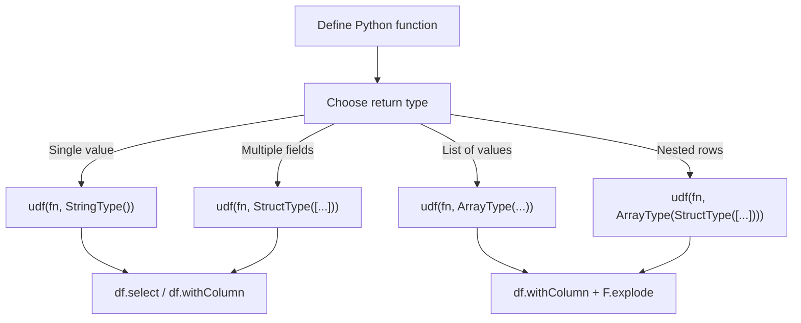

# User Guide

Step-by-step walkthroughs of every XML + PySpark pattern in this project,
from simple single-field extraction to full XML document generation.

## UDF Pattern Overview

Every example follows the same core pattern — wrap a Python function that
calls `xml.etree.ElementTree` in a PySpark UDF:

## Examples by Pattern

| Pattern | Guide | Source | Key Concept |
|---------|-------|--------|-------------|
| String UDF | [Single-Field](single-field.md) | `xmls_data_processing.py` | `udf(fn, StringType())` |
| Struct UDF | [Multi-Field](multi-field.md) | `xmls_data_processing_multiple_column.py` | `udf(fn, StructType)` → `info.*` |
| Array UDF + explode | [Attributes & Explode](attributes-explode.md) | `xmls_data_processing_multiple_column2.py` | `@udf` decorator, `F.explode` |
| Namespace maps | [Namespaces](namespaces.md) | `xmls_namespace_handling.py` | `findall(xpath, NS)` |
| Array-of-struct UDF | [Nested Flattening](nested-flattening.md) | `xmls_nested_flattening.py` | Denormalize → explode |
| Error capture | [Error Handling](error-handling.md) | `xmls_error_handling.py` | `try/except ET.ParseError` |
| XML generation | [Building XML](building-xml.md) | `xmls_build_from_dataframe.py` | `ET.Element` → `ET.tostring` |

## UDF Return Type Quick Reference

| Return Type | Spark Type | Use When |
|-------------|-----------|----------|
| `str` | `StringType()` | Extracting one text value |
| `Dict[str, str]` | `StructType([StructField(...)])` | Extracting multiple named fields |
| `List[int]` | `ArrayType(IntegerType())` | Variable-length list of values |
| `List[str]` | `ArrayType(StringType())` | Variable-length list of strings |
| `List[Tuple]` | `ArrayType(StructType([...]))` | One-to-many denormalization |
