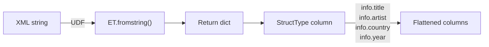

# Multi-Field Extraction

> :material-file-code: **Source:** `src/spark_etree/xmls_data_processing_multiple_column.py`

Extract multiple named fields from each XML row using a struct-returning UDF.

## Data Flow



## Implementation

### Define the schema and extraction function

```python linenums="1"
from pyspark.sql.types import StructType, StructField, StringType

CD_INFO_SCHEMA = StructType([                                          # (1)!
    StructField("title", StringType(), True),
    StructField("artist", StringType(), True),
    StructField("country", StringType(), True),
    StructField("year", StringType(), True),
])

def extract_cd_info(payload: str) -> Dict[str, Optional[str]]:
    """Extract title, artist, country, and year from a CD element."""
    doc = ET.fromstring(payload)
    return {
        "title": select_text(doc, "TITLE"),                            # (2)!
        "artist": select_text(doc, "ARTIST"),
        "country": select_text(doc, "COUNTRY"),
        "year": select_text(doc, "YEAR"),
    }
```

1. Schema must match the dict keys exactly — order and names must align.
2. `select_text` is a small helper that returns `None` for missing elements.

### Helper function

```python linenums="1"
def select_text(xml_doc: ET.Element, xpath: str) -> Optional[str]:
    """Return text of the first matching element, or None."""
    nodes = [e.text for e in xml_doc.findall(xpath)
             if isinstance(e, ET.Element)]
    return next(iter(nodes), None)
```

### Apply and flatten the struct

```python linenums="1"
extract_cd_info_udf = udf(extract_cd_info, CD_INFO_SCHEMA)

(cd_df
 .withColumn("info", extract_cd_info_udf("cd"))                       # (1)!
 .select("index", "info.title", "info.artist",
         "info.country", "info.year")                                  # (2)!
 .show(truncate=False))
```

1. The UDF returns a struct column named `info`.
2. Access nested fields with dot notation — `info.title`, `info.artist`, etc.

## Run

```bash
uv run python src/spark_etree/xmls_data_processing_multiple_column.py
```

??? success "Expected output"

    ```
    +-----+-------------------+---------------+-------+----+
    |index|title              |artist         |country|year|
    +-----+-------------------+---------------+-------+----+
    |0    |Empire Burlesque   |Bob Dylan      |USA    |1985|
    |1    |Hide your heart    |Bonnie Tyler   |UK     |1988|
    |2    |Greatest Hits      |Dolly Parton   |USA    |1982|
    |3    |Still got the blues|Gary Moore     |UK     |1990|
    |4    |Eros               |Eros Ramazzotti|EU     |1997|
    +-----+-------------------+---------------+-------+----+
    ```

## Key Takeaways

| Concept | Detail |
|---------|--------|
| UDF return type | `StructType` with named `StructField`s |
| Python return value | `dict` with keys matching the schema field names |
| Flatten struct | `select("info.title", "info.artist", ...)` |
| Missing elements | Return `None` — the field is nullable (`True`) |
