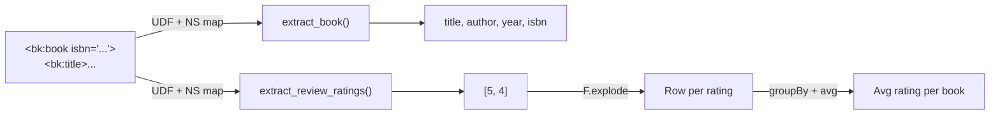

# Namespace Handling

> :material-file-code: **Source:** `examples/xmls_namespace_handling.py`

Parse XML that uses namespace prefixes (`bk:`, `rv:`) by passing a namespace
map to `find()` and `findall()`.

## Data Flow



## XML Input

```xml
<bk:library xmlns:bk="http://example.com/books"
            xmlns:rv="http://example.com/reviews">
  <bk:book isbn="978-0-13-468599-1">
    <bk:title>The Pragmatic Programmer</bk:title>
    <bk:author>David Thomas</bk:author>
    <bk:year>2019</bk:year>
    <rv:reviews>
      <rv:review>
        <rv:rating>5</rv:rating>
        <rv:comment>Classic</rv:comment>
      </rv:review>
    </rv:reviews>
  </bk:book>
</bk:library>
```

## Implementation

### Define the namespace map

```python linenums="1"
NS = {
    "bk": "http://example.com/books",                                  # (1)!
    "rv": "http://example.com/reviews",
}
```

1. Keys are the short prefixes used in `find()` / `findall()` calls.
   These do **not** need to match the prefixes in the XML document itself.

### Extract book metadata

```python linenums="1"
def extract_book(payload: str) -> Dict[str, Optional[str]]:
    doc = ET.fromstring(payload)
    return {
        "isbn": doc.attrib.get("isbn"),                                # (1)!
        "title": _text(doc, "bk:title"),                               # (2)!
        "author": _text(doc, "bk:author"),
        "year": _text(doc, "bk:year"),
    }

def _text(el: ET.Element, path: str) -> Optional[str]:
    node = el.find(path, NS)                                           # (3)!
    return node.text if node is not None else None
```

1. ISBN is an attribute on the root element — no namespace needed.
2. Prefixed XPath: `bk:title` resolves via the `NS` map.
3. Pass the namespace dict as the second argument to `find()`.

### Extract review ratings and aggregate

```python linenums="1"
def extract_review_ratings(payload: str) -> List[int]:
    doc = ET.fromstring(payload)
    return [
        int(r.text)
        for r in doc.findall("rv:reviews/rv:review/rv:rating", NS)     # (1)!
        if r.text is not None
    ]
```

1. Multi-level namespaced path — each segment needs its prefix.

### Register namespaces for serialization

```python linenums="1"
for prefix, uri in NS.items():
    ET.register_namespace(prefix, uri)                                  # (1)!
```

1. Required before `ET.tostring()` so output preserves the `bk:` / `rv:` prefixes
   instead of generating `ns0:` / `ns1:`.

## Run

```bash
uv run python examples/xmls_namespace_handling.py
```

??? success "Expected output"

    ```
    === Average rating per book ===
    +--------------------------+----------+------------+
    |title                     |avg_rating|review_count|
    +--------------------------+----------+------------+
    |The Pragmatic Programmer  |4.5       |2           |
    |JavaScript: The Good Parts|4.0       |1           |
    |Clean Code                |4.0       |3           |
    +--------------------------+----------+------------+
    ```

## Key Takeaways

| Concept | Detail |
|---------|--------|
| Namespace map | `dict` mapping prefix → URI, passed to `find()` / `findall()` |
| Prefixed paths | `"bk:title"`, `"rv:reviews/rv:review/rv:rating"` |
| `register_namespace` | Call before `tostring()` to preserve prefixes |
| Attributes | `doc.attrib.get("isbn")` — no namespace needed for unprefixed attributes |

!!! warning "Common pitfall"
    If you forget to pass the `NS` dict to `find()`, ElementTree will look
    for an element literally named `bk:title` (with the colon in the tag
    name) and return `None`.
