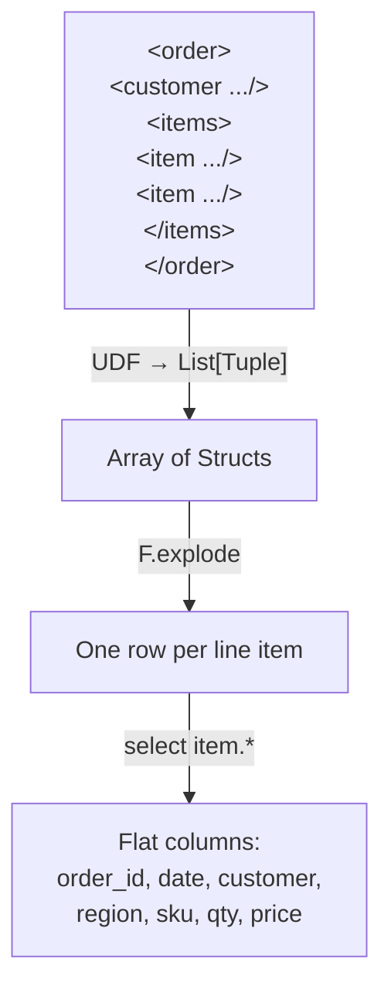

# Nested Flattening

> :material-file-code: **Source:** `examples/xmls_nested_flattening.py`

Denormalize deeply nested XML (orders containing line items) into flat
tabular rows using an array-of-struct UDF and `F.explode`.

## Data Flow



## XML Input

```xml title="Single order element"
<order id="1001" date="2025-06-15">
  <customer name="Alice" region="North" />
  <items>
    <item sku="A100" qty="2" price="29.99" />
    <item sku="B200" qty="1" price="49.99" />
  </items>
</order>
```

## Implementation

### Define the nested schema

```python linenums="1"
LINE_ITEM_SCHEMA = ArrayType(StructType([                              # (1)!
    StructField("order_id", StringType(), False),
    StructField("order_date", StringType(), False),
    StructField("customer", StringType(), True),
    StructField("region", StringType(), True),
    StructField("sku", StringType(), False),
    StructField("qty", IntegerType(), False),
    StructField("price", DoubleType(), False),
]))
```

1. `ArrayType(StructType([...]))` — each order produces a **list of structs**,
   one per line item. Parent fields (order_id, customer) are repeated in each.

### Flatten function

```python linenums="1"
def flatten_order(payload: str) -> List[Tuple]:
    order = ET.fromstring(payload)
    order_id = order.attrib["id"]
    order_date = order.attrib["date"]

    cust = order.find("customer")                                      # (1)!
    customer = cust.attrib.get("name") if cust is not None else None
    region = cust.attrib.get("region") if cust is not None else None

    rows = []
    for item in order.findall("items/item"):                           # (2)!
        rows.append((
            order_id, order_date, customer, region,
            item.attrib["sku"],
            int(item.attrib["qty"]),
            float(item.attrib["price"]),
        ))
    return rows
```

1. Safely handle missing `<customer>` elements.
2. Iterate over all `<item>` children and build a tuple per line item.

### Explode and flatten

```python linenums="1"
flatten_udf = udf(flatten_order, LINE_ITEM_SCHEMA)

line_items = (
    order_df
    .withColumn("items", flatten_udf("xml"))                           # (1)!
    .select(F.explode("items").alias("item"))                          # (2)!
    .select("item.*")                                                  # (3)!
)
```

1. Apply the UDF — each row gets an array of structs.
2. Explode the array — one row per struct.
3. Flatten the struct fields into top-level columns.

### Aggregate

```python linenums="1"
(line_items
 .withColumn("line_total", F.col("qty") * F.col("price"))
 .groupBy("sku")
 .agg(
     F.round(F.sum("line_total"), 2).alias("total_revenue"),
     F.sum("qty").alias("total_qty"),
 )
 .orderBy(F.desc("total_revenue")))
```

## Run

```bash
uv run python examples/xmls_nested_flattening.py
```

??? success "Expected output — flattened line items"

    ```
    +--------+----------+--------+------+----+---+-----+
    |order_id|order_date|customer|region|sku |qty|price|
    +--------+----------+--------+------+----+---+-----+
    |1001    |2025-06-15|Alice   |North |A100|2  |29.99|
    |1001    |2025-06-15|Alice   |North |B200|1  |49.99|
    |1002    |2025-06-16|Bob     |South |C300|5  |9.99 |
    |1002    |2025-06-16|Bob     |South |A100|1  |29.99|
    |1002    |2025-06-16|Bob     |South |D400|3  |14.5 |
    |1003    |2025-06-16|Charlie |North |B200|2  |49.99|
    |1004    |2025-06-17|Diana   |East  |A100|4  |29.99|
    |1004    |2025-06-17|Diana   |East  |D400|1  |14.5 |
    +--------+----------+--------+------+----+---+-----+
    ```

??? success "Expected output — revenue by SKU"

    ```
    +----+-------------+---------+
    |sku |total_revenue|total_qty|
    +----+-------------+---------+
    |A100|209.93       |7        |
    |B200|149.97       |3        |
    |D400|58.0         |4        |
    |C300|49.95        |5        |
    +----+-------------+---------+
    ```

## Key Takeaways

| Concept | Detail |
|---------|--------|
| Schema | `ArrayType(StructType([...]))` for one-to-many |
| Python return | `List[Tuple]` — each tuple becomes a struct |
| Denormalization | Parent fields (order_id, customer) are repeated per child row |
| Explode + flatten | `F.explode("items").alias("item")` then `select("item.*")` |
