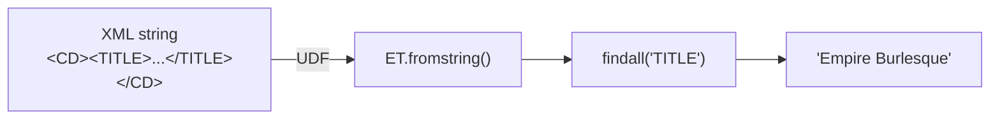

# Single-Field Extraction

> :material-file-code: **Source:** `src/spark_etree/xmls_data_processing.py`

Extract a single text value from each XML row using a string-returning UDF.

## Data Flow



## XML Input

```xml title="Sample CD element"
<CD>
  <TITLE>Empire Burlesque</TITLE>
  <ARTIST>Bob Dylan</ARTIST>
  <COUNTRY>USA</COUNTRY>
  <PRICE>10.90</PRICE>
  <YEAR>1985</YEAR>
</CD>
```

## Implementation

### Step 1 — Write the extraction function

```python linenums="1"
import xml.etree.ElementTree as ET
from typing import Optional

def extract_title(payload: str) -> Optional[str]:
    """Extract the TITLE text from a single CD XML element."""
    doc = ET.fromstring(payload)                                      # (1)!
    titles = [e.text for e in doc.findall("TITLE")
              if isinstance(e, ET.Element)]                           # (2)!
    return next(iter(titles), None)                                   # (3)!
```

1. Parse the XML string into an Element tree.
2. Find all `<TITLE>` children and collect their text.
3. Return the first match, or `None` if no title exists.

### Step 2 — Register the UDF with an explicit return type

```python linenums="1"
from pyspark.sql.functions import udf
from pyspark.sql.types import StringType

extract_title_udf = udf(extract_title, StringType())                 # (1)!
```

1. Always specify the return type — Spark defaults to `StringType` but being
   explicit avoids surprises.

### Step 3 — Apply to the DataFrame

```python linenums="1"
from pyspark.sql import functions as F

(cd_df
 .select("index", extract_title_udf(F.col("cd")).alias("title"))     # (1)!
 .show(truncate=False))
```

1. Call the UDF on the `cd` column and alias the result as `title`.

## Run

```bash
uv run python src/spark_etree/xmls_data_processing.py
```

??? success "Expected output"

    ```
    +-----+-------------------+
    |index|title              |
    +-----+-------------------+
    |0    |Empire Burlesque   |
    |1    |Hide your heart    |
    |2    |Greatest Hits      |
    |3    |Still got the blues|
    |4    |Eros               |
    +-----+-------------------+
    ```

## Key Takeaways

| Concept | Detail |
|---------|--------|
| UDF return type | `StringType()` for a single text value |
| Parse method | `ET.fromstring(payload)` per row |
| Null safety | Returns `None` when element is missing |
| Column alias | `.alias("title")` names the output column |
