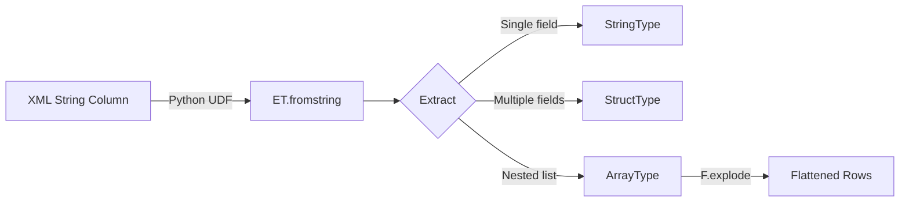

# PySpark XML ElementTree

Parse, extract, and build XML inside PySpark DataFrames using Python's
built-in `xml.etree.ElementTree` — no external JARs required.



## Features

| Feature | Module | Description |
|---------|--------|-------------|
| :material-text-short: Single field | `xmls_data_processing` | Extract one element via a string UDF |
| :material-table: Multi-field | `xmls_data_processing_multiple_column` | Extract multiple elements via a struct UDF |
| :material-code-array: Attributes & explode | `xmls_data_processing_multiple_column2` | Read XML attributes and explode nested arrays |
| :material-xml: Namespaces | `xmls_namespace_handling` | Parse namespace-prefixed XML with namespace maps |
| :material-file-tree: Nested flattening | `xmls_nested_flattening` | Denormalize hierarchical XML into flat rows |
| :material-shield-alert: Error handling | `xmls_error_handling` | Safely parse malformed or missing XML |
| :material-file-export: Build XML | `xmls_build_from_dataframe` | Convert DataFrame rows into XML strings |

## Quick Start

=== "Install"

    ```bash
    uv sync
    ```

=== "Run an example"

    ```bash
    uv run python src/spark_etree/xmls_data_processing.py
    ```

=== "Run tests"

    ```bash
    uv run pytest tests/ -v
    ```

!!! tip "No cluster needed"
    Every example runs locally with `local[*]` — no Spark cluster required.

## Project Structure

```
spark-xml-etree/
├── src/spark_etree/           # source examples
│   ├── xmls_data_processing.py
│   ├── xmls_data_processing_multiple_column.py
│   ├── xmls_data_processing_multiple_column2.py
│   ├── xmls_namespace_handling.py
│   ├── xmls_nested_flattening.py
│   ├── xmls_error_handling.py
│   └── xmls_build_from_dataframe.py
├── tests/                     # pytest suite (57 tests)
├── docs/                      # this documentation
├── pyproject.toml
└── mkdocs.yml
```

## Technology Stack

| Component | Version |
|-----------|---------|
| Python | ≥ 3.11 |
| PySpark | < 4.0.0 (3.5.x preferred) |
| XML library | `xml.etree.ElementTree` (stdlib) |
| Package manager | uv |
| Testing | pytest ≥ 8.0 |

## When to Use This Approach

!!! success "Good fit"
    - Irregular or mixed XML schemas that resist spark-xml's row-tag model
    - Namespace-heavy XML requiring `findall(xpath, namespaces)`
    - Environments where adding the Databricks spark-xml JAR is not possible
    - Need for fine-grained parse error handling per row
    - Small to medium XML payloads (< 1 MB per row)

!!! failure "Not a good fit"
    - Very large XML files (> 1 MB per row) — JVM-native spark-xml is faster
    - Simple, flat XML that spark-xml reads directly with schema inference
    - Streaming workloads where Python UDF serialization is a bottleneck
