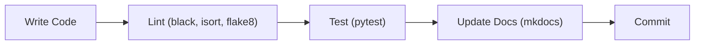

# Copilot Instructions — spark-xml

## Project Overview

This project demonstrates **PySpark XML processing** using the [Databricks spark-xml](https://github.com/databricks/spark-xml) library. It covers reading, writing, parsing, validating, and transforming XML data with PySpark across a variety of scenarios including encoding, compression, namespaces, nested structures, schema enforcement, and SQL-based access.

### Architecture

```mermaid
graph TD
    subgraph "spark-xml Project"
        SRC["src/spark_xml/"]
        TESTS["tests/"]
        DOCS["docs/ (MkDocs)"]
        EXAMPLES["examples/"]
    end

    subgraph "src/spark_xml/ Modules"
        READER["reader/ — XML reading & date/time parsing"]
        WRITER["writer/ — XML writing"]
        SCHEMA["schema/ — Schema definition, JSON schema, XSD validation"]
        NESTED["nested/ — Nested/complex XML flattening"]
        ENCODING["encoding/ — UTF-8, UTF-16, ISO-8859-1"]
        COMPRESSION["compression/ — gzip, bzip2, deflate, snappy"]
        NAMESPACE["namespace/ — XML namespace handling"]
        ATTRIBUTE["attribute/ — Attribute prefix mapping"]
        COLLECTION["collection/ — In-memory & API XML parsing"]
        SQL["sql/ — Spark SQL CREATE TABLE USING xml"]
        VALUE_TAG["value_tag/ — _VALUE access pattern"]
        INSTRUCTION["instruction/ — Processing instructions"]
        ERROR["error/ — Corrupt record handling"]
        UTIL["util/ — XSD generation, validation, data generation"]
    end

    SRC --> READER & WRITER & SCHEMA & NESTED & ENCODING & COMPRESSION
    SRC --> NAMESPACE & ATTRIBUTE & COLLECTION & SQL & VALUE_TAG
    SRC --> INSTRUCTION & ERROR & UTIL
```



### Data Flow

```mermaid
flowchart LR
    XML_FILE["XML Files"] -->|spark.read.format('xml')| SPARK_DF["Spark DataFrame"]
    API["HTTP/API XML"] -->|collection module| SPARK_DF
    XSD["XSD Schema"] -->|rowValidationXSDPath| SPARK_DF
    JSON_SCHEMA["JSON Schema"] -->|StructType.fromJson| SPARK_DF
    SPARK_DF -->|df.write.format('xml')| XML_OUT["XML Output"]
    SPARK_DF -->|.show() / transforms| RESULTS["Results"]
```

---

## Technology Stack

| Technology | Version / Details |
|---|---|
| Python | 3.11+ |
| PySpark | < 4.0.0 |
| spark-xml JAR | `com.databricks:spark-xml_2.12:0.18.0` |
| Java | JDK 8 or 17 (via `JAVA_HOME_8` / `JAVA_HOME_17` env vars) |
| Package Manager | uv |
| Linting | black, flake8, isort |
| Testing | pytest (tests/) |
| Docs | MkDocs with Mermaid diagrams |

---

## Code Conventions & Patterns

### SparkSession Creation

Always use this pattern for new files:

```python
import os
import sys
from pyspark.sql import SparkSession

os.environ["JAVA_HOME"] = os.environ["JAVA_HOME_17"]
os.environ["PYSPARK_PYTHON"] = sys.executable

if __name__ == "__main__":
    spark = (
        SparkSession.builder
        .master("local[*]")
        .appName("spark-xml")
        .getOrCreate()
    )
```

- Always set `JAVA_HOME` and `PYSPARK_PYTHON` at module level before SparkSession creation.
- Always wrap execution in `if __name__ == "__main__":` guard.
- Use `local[*]` master for local development.
- Prefer `JAVA_HOME_17` for new code.
- Use `os.environ["DATA_HOME"]` for data file paths.

### XML Read Pattern

```python
df = (
    spark.read.format("xml")
    .option("rowTag", "person")
    .load(xml_file_path)
)
df.show(truncate=False)
df.printSchema()
```

### XML Write Pattern

```python
(
    df.write.format("xml")
    .mode("overwrite")
    .option("rootTag", "people")
    .option("rowTag", "person")
    .save(output_path)
)
```

### Compressed XML Read/Write Round-Trip

```python
# Write with compression
data = [("John", 28), ("Anna", 23), ("Peter", 34)]
columns = ["Name", "Age"]
df1 = spark.createDataFrame(data, columns)

(
    df1.write.format("xml")
    .mode("overwrite")
    .option("rootTag", "people")
    .option("rowTag", "person")
    .option("compression", "bzip2")  # also: gzip, deflate, snappy
    .save(xml_file)
)

# Read compressed XML back
df2 = (
    spark.read.format("xml")
    .option("rowTag", "person")
    .option("compression", "bzip2")
    .load(xml_file)
)
df2.show()
```

### Encoding-Aware Read/Write

```python
import codecs
import chardet

# Detect encoding before reading
with open(data_file, mode="rb") as file:
    print(chardet.detect(file.read()))

# Read with explicit charset
df = (
    spark.read.format("xml")
    .option("rowTag", "book")
    .option("charset", "UTF-16")
    .option("multiLine", True)
    .load(data_file)
)

# Write with encoding declaration
(
    df.write.mode("overwrite")
    .format("xml")
    .option("rootTag", "catalog")
    .option("rowTag", "book")
    .option("version", "1.0")
    .option("encoding", "UTF-16")
    .option("charset", "UTF-16")
    .save(f"{data_file}_output")
)
```

### Attribute Prefix Mapping

```python
# XML attributes become columns prefixed with "attr_"
# e.g. <person id="1"> → column "attr_id"
movies = (
    spark.read.format("com.databricks.spark.xml")
    .option("rootTag", "root")
    .option("rowTag", "person")
    .option("attributePrefix", "attr_")
    .load(xml_file)
)
movies.printSchema()
movies.show(5)
```

### Value Tag — Mixed Content Elements

```python
# Access both element text (_VALUE) and attributes for elements like:
# <price currency="USD">44.95</price>
books_df = (
    spark.read.format("com.databricks.spark.xml")
    .option("rootTag", "books")
    .option("rowTag", "book")
    .option("attributePrefix", "attr_")
    .load(xml_file)
)
books_df.select("price._VALUE", "price.attr_currency").show()
```

### XML Namespace Handling

```python
# Preserve namespaces — rowTag must include prefix
df = (
    spark.read.format("xml")
    .option("rowTag", "bk:book")
    .option("ignoreNamespace", "false")
    .load(f"{data_home}/file_data/xml/book.xml")
)

# Ignore namespaces — cleaner column names
df = (
    spark.read.format("xml")
    .option("rowTag", "bk:book")
    .option("ignoreNamespace", "true")
    .load(f"{data_home}/file_data/xml/book.xml")
)
```

### Explicit Schema with Nested StructType

```python
from pyspark.sql.types import (
    ArrayType, DoubleType, LongType, StringType,
    StructField, StructType, TimestampType,
)

schema = StructType([
    StructField("Customers", StructType([
        StructField("Customer", ArrayType(StructType([
            StructField("CompanyName", StringType(), True),
            StructField("ContactName", StringType(), True),
            StructField("FullAddress", StructType([
                StructField("Address", StringType(), True),
                StructField("City", StringType(), True),
                StructField("Country", StringType(), True),
                StructField("PostalCode", LongType(), True),
            ]), True),
            StructField("_CustomerID", StringType(), True),
        ]), True), True),
    ]), True),
    StructField("Orders", StructType([
        StructField("Order", ArrayType(StructType([
            StructField("CustomerID", StringType(), True),
            StructField("OrderDate", TimestampType(), True),
            StructField("ShipInfo", StructType([
                StructField("Freight", DoubleType(), True),
                StructField("ShipCity", StringType(), True),
                StructField("ShipCountry", StringType(), True),
            ]), True),
        ]), True), True),
    ]), True),
])

orders = (
    spark.read.format("com.databricks.spark.xml")
    .option("rowTag", "Root")
    .schema(schema)
    .load(xml_file)
)
orders.printSchema()
```

### JSON-Based Schema Loading

```python
import json
from pyspark.sql.types import StructType

with open(schema_path) as f:
    d = json.load(f)
    schema = StructType.fromJson(d)

df = (
    spark.read.format("xml")
    .option("rowTag", "note")
    .option("excludeAttribute", "true")
    .option("ignoreNamespace", "true")
    .schema(schema)
    .load(xml_file)
)
df.show(truncate=False)
```

### Custom Date/Time Parsing with Corrupt Record Handling

```python
from pyspark.sql.types import LongType, StringType, StructField, StructType, TimestampType

schema = StructType([
    StructField("id", LongType(), True),
    StructField("created_at", TimestampType(), True),
    StructField("_corrupt_record", StringType()),
])

df = (
    spark.read.format("xml")
    .option("rowTag", "record")
    .option("dateFormat", "dd-MM-yyyy")
    .option("columnNameOfCorruptRecord", "_corrupt_record")
    .option("mode", "PERMISSIVE")
    .schema(schema)
    .load(xml_file)
)
df.show(truncate=False)
```

### Nested XML Flattening (Iterative)

```python
from pyspark.sql import DataFrame
from pyspark.sql.types import ArrayType, StructType


def flatten_iterative(dataframe: DataFrame) -> DataFrame:
    """Recursively flatten all StructType and ArrayType columns."""
    df = dataframe
    flag = True
    while flag:
        flag = False
        for field in df.schema.fields:
            field_names = [f.name for f in df.schema.fields]
            if isinstance(field.dataType, ArrayType):
                flag = True
                others = [n for n in field_names if n != field.name]
                others.append(f"explode_outer({field.name}) as {field.name}")
                df = df.selectExpr(*others)
            elif isinstance(field.dataType, StructType):
                flag = True
                struct_cols = [
                    f"{field.name}.{child.name} as {field.name}_{child.name}"
                    for child in field.dataType.fields
                ]
                others = [n for n in field_names if n != field.name]
                others.extend(struct_cols)
                df = df.selectExpr(*others)
    return df


# Usage:
df = spark.read.format("xml").option("rowTag", "DWHBatch").load(xml_file)
flat_df = flatten_iterative(df)
flat_df.show(truncate=False)
```

### Explode Nested Arrays with Position

```python
from pyspark.sql.functions import col, posexplode

books = spark.read.format("xml").option("rowTag", "foo").load(xml_file)
books = (
    books.select(posexplode(col("bar")))
    .withColumnRenamed("col", "bar")
    .select("pos", "bar.sum", "bar.periods.start", "bar.periods.end")
)
books.show(truncate=False)
```

### Parse XML Column with JVM Bridge (from_xml)

```python
from pyspark.sql import functions as f
from pyspark.sql.column import Column, _to_java_column
from pyspark.sql.types import _parse_datatype_json_string


def ext_from_xml(spark, xml_column, schema, options={}):
    """Parse XML string column into a struct using spark-xml's from_xml JVM function."""
    java_column = _to_java_column(xml_column.cast("string"))
    java_schema = spark._jsparkSession.parseDataType(schema.json())
    scala_map = spark._jvm.org.apache.spark.api.python.PythonUtils.toScalaMap(options)
    jc = spark._jvm.com.databricks.spark.xml.functions.from_xml(
        java_column, java_schema, scala_map
    )
    return Column(jc)


def ext_schema_of_xml_df(spark, df, options={}):
    """Infer XML schema from a single-column DataFrame of XML strings."""
    assert len(df.columns) == 1
    scala_options = spark._jvm.PythonUtils.toScalaMap(options)
    java_xml_module = getattr(
        getattr(spark._jvm.com.databricks.spark.xml, "package$"), "MODULE$"
    )
    java_schema = java_xml_module.schema_of_xml_df(df._jdf, scala_options)
    return _parse_datatype_json_string(java_schema.json())


# Usage: parse XML stored in a DataFrame column
df = spark.createDataFrame(rdd, "url string, content string")
payload_schema = ext_schema_of_xml_df(spark, df.select("content"))
parsed = df.withColumn(
    "parsed", ext_from_xml(spark, df.content, payload_schema, {"rowTag": "Level_0"})
)
df2 = parsed.select(
    "parsed._Id0",
    f.explode_outer("parsed.Level_1.Level_2.Level_3.Level_4").alias("Level_4"),
)
df2.select("_Id0", "Level_4.*").show()
```

### Parse XML Column with Python UDF (ElementTree)

```python
import xml.etree.ElementTree as ET
from pyspark.sql.functions import udf
from pyspark.sql.types import FloatType, StringType, StructField, StructType


def parse_xml(xml_str):
    """Parse a single XML string into a struct."""
    if xml_str is None:
        return None
    try:
        root = ET.fromstring(xml_str)
        return (
            root.find("title").text,
            root.find("author").text,
            float(root.find("price").text),
        )
    except Exception as e:
        print(f"Error parsing XML: {e}")
        return None


xml_schema = StructType([
    StructField("title", StringType(), True),
    StructField("author", StringType(), True),
    StructField("price", FloatType(), True),
])
parse_xml_udf = udf(parse_xml, xml_schema)

# Apply UDF to an XML string column
data = [
    (1, "<book><title>Effective Java</title><author>Joshua Bloch</author><price>45.00</price></book>"),
    (2, "<book><title>Clean Code</title><author>Robert C. Martin</author><price>50.00</price></book>"),
]
df = spark.createDataFrame(data, ["id", "xml_data"])
parsed_df = df.withColumn("parsed_data", parse_xml_udf(df["xml_data"]))
result_df = parsed_df.select("id", "xml_data", "parsed_data.*")
result_df.show(truncate=False)
```

### Spark SQL Interface (CREATE TABLE USING xml)

```python
spark_warehouse_dir = os.environ["SPARK_WAREHOUSE"]
spark = (
    SparkSession.builder.master("local[*]")
    .config("spark.jars.packages", "com.databricks:spark-xml_2.12:0.18.0")
    .config("spark.sql.warehouse.dir", spark_warehouse_dir)
    .appName("spark-db-xml")
    .getOrCreate()
)

xml_file = f"{data_home}/file_data/xml/movies.xml"
spark.sql(f"""
    CREATE TABLE movies USING xml
    OPTIONS (path 'file:///{xml_file}', rootTag 'collection', rowTag 'movie')
""")
spark.sql("SELECT * FROM movies").show(truncate=False)
```

### Read XML from HTTP API / In-Memory String

```python
import tempfile
import requests

# Fetch XML from API
data = requests.get(url=url, verify=ca_path).text

# Write to temp file for spark-xml to read
with tempfile.NamedTemporaryFile(delete=False, suffix=".xml") as temp_file:
    temp_file.write(data.encode("utf-8"))
    temp_file_path = temp_file.name

options = {"rowTag": "person", "multiLine": True, "mode": "FAILFAST"}
df = spark.read.format("xml").options(**options).load(temp_file_path)
df.show(truncate=False)
```

### Alternative: Read XML via Pandas Bridge

```python
import pandas as pd
import requests

data = requests.get(url=url, verify=ca_path).text
pdf = pd.read_xml(data)
spark_df = spark.createDataFrame(pdf)
spark_df.printSchema()
spark_df.show()
```

### Generate Test XML Data with Faker

```python
import csv
import random
import xml.etree.ElementTree as ET
from faker import Faker

fake = Faker()


def generate_value(data_type, allowed_values):
    if allowed_values:
        return random.choice(allowed_values.split(","))
    elif data_type == "int":
        return str(random.randint(18, 99))
    elif data_type == "string":
        return fake.word()
    return ""


def build_single_element(mapping, main_tag):
    """Build one XML element from a CSV mapping definition."""
    element = ET.Element(main_tag)
    current_tag = None
    current_el = None
    for row in mapping:
        tag, attr = row["tag"], row["attribute"]
        if tag != current_tag:
            current_el = ET.SubElement(element, tag)
            current_tag = tag
        if attr:
            current_el.set(attr, generate_value(row["attribute_type"], row.get("attribute_allowed_values", "")))
        elif row["data_type"]:
            current_el.text = generate_value(row["data_type"], row["allowed_values"])
    return element


def build_xml(mapping, main_tag, count=1000):
    root = ET.Element("root")
    for _ in range(count):
        root.append(build_single_element(mapping, main_tag))
    return ET.ElementTree(root)
```

### Format Strings

- Use `"xml"` (short alias) for `spark.read.format()` / `spark.write.format()` — preferred for Spark 3.4+.
- Use `"com.databricks.spark.xml"` only when needed for backward compatibility.

### Key spark-xml Options Reference

| Option | Purpose | Example Values |
|---|---|---|
| `rowTag` | XML element to map to DataFrame rows | `"person"`, `"book"`, `"record"` |
| `rootTag` | Root element wrapping all rows (write) | `"people"`, `"books"`, `"root"` |
| `attributePrefix` | Prefix for XML attribute columns | `"attr_"` |
| `excludeAttribute` | Exclude XML attributes from schema | `True` |
| `ignoreNamespace` | Ignore XML namespace prefixes | `"true"` |
| `compression` | Codec for compressed XML | `"gzip"`, `"bzip2"`, `"deflate"`, `"snappy"` |
| `charset` / `encoding` | Character encoding | `"UTF-8"`, `"UTF-16"`, `"ISO-8859-1"` |
| `rowValidationXSDPath` | XSD file path for row validation | `"orders.xsd"` |
| `mode` | Parse mode for malformed records | `"PERMISSIVE"`, `"FAILFAST"` |
| `dateFormat` | Custom date parsing format | `"dd-MM-yyyy"` |
| `columnNameOfCorruptRecord` | Column for corrupt records | `"_corrupt_record"` |
| `multiLine` | Enable multi-line XML parsing | `True` |
| `version` | XML declaration version (write) | `"1.0"` |
| `inferSchema` | Whether to infer schema automatically | `"true"`, `"false"` |

---

## Project Structure

```
spark-xml/
├── .github/
│   └── copilot-instructions.md   # This file
├── src/
│   └── spark_xml/
│       ├── reader/               # XML reading, date/time parsing
│       │   └── date_time/        # Date format handling (default, custom, post-read)
│       ├── writer/               # XML writing examples
│       ├── schema/               # Schema handling
│       │   ├── json/             # JSON-based schema loading
│       │   └── xsd/              # XSD validation & XML generation from XSD
│       ├── nested/               # Nested XML: struct/array flattening, from_xml()
│       ├── encoding/             # UTF-8, UTF-16, ISO-8859-1 encoding
│       ├── compression/          # gzip, bzip2, deflate, snappy codec support
│       ├── namespace/            # XML namespace handling (ignore vs preserve)
│       ├── attribute/            # Attribute prefix mapping (attr_)
│       ├── collection/           # In-memory XML, API/HTTP XML, pandas bridge
│       ├── sql/                  # Spark SQL CREATE TABLE USING xml
│       ├── value_tag/            # _VALUE access for mixed content elements
│       ├── instruction/          # XML processing instructions
│       ├── error/                # Corrupt record handling
│       ├── surrounding_space/    # Whitespace handling
│       ├── stack_overlfow/       # Recipes: posexplode, UDF XML column parsing
│       └── util/                 # XSD generation (trang, xmltoxsd), validation, faker data gen
├── tests/                        # pytest test files
├── docs/                         # MkDocs documentation (Markdown + Mermaid)
├── examples/                     # Standalone runnable examples
├── pyproject.toml                # Project config (uv, black, flake8, isort)
├── uv.lock                       # Lock file
└── README.md
```

---

## Guidelines for Source Code (`src/`)

### General Rules

- Each module file is a **standalone runnable script** with `if __name__ == "__main__":` guard.
- Use `snake_case` for variables, functions, and file names.
- Imports order: stdlib (`os`, `sys`) → PySpark (`pyspark.sql`) → third-party.
- Keep files focused on a **single spark-xml feature or scenario**.
- Always call `df.show(truncate=False)` and `df.printSchema()` after reading XML.
- Add module-level docstrings explaining what the script demonstrates.
- Do not hardcode absolute file paths — use `os.environ["DATA_HOME"]` for data directories.

### Adding New Modules

When adding a new spark-xml feature demonstration:

1. Create a new subdirectory under `src/spark_xml/` named after the feature.
2. Add an `__init__.py` (can be empty).
3. Follow the SparkSession creation pattern above.
4. Include inline comments explaining the spark-xml options being demonstrated.
5. Add corresponding test in `tests/`.
6. Add a documentation page in `docs/`.

### XML Libraries Available

| Library | Use Case |
|---|---|
| `spark.read.format("xml")` | Primary — PySpark DataFrame XML I/O |
| `xml.etree.ElementTree` | Stdlib — UDF-based column XML parsing |
| `lxml.etree` | Pretty-printed XML generation |
| `xmlschema` | XSD validation and schema introspection |
| `xmltoxsd` | Auto-generate XSD from sample XML |
| `pandas.read_xml()` | Alternative XML reading, convert to Spark DF |
| `chardet` | Detect file encoding before reading |

---

## Guidelines for Testing (`tests/`)

### Framework & Conventions

- Use **pytest** as the test framework.
- Test file naming: `test_<module_name>.py` (e.g., `test_reader.py`, `test_compression.py`).
- Use a shared `conftest.py` for SparkSession fixture and test data paths.

### SparkSession Fixture

```python
# tests/conftest.py
import os
import sys
import pytest
from pyspark.sql import SparkSession

os.environ["JAVA_HOME"] = os.environ.get("JAVA_HOME_17", os.environ.get("JAVA_HOME", ""))
os.environ["PYSPARK_PYTHON"] = sys.executable


@pytest.fixture(scope="session")
def spark():
    """Shared SparkSession for all tests."""
    session = (
        SparkSession.builder
        .master("local[*]")
        .appName("spark-xml-tests")
        .getOrCreate()
    )
    yield session
    session.stop()


@pytest.fixture
def data_home():
    """Path to test data directory."""
    return os.environ.get("DATA_HOME", "tests/data")
```

### Test Patterns

#### Basic Round-Trip (Compression)

```python
# tests/test_compression.py
import pytest


@pytest.mark.parametrize("codec", ["gzip", "bzip2", "deflate", "snappy"])
def test_read_write_compressed_xml(spark, tmp_path, codec):
    """Test XML round-trip with all supported compression codecs."""
    data = [("Alice", 30), ("Bob", 25), ("Charlie", 35)]
    df_write = spark.createDataFrame(data, ["Name", "Age"])

    output_path = str(tmp_path / f"people_{codec}.xml")
    (
        df_write.write.format("xml")
        .mode("overwrite")
        .option("rootTag", "people")
        .option("rowTag", "person")
        .option("compression", codec)
        .save(output_path)
    )

    df_read = (
        spark.read.format("xml")
        .option("rowTag", "person")
        .option("compression", codec)
        .load(output_path)
    )

    assert df_read.count() == 3
    assert set(df_read.columns) == {"Name", "Age"}
    rows = {row["Name"] for row in df_read.collect()}
    assert rows == {"Alice", "Bob", "Charlie"}
```

#### Encoding Round-Trip

```python
# tests/test_encoding.py
import codecs
import pytest


@pytest.mark.parametrize("encoding", ["UTF-8", "UTF-16", "ISO-8859-1"])
def test_read_write_xml_encoding(spark, tmp_path, encoding):
    """Test XML read/write with different character encodings."""
    xml_content = """<?xml version="1.0"?>
    <catalog>
       <book id="bk101">
          <author>Müller, François</author>
          <title>XML Guide</title>
          <price>44.95</price>
       </book>
    </catalog>"""

    input_file = str(tmp_path / f"input_{encoding}.xml")
    with codecs.open(input_file, mode="w", encoding=encoding) as f:
        f.write(xml_content)

    df = (
        spark.read.format("xml")
        .option("rowTag", "book")
        .option("charset", encoding)
        .option("multiLine", True)
        .load(input_file)
    )

    assert df.count() == 1
    assert "author" in df.columns
```

#### Nested XML Flattening

```python
# tests/test_nested.py
from pyspark.sql.functions import col, explode


def test_explode_nested_array(spark, tmp_path):
    """Test flattening nested XML arrays with explode."""
    xml_content = """<catalog>
      <book>
        <title>Book A</title>
        <authors><author>Alice</author><author>Bob</author></authors>
      </book>
    </catalog>"""

    input_file = str(tmp_path / "nested.xml")
    with open(input_file, "w") as f:
        f.write(xml_content)

    df = spark.read.format("xml").option("rowTag", "book").load(input_file)
    exploded = df.withColumn("author", explode(col("authors.author")))

    assert exploded.count() == 2
    authors = {row["author"] for row in exploded.collect()}
    assert authors == {"Alice", "Bob"}
```

#### Schema Validation

```python
# tests/test_schema.py
import json
from pyspark.sql.types import StructType, StructField, StringType, LongType


def test_explicit_schema_read(spark, tmp_path):
    """Test reading XML with an explicit StructType schema."""
    xml_content = """<people>
      <person><name>Alice</name><age>30</age></person>
      <person><name>Bob</name><age>25</age></person>
    </people>"""

    input_file = str(tmp_path / "people.xml")
    with open(input_file, "w") as f:
        f.write(xml_content)

    schema = StructType([
        StructField("name", StringType(), True),
        StructField("age", LongType(), True),
    ])

    df = (
        spark.read.format("xml")
        .option("rowTag", "person")
        .schema(schema)
        .load(input_file)
    )

    assert df.count() == 2
    assert df.schema == schema


def test_json_schema_loading(spark, tmp_path):
    """Test loading schema from a JSON file."""
    schema = StructType([
        StructField("name", StringType(), True),
        StructField("age", LongType(), True),
    ])
    schema_file = str(tmp_path / "schema.json")
    with open(schema_file, "w") as f:
        json.dump(schema.jsonValue(), f)

    with open(schema_file) as f:
        loaded_schema = StructType.fromJson(json.load(f))

    assert loaded_schema == schema
```

#### Attribute Prefix and Value Tag

```python
# tests/test_attributes.py
def test_attribute_prefix(spark, tmp_path):
    """Test that XML attributes are mapped with the configured prefix."""
    xml_content = """<root>
      <person id="1" role="admin"><name>Alice</name></person>
      <person id="2" role="user"><name>Bob</name></person>
    </root>"""

    input_file = str(tmp_path / "attrs.xml")
    with open(input_file, "w") as f:
        f.write(xml_content)

    df = (
        spark.read.format("xml")
        .option("rowTag", "person")
        .option("attributePrefix", "attr_")
        .load(input_file)
    )

    assert "attr_id" in df.columns
    assert "attr_role" in df.columns
    assert "name" in df.columns


def test_value_tag_access(spark, tmp_path):
    """Test _VALUE access for elements with both text and attributes."""
    xml_content = """<books>
      <book><title>Book A</title><price currency="USD">29.99</price></book>
      <book><title>Book B</title><price currency="EUR">24.99</price></book>
    </books>"""

    input_file = str(tmp_path / "books.xml")
    with open(input_file, "w") as f:
        f.write(xml_content)

    df = (
        spark.read.format("xml")
        .option("rowTag", "book")
        .option("attributePrefix", "attr_")
        .load(input_file)
    )

    values = df.select("price._VALUE", "price.attr_currency").collect()
    assert len(values) == 2
    currencies = {row["attr_currency"] for row in values}
    assert currencies == {"USD", "EUR"}
```

#### Namespace Handling

```python
# tests/test_namespace.py
def test_ignore_namespace(spark, tmp_path):
    """Test ignoreNamespace strips namespace prefixes from columns."""
    xml_content = """<root xmlns:bk="http://example.com/books">
      <bk:book><bk:title>XML Guide</bk:title></bk:book>
    </root>"""

    input_file = str(tmp_path / "ns.xml")
    with open(input_file, "w") as f:
        f.write(xml_content)

    df = (
        spark.read.format("xml")
        .option("rowTag", "bk:book")
        .option("ignoreNamespace", "true")
        .load(input_file)
    )

    assert "title" in df.columns
    assert df.count() == 1
```

#### Corrupt Record Handling

```python
# tests/test_error_handling.py
from pyspark.sql.types import StructType, StructField, StringType, LongType


def test_permissive_mode_corrupt_record(spark, tmp_path):
    """Test PERMISSIVE mode captures malformed rows in _corrupt_record."""
    xml_content = """<people>
      <person><name>Alice</name><age>30</age></person>
      <person><name>Bob</name><age>not_a_number</age></person>
    </people>"""

    input_file = str(tmp_path / "corrupt.xml")
    with open(input_file, "w") as f:
        f.write(xml_content)

    schema = StructType([
        StructField("name", StringType(), True),
        StructField("age", LongType(), True),
        StructField("_corrupt_record", StringType(), True),
    ])

    df = (
        spark.read.format("xml")
        .option("rowTag", "person")
        .option("mode", "PERMISSIVE")
        .option("columnNameOfCorruptRecord", "_corrupt_record")
        .schema(schema)
        .load(input_file)
    )

    assert df.count() == 2
    assert "_corrupt_record" in df.columns
```

#### UDF-Based XML Column Parsing

```python
# tests/test_xml_column.py
import xml.etree.ElementTree as ET
from pyspark.sql.functions import udf
from pyspark.sql.types import StructType, StructField, StringType, FloatType


def test_parse_xml_column_with_udf(spark):
    """Test parsing an XML string column using a Python UDF."""
    def parse_xml(xml_str):
        if xml_str is None:
            return None
        root = ET.fromstring(xml_str)
        return (root.find("name").text, float(root.find("score").text))

    schema = StructType([
        StructField("name", StringType(), True),
        StructField("score", FloatType(), True),
    ])
    parse_udf = udf(parse_xml, schema)

    data = [
        (1, "<entry><name>Alice</name><score>95.5</score></entry>"),
        (2, "<entry><name>Bob</name><score>87.0</score></entry>"),
    ]
    df = spark.createDataFrame(data, ["id", "xml_data"])
    result = df.withColumn("parsed", parse_udf("xml_data")).select("id", "parsed.*")

    assert result.count() == 2
    assert set(result.columns) == {"id", "name", "score"}
    row = result.filter("id = 1").collect()[0]
    assert row["name"] == "Alice"
    assert row["score"] == pytest.approx(95.5)
```

### Test Guidelines

- Use `tmp_path` (pytest built-in) for temporary write outputs — avoids test pollution.
- Test both read and write (round-trip) when applicable.
- Assert on `count()`, `columns`, `schema`, and specific cell values.
- Group tests by module: one test file per `src/spark_xml/` subdirectory.
- Mark slow integration tests with `@pytest.mark.slow`.
- Use `pytest.mark.parametrize` for testing multiple compression/encoding variants.
- Use `pytest.approx` for float comparisons.
- Write inline XML strings in tests instead of depending on external data files where possible.

---

## Guidelines for Documentation (`docs/`)

### Framework

- Use **MkDocs** with **Material for MkDocs** theme.
- Use **Mermaid** diagrams for architecture, data flow, and process diagrams.
- Configuration in `mkdocs.yml` at project root.

### MkDocs Configuration

```yaml
# mkdocs.yml
site_name: Spark XML - PySpark XML Processing
theme:
  name: material
  features:
    - content.code.copy
    - content.code.annotate
    - navigation.sections
    - navigation.expand
    - search.suggest
markdown_extensions:
  - pymdownx.superfences:
      custom_fences:
        - name: mermaid
          class: mermaid
          format: !!python/name:pymdownx.superfences.fence_code_format
  - pymdownx.highlight:
      anchor_linenums: true
  - pymdownx.tabbed:
      alternate_style: true
  - admonition
  - pymdownx.details
  - attr_list
  - md_in_html
  - toc:
      permalink: true
nav:
  - Home: index.md
  - Getting Started: getting-started.md
  - User Guide:
      - Reading XML: guide/reading.md
      - Writing XML: guide/writing.md
      - Schema Handling: guide/schema.md
      - Nested XML: guide/nested.md
      - Encoding: guide/encoding.md
      - Compression: guide/compression.md
      - Namespaces: guide/namespaces.md
      - Attributes: guide/attributes.md
      - Value Tags: guide/value-tags.md
      - SQL Interface: guide/sql.md
      - Error Handling: guide/error-handling.md
  - API Reference: api/reference.md
  - Examples: examples/index.md
```

### Documentation Structure

```
docs/
├── index.md                  # Project overview, quick start
├── getting-started.md        # Installation, environment setup, prerequisites
├── guide/
│   ├── reading.md            # XML reading patterns
│   ├── writing.md            # XML writing patterns
│   ├── schema.md             # Schema definition, JSON schema, XSD validation
│   ├── nested.md             # Nested XML flattening
│   ├── encoding.md           # Character encoding handling
│   ├── compression.md        # Compression codecs
│   ├── namespaces.md         # XML namespace handling
│   ├── attributes.md         # Attribute prefix mapping
│   ├── value-tags.md         # _VALUE access pattern
│   ├── sql.md                # Spark SQL interface
│   └── error-handling.md     # Corrupt record handling
├── api/
│   └── reference.md          # Utility function API docs
└── examples/
    └── index.md              # Links to runnable examples
```

### Documentation Conventions

- Every doc page should start with a brief description and a Mermaid diagram where applicable.
- Include **runnable code snippets** copied from `src/` or `examples/`.
- Use **admonitions** for tips, warnings, and notes:

  ```markdown
  !!! tip "Performance"
      Use `compression: "snappy"` for best read/write speed.

  !!! warning
      `mode: FAILFAST` will throw an exception on the first malformed record.
  ```

- Use **tabbed content** for showing multiple approaches:

  ```markdown
  === "DataFrame API"
      ```python
      df = spark.read.format("xml").option("rowTag", "person").load(path)
      ```
  === "Spark SQL"
      ```sql
      CREATE TABLE people USING xml OPTIONS (path '...', rowTag 'person')
      ```
  ```

- Include Mermaid diagrams for process flows:

  ```markdown
  ```mermaid
  flowchart TD
      A[XML File] --> B{Has Schema?}
      B -->|Yes| C[Read with explicit schema]
      B -->|No| D[Read with schema inference]
      C --> E[DataFrame]
      D --> E
  ```

---

## Guidelines for Examples (`examples/`)

### Purpose

Self-contained, runnable example scripts that demonstrate end-to-end spark-xml use cases.

### Structure

```
examples/
├── basic_read_write.py       # Simplest read/write round-trip
├── nested_xml_flattening.py  # Flatten complex nested XML
├── schema_validation.py      # XSD-based validation
├── encoding_handling.py      # Multi-encoding support
├── compression_roundtrip.py  # Compressed XML I/O
└── README.md                 # Index of examples with descriptions
```

### Example File Template

```python
"""
Example: <Brief Description>

Demonstrates:
- <Feature 1>
- <Feature 2>

Prerequisites:
- DATA_HOME environment variable set
- JAVA_HOME_17 environment variable set

Usage:
    python examples/<filename>.py
"""

import os
import sys
from pyspark.sql import SparkSession

os.environ["JAVA_HOME"] = os.environ["JAVA_HOME_17"]
os.environ["PYSPARK_PYTHON"] = sys.executable


def main():
    spark = (
        SparkSession.builder
        .master("local[*]")
        .appName("spark-xml-example")
        .getOrCreate()
    )

    data_home = os.environ["DATA_HOME"]

    # --- Example code here ---

    spark.stop()


if __name__ == "__main__":
    main()
```

### Example: Basic Read/Write Round-Trip

```python
"""
Example: Basic XML Read/Write Round-Trip

Demonstrates:
- Creating a DataFrame and writing it as XML
- Reading the XML back with rowTag/rootTag options
- Verifying the round-trip preserves data
"""

import os
import sys
from pyspark.sql import SparkSession

os.environ["JAVA_HOME"] = os.environ["JAVA_HOME_17"]
os.environ["PYSPARK_PYTHON"] = sys.executable


def main():
    spark = (
        SparkSession.builder.master("local[*]")
        .appName("spark-xml-basic-example")
        .getOrCreate()
    )

    data_home = os.environ["DATA_HOME"]
    output_path = f"{data_home}/file_data/xml/output/people_basic.xml"

    print("=== Creating DataFrame ===")
    data = [("Alice", 30, "Engineering"), ("Bob", 25, "Marketing"), ("Charlie", 35, "Finance")]
    df = spark.createDataFrame(data, ["name", "age", "department"])
    df.show()

    print("=== Writing XML ===")
    (
        df.write.format("xml")
        .mode("overwrite")
        .option("rootTag", "company")
        .option("rowTag", "employee")
        .save(output_path)
    )

    print("=== Reading XML Back ===")
    df_read = spark.read.format("xml").option("rowTag", "employee").load(output_path)
    df_read.printSchema()
    df_read.show(truncate=False)

    print(f"=== Wrote {df.count()} rows, read back {df_read.count()} rows ===")
    spark.stop()


if __name__ == "__main__":
    main()
```

### Example: Nested XML Flattening

```python
"""
Example: Nested XML Flattening

Demonstrates:
- Reading deeply nested XML with explicit schema
- Using explode() to flatten arrays
- Accessing nested struct fields with dot notation
"""

import os
import sys
from pyspark.sql import SparkSession
from pyspark.sql.functions import col, explode
from pyspark.sql.types import ArrayType, StringType, StructField, StructType

os.environ["JAVA_HOME"] = os.environ["JAVA_HOME_17"]
os.environ["PYSPARK_PYTHON"] = sys.executable


def main():
    spark = (
        SparkSession.builder.master("local[*]")
        .appName("spark-xml-nested-example")
        .getOrCreate()
    )

    data_home = os.environ["DATA_HOME"]
    xml_file = f"{data_home}/file_data/xml/books.xml"

    print("=== Reading Nested XML ===")
    df = (
        spark.read.format("xml")
        .option("rowTag", "catalog")
        .load(xml_file)
    )
    df.printSchema()

    print("=== Flattening with explode ===")
    flat_df = (
        df.withColumn("book", explode(col("book")))
        .select("dt_creation", "book.*")
    )
    flat_df.show(truncate=False)

    spark.stop()


if __name__ == "__main__":
    main()
```

### Example: Schema Validation with XSD

```python
"""
Example: XSD-Based Schema Validation

Demonstrates:
- Adding XSD file to Spark context
- Using rowValidationXSDPath for validation
- FAILFAST mode to reject invalid records
"""

import os
import sys
from pyspark.sql import SparkSession

os.environ["JAVA_HOME"] = os.environ["JAVA_HOME_17"]
os.environ["PYSPARK_PYTHON"] = sys.executable


def main():
    spark = (
        SparkSession.builder.master("local[*]")
        .config("spark.jars.packages", "com.databricks:spark-xml_2.12:0.18.0")
        .appName("spark-xml-xsd-validation")
        .getOrCreate()
    )

    data_home = os.environ["DATA_HOME"]
    xml_file = f"{data_home}/file_data/xml/orders.xml"
    xsd_file = f"{data_home}/file_data/xml/orders.xsd"

    spark.sparkContext.addFile(xsd_file)

    print("=== Reading XML with XSD Validation ===")
    df = (
        spark.read.format("com.databricks.spark.xml")
        .option("rowTag", "Root")
        .option("rowValidationXSDPath", "orders.xsd")
        .option("mode", "FAILFAST")
        .load(xml_file)
    )

    df.printSchema()
    df.show(truncate=False)
    print(f"=== Valid records: {df.count()} ===")

    spark.stop()


if __name__ == "__main__":
    main()
```

### Example: Multi-Encoding Support

```python
"""
Example: Multi-Encoding XML Support

Demonstrates:
- Detecting file encoding with chardet
- Reading XML with UTF-8, UTF-16, and ISO-8859-1 encodings
- Writing XML with explicit encoding declaration
"""

import codecs
import os
import sys

import chardet
from pyspark.sql import SparkSession

os.environ["JAVA_HOME"] = os.environ["JAVA_HOME_17"]
os.environ["PYSPARK_PYTHON"] = sys.executable


def write_xml_with_encoding(filename, content, encoding):
    with codecs.open(filename=filename, mode="w", encoding=encoding) as f:
        f.write(content)


def main():
    spark = (
        SparkSession.builder.master("local[*]")
        .appName("spark-xml-encoding-example")
        .getOrCreate()
    )

    data_home = os.environ["DATA_HOME"]
    xml_content = """<?xml version="1.0"?>
    <catalog>
       <book id="bk101">
          <author>Müller, François</author>
          <title>XML Developer's Guide</title>
          <price>44.95</price>
       </book>
    </catalog>"""

    for encoding in ["UTF-8", "UTF-16"]:
        print(f"\n=== Testing {encoding} ===")
        data_file = f"{data_home}/file_data/xml/encoding/sample_{encoding.lower()}.xml"
        write_xml_with_encoding(data_file, xml_content, encoding)

        with open(data_file, mode="rb") as f:
            detected = chardet.detect(f.read())
            print(f"Detected encoding: {detected}")

        df = (
            spark.read.format("xml")
            .option("rowTag", "book")
            .option("charset", encoding)
            .option("multiLine", True)
            .load(data_file)
        )
        df.show(truncate=False)

    spark.stop()


if __name__ == "__main__":
    main()
```

### Example Guidelines

- Each example must be **fully self-contained** and runnable with `python examples/<file>.py`.
- Include a module docstring with description, prerequisites, and usage.
- Wrap logic in a `main()` function.
- Always call `spark.stop()` at the end.
- Print clear output labels: `print("=== Reading XML ===")`.
- Keep examples focused — one concept per file.

---

## Environment Variables

| Variable | Purpose | Example |
|---|---|---|
| `JAVA_HOME_17` | JDK 17 path (preferred) | `/usr/lib/jvm/java-17-openjdk` |
| `JAVA_HOME_8` | JDK 8 path (legacy) | `/usr/lib/jvm/java-8-openjdk` |
| `DATA_HOME` | Root directory for XML/XSD test data files | `~/data` |
| `PYSPARK_PYTHON` | Python interpreter for PySpark workers | Set to `sys.executable` |

---

## Development Workflow



### Commands

```bash
# Install dependencies
uv sync

# Lint
uv run black src/ tests/
uv run isort src/ tests/
uv run flake8 src/ tests/

# Test
uv run pytest tests/ -v

# Docs
uv run mkdocs serve     # Local preview
uv run mkdocs build     # Build static site
```

---

## Common Pitfalls

- **Missing spark-xml JAR**: If `"xml"` format is not recognized, ensure `com.databricks:spark-xml_2.12:0.18.0` is in `spark.jars.packages` config.
- **Namespace issues**: Use `ignoreNamespace: "true"` when XML uses prefixed tags like `bk:book`.
- **Attribute vs element confusion**: Use `attributePrefix: "attr_"` and access attributes as `attr_<name>`, element text as `_VALUE`.
- **Encoding mismatch**: Set both `charset` and `encoding` options when reading non-UTF-8 XML.
- **Schema inference on complex XML**: Provide an explicit `StructType` schema for deeply nested XML to avoid incorrect inference.
