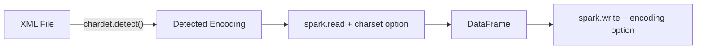

# Encoding

Read and write XML with different character encodings.



---

## Supported Encodings

| Encoding | Option Value | Use Case |
|---|---|---|
| UTF-8 | `"UTF-8"` | Default, most common |
| UTF-16 | `"UTF-16"` | Windows / BOM-prefixed files |
| ISO-8859-1 | `"ISO-8859-1"` | Legacy Western European |

---

## Detect Encoding

Use `chardet` to detect the encoding before reading:

```python
import chardet

with open(xml_file, mode="rb") as f:
    detected = chardet.detect(f.read())
    print(detected)  # {'encoding': 'UTF-16', 'confidence': 1.0, ...}
```

---

## Read with Encoding

```python
df = (
    spark.read.format("xml")
    .option("rowTag", "book")
    .option("charset", "UTF-16")
    .option("multiLine", True)
    .load(data_file)
)
df.show(truncate=False)
```

!!! info
    Set `multiLine: True` when reading files with multi-byte encodings or BOM markers.

---

## Write with Encoding

```python
(
    df.write.mode("overwrite")
    .format("xml")
    .option("rootTag", "catalog")
    .option("rowTag", "book")
    .option("version", "1.0")
    .option("encoding", "UTF-16")
    .option("charset", "UTF-16")
    .save(output_path)
)
```

!!! tip
    Set **both** `encoding` (XML declaration) and `charset` (actual byte encoding) to the same value for consistency.

---

## Complete Round-Trip Example

```python
import codecs
import chardet

# Write XML with specific encoding
xml_content = """<?xml version="1.0" encoding="utf-16"?>
<catalog>
   <book id="bk101">
      <author>Müller, François</author>
      <title>XML Developer's Guide</title>
      <price>44.95</price>
   </book>
</catalog>"""

with codecs.open(data_file, mode="w", encoding="utf-16") as f:
    f.write(xml_content)

# Verify encoding
with open(data_file, mode="rb") as f:
    print(chardet.detect(f.read()))

# Read
df = (
    spark.read.format("xml")
    .option("rowTag", "book")
    .option("charset", "UTF-16")
    .option("multiLine", True)
    .load(data_file)
)

# Write back
(
    df.write.mode("overwrite").format("xml")
    .option("rootTag", "catalog")
    .option("rowTag", "book")
    .option("encoding", "UTF-16")
    .option("charset", "UTF-16")
    .save(f"{data_file}_output")
)
```

> **Source:** `src/spark_xml/encoding/`
