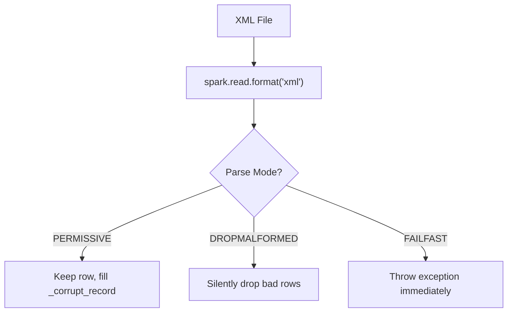

# Error Handling

Handle malformed XML records gracefully.



---

## Parse Modes

| Mode | Behavior |
|---|---|
| `PERMISSIVE` | *(default)* Keeps malformed rows with null fields; captures raw XML in `_corrupt_record` column |
| `DROPMALFORMED` | Silently drops rows that don't match the schema |
| `FAILFAST` | Throws an exception on the first malformed record |

---

## PERMISSIVE Mode (Default)

```python
from pyspark.sql.types import LongType, StringType, StructField, StructType, TimestampType

schema = StructType([
    StructField("id", LongType(), True),
    StructField("created_at", TimestampType(), True),
    StructField("_corrupt_record", StringType()),
])

df = (
    spark.read.format("xml")
    .option("rowTag", "record")
    .option("mode", "PERMISSIVE")
    .option("columnNameOfCorruptRecord", "_corrupt_record")
    .schema(schema)
    .load(xml_file)
)

# Good rows have _corrupt_record = null
# Bad rows have data fields = null, _corrupt_record = raw XML
df.show(truncate=False)
```

!!! info
    You **must** include `_corrupt_record` (or your custom name) in the schema for it to be populated.

> **Source:** `src/spark_xml/reader/date_time/custom_date_time_reader_before.py`

---

## FAILFAST Mode

```python
df = (
    spark.read.format("xml")
    .option("rowTag", "record")
    .option("mode", "FAILFAST")
    .load(xml_file)
)
# Throws SparkException on first bad row
```

!!! warning
    Use `FAILFAST` only when you're confident the data is clean, or in validation pipelines where you want to catch issues early.

---

## DROPMALFORMED Mode

```python
df = (
    spark.read.format("xml")
    .option("rowTag", "record")
    .option("mode", "DROPMALFORMED")
    .load(xml_file)
)
# Bad rows are silently dropped — count may be less than expected
```

---

## Custom Date Parsing Errors

When using `dateFormat`, unparseable dates produce corrupt records:

```python
df = (
    spark.read.format("xml")
    .option("rowTag", "record")
    .option("dateFormat", "dd-MM-yyyy")
    .option("columnNameOfCorruptRecord", "_corrupt_record")
    .option("mode", "PERMISSIVE")
    .schema(schema)
    .load(xml_file)
)

# Filter to find corrupt rows
df.filter(df._corrupt_record.isNotNull()).show(truncate=False)
```

---

## XSD Validation Errors

Combine `rowValidationXSDPath` with parse modes:

```python
# Permissive — invalid rows captured
df = (
    spark.read.format("com.databricks.spark.xml")
    .option("rowTag", "Root")
    .option("rowValidationXSDPath", "orders.xsd")
    .option("mode", "PERMISSIVE")
    .load(xml_file)
)

# Failfast — exception on first invalid row
df = (
    spark.read.format("com.databricks.spark.xml")
    .option("rowTag", "Root")
    .option("rowValidationXSDPath", "orders.xsd")
    .option("mode", "FAILFAST")
    .load(xml_file)
)
```
