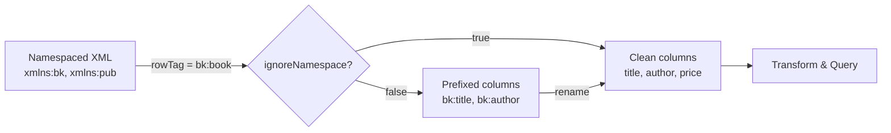
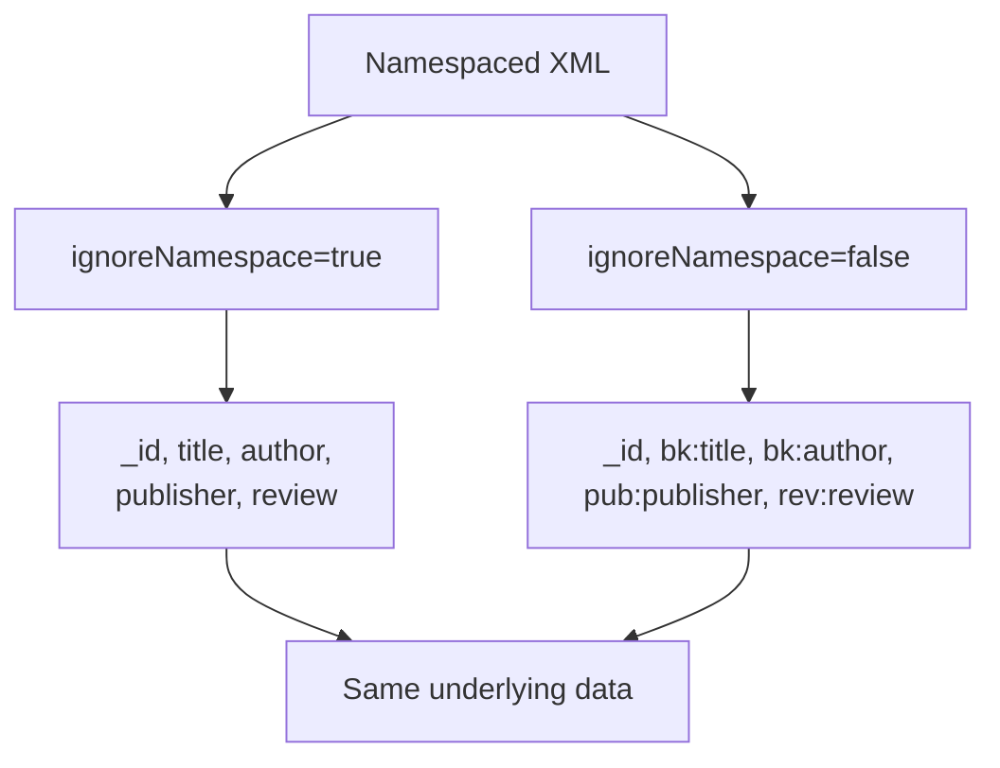

# Namespaces

Handle XML namespace prefixes during reads and writes with spark-xml.



---

## What Are XML Namespaces?

XML namespaces avoid element name collisions when combining vocabularies.
A namespace is declared with `xmlns` and a URI, optionally with a prefix:

```xml
<!-- Prefixed namespaces -->
<catalog xmlns:bk="http://example.com/books"
         xmlns:pub="http://example.com/publisher">
  <bk:book>
    <bk:title>XML Guide</bk:title>
    <pub:publisher>Acme Press</pub:publisher>
  </bk:book>
</catalog>

<!-- Default (unprefixed) namespace -->
<employees xmlns="http://example.com/hr">
  <employee>
    <name>Alice</name>
  </employee>
</employees>
```

!!! info "Namespace Types"
    | Type | Declaration | Column Effect |
    |---|---|---|
    | **Prefixed** | `xmlns:bk="URI"` | `bk:title` (with `ignoreNamespace=false`) |
    | **Default** | `xmlns="URI"` | `title` (no prefix in either mode) |

---

## The `ignoreNamespace` Option

The `ignoreNamespace` option controls whether namespace prefixes appear in DataFrame column names.
The `rowTag` **always requires the prefix** regardless of this setting.

| Setting | Column Names | Best For |
|---|---|---|
| `ignoreNamespace=true` | `title`, `author`, `publisher` | Most use cases — clean, easy names |
| `ignoreNamespace=false` | `bk:title`, `bk:author`, `pub:publisher` | Distinguishing same-named elements across namespaces |

---

## Ignore Namespaces (Recommended)

Strip prefixes for clean column names:

```python
df = (
    spark.read.format("xml")
    .option("rowTag", "bk:book")          # (1)!
    .option("ignoreNamespace", "true")    # (2)!
    .load(xml_file)
)
df.printSchema()
df.show(truncate=False)
```

1. The `rowTag` still requires the namespace prefix.
2. Column names will be `title`, `author`, `price` — no `bk:` prefix.

**Schema output:**

```
root
 |-- _id: long
 |-- title: string
 |-- author: string
 |-- price: struct
 |    |-- _VALUE: double
 |    |-- _currency: string
 |-- publisher: struct
 |    |-- name: string
 |    |-- year: long
```

### Accessing Nested Fields

With `ignoreNamespace=true`, nested fields from different namespace prefixes
(`pub:publisher`, `rev:review`) become simple struct access:

```python
df.selectExpr(
    "_id as book_id",
    "title",
    "author",
    "price._VALUE as price",
    "price._currency as currency",
    "publisher.name as publisher_name",   # was pub:publisher > pub:name
    "publisher.year as pub_year",
    "review.rating",                      # was rev:review > rev:rating
    "review.comment",
).show(truncate=False)
```

### Default Namespace

A default namespace (`xmlns="URI"` without a prefix) is transparent — the `rowTag`
uses the bare element name:

```python
# <employees xmlns="http://example.com/hr">
#   <employee><name>Alice</name></employee>
# </employees>

df = (
    spark.read.format("xml")
    .option("rowTag", "employee")         # bare name — no prefix needed
    .option("ignoreNamespace", "true")
    .load(xml_file)
)
# Columns: id, name, department, salary
```

### Mixed Default + Prefixed Namespaces

When a document has both a default namespace and prefixed namespaces,
`ignoreNamespace=true` strips all prefixes:

```python
# <inventory xmlns="http://example.com/inventory"
#            xmlns:loc="http://example.com/location"
#            xmlns:sup="http://example.com/supplier">
#   <product>
#     <name>Sensor</name>
#     <loc:warehouse><loc:city>Chicago</loc:city></loc:warehouse>
#     <sup:supplier><sup:name>SensorTech</sup:name></sup:supplier>
#   </product>

df = (
    spark.read.format("xml")
    .option("rowTag", "product")
    .option("ignoreNamespace", "true")
    .load(xml_file)
)
# Columns: name, category, price, warehouse (struct), supplier (struct)
```

!!! warning "Name Collisions"
    If two different namespaces define elements with the same local name
    (e.g., `bk:name` and `pub:name`), `ignoreNamespace=true` may merge
    them into a single column.  Use `ignoreNamespace=false` in that case.

> **Source:** `src/spark_xml/namespace/ignore_namespace_xml.py`

---

## Preserve Namespaces

Column names retain the namespace prefix:

```python
df = (
    spark.read.format("xml")
    .option("rowTag", "bk:book")
    .option("ignoreNamespace", "false")   # this is the default
    .load(xml_file)
)
df.printSchema()
```

**Schema output:**

```
root
 |-- _id: long
 |-- bk:author: string
 |-- bk:genre: string
 |-- bk:price: struct
 |    |-- _VALUE: double
 |    |-- _currency: string
 |-- bk:title: string
 |-- pub:publisher: struct
 |    |-- pub:city: string
 |    |-- pub:name: string
 |    |-- pub:year: long
 |-- rev:review: struct
 |    |-- rev:comment: string
 |    |-- rev:rating: double
```

### Accessing Prefixed Columns — SQL Expressions

Columns containing `:` must be wrapped in **backticks** in SQL expressions:

```python
df.selectExpr(
    "_id as book_id",
    "`bk:title` as title",                           # (1)!
    "`bk:author` as author",
    "`bk:price`._VALUE as price",
    "`pub:publisher`.`pub:name` as publisher_name",   # (2)!
    "`rev:review`.`rev:rating` as rating",
).show(truncate=False)
```

1. Backtick-escape each prefixed column name.
2. Nested prefixed structs require backticks at each level.

### Accessing Prefixed Columns — col() API

The `col()` function also supports backtick escaping:

```python
from pyspark.sql import functions as F

df.select(
    F.col("_id").alias("book_id"),
    F.col("`bk:title`").alias("title"),
    F.col("`bk:price`._VALUE").alias("price"),
    F.col("`rev:review`.`rev:rating`").alias("rating"),
).show(truncate=False)
```

### Filtering on Prefixed Columns

```python
# Filter: books rated above 4.2
df.filter(
    F.col("`rev:review`.`rev:rating`") > 4.2
).selectExpr(
    "`bk:title` as title",
    "`rev:review`.`rev:rating` as rating",
).show(truncate=False)
```

> **Source:** `src/spark_xml/namespace/namespace_xml.py`

---

## Renaming Prefixed Columns

Prefixed column names are awkward for downstream use (Parquet, Delta, SQL).
Best practice: rename immediately after reading.

### Manual Rename

```python
df_clean = df.selectExpr(
    "_id as book_id",
    "`bk:title` as title",
    "`bk:author` as author",
    "`pub:publisher`.`pub:name` as publisher_name",
)
```

### Automated Rename

Strip all namespace prefixes programmatically:

```python
def strip_ns_prefix(df):
    """Remove namespace prefixes from all column names."""
    for col_name in df.columns:
        if ":" in col_name:
            local_name = col_name.split(":")[-1]
            df = df.withColumnRenamed(col_name, local_name)
    return df

df_clean = strip_ns_prefix(df)
# Before: ['bk:author', 'bk:title', 'pub:publisher', 'rev:review']
# After:  ['author', 'title', 'publisher', 'review']
```

!!! tip
    Nested struct fields keep their prefixes even after top-level rename.
    Use `selectExpr` with aliases for a fully clean schema.

---

## Namespaced Attributes

XML attributes can also have namespace prefixes.
Both `ignoreNamespace` settings handle them:

```xml
<data xmlns:meta="http://example.com/metadata"
      xmlns:val="http://example.com/validation">
  <record meta:created="2024-01-15" val:status="verified">
    <id>1</id>
    <content>Record with namespaced attributes</content>
  </record>
</data>
```

=== "ignoreNamespace=true"

    ```python
    df = (
        spark.read.format("xml")
        .option("rowTag", "record")
        .option("ignoreNamespace", "true")
        .load(xml_file)
    )
    # Columns: _created, _status, content, id
    # Attribute prefixes (meta:, val:) are stripped
    ```

=== "ignoreNamespace=false"

    ```python
    df = (
        spark.read.format("xml")
        .option("rowTag", "record")
        .option("ignoreNamespace", "false")
        .load(xml_file)
    )
    # Columns: meta:created, val:status, content, id
    # Access: F.col("`meta:created`")
    ```

---

## Schema Comparison

Reading the same document with both settings produces different column names
but identical data:



| Preserved (`false`) | Ignored (`true`) |
|---|---|
| `_id` | `_id` |
| `bk:title` | `title` |
| `bk:author` | `author` |
| `bk:genre` | `genre` |
| `bk:price` | `price` |
| `pub:publisher` | `publisher` |
| `rev:review` | `review` |

---

## Explicit Schema

When using an explicit `StructType`, field names must match the column naming mode:

=== "ignoreNamespace=true"

    ```python
    from pyspark.sql.types import *

    schema = StructType([
        StructField("_id", LongType(), True),
        StructField("title", StringType(), True),       # plain name
        StructField("author", StringType(), True),
        StructField("publisher", StructType([
            StructField("name", StringType(), True),     # plain name
            StructField("year", LongType(), True),
        ]), True),
    ])

    df = (
        spark.read.format("xml")
        .option("rowTag", "bk:book")
        .option("ignoreNamespace", "true")
        .schema(schema)
        .load(xml_file)
    )
    ```

=== "ignoreNamespace=false"

    ```python
    from pyspark.sql.types import *

    schema = StructType([
        StructField("_id", LongType(), True),
        StructField("bk:title", StringType(), True),    # prefixed name
        StructField("bk:author", StringType(), True),
        StructField("pub:publisher", StructType([
            StructField("pub:name", StringType(), True), # prefixed name
            StructField("pub:year", LongType(), True),
        ]), True),
    ])

    df = (
        spark.read.format("xml")
        .option("rowTag", "bk:book")
        .option("ignoreNamespace", "false")
        .schema(schema)
        .load(xml_file)
    )
    ```

---

## Write Round-Trip

When writing a DataFrame as XML, spark-xml uses column names as element names.
**No `xmlns` declarations are generated** in the output — regardless of how it was read.

```python
# Read with namespaces ignored
df = (
    spark.read.format("xml")
    .option("rowTag", "bk:book")
    .option("ignoreNamespace", "true")
    .load(xml_file)
)

# Flatten and write
df_flat = df.selectExpr(
    "title", "author", "price._VALUE as price",
    "publisher.name as publisher_name",
)

(
    df_flat.write.format("xml")
    .mode("overwrite")
    .option("rootTag", "catalog")
    .option("rowTag", "book")
    .save(output_path)
)
```

**Output XML** (no `xmlns`, no prefixes):

```xml
<catalog>
  <book>
    <title>Learning PySpark</title>
    <author>Alice Johnson</author>
    <price>45.99</price>
    <publisher_name>Tech Books Inc.</publisher_name>
  </book>
</catalog>
```

---

## Quick Reference

| Behavior | `ignoreNamespace=true` | `ignoreNamespace=false` |
|---|---|---|
| `rowTag` | Requires prefix (`bk:book`) | Requires prefix (`bk:book`) |
| Element columns | `title`, `author` | `bk:title`, `bk:author` |
| Nested columns | `publisher.name` | `` `pub:publisher`.`pub:name` `` |
| Attribute columns | `_created`, `_status` | `_meta:created`, `_val:status` |
| Default namespace | Bare names | Bare names |
| Column access | Direct: `df["title"]` | Backticks: `` F.col("`bk:title`") `` |
| Explicit schema | Plain field names | Prefixed field names |
| Written XML | No `xmlns` | No `xmlns` |

!!! tip "When to use each mode"
    Use **`ignoreNamespace=true`** (recommended) for most use cases — cleaner
    column names, easier transformations, no backtick escaping needed.

    Use **`ignoreNamespace=false`** only when you need to distinguish
    identically-named elements from different namespaces (e.g., `bk:name`
    vs `pub:name` must remain separate columns).

---

## Common Pitfalls

!!! failure "Missing prefix in rowTag"
    ```python
    # ✗ Wrong — will find zero rows
    spark.read.format("xml").option("rowTag", "book").load(...)

    # ✓ Correct — rowTag always needs the prefix
    spark.read.format("xml").option("rowTag", "bk:book").load(...)
    ```

!!! failure "Forgetting backticks with preserved namespaces"
    ```python
    # ✗ AnalysisException — colon is not valid in identifiers
    df.select("bk:title")

    # ✓ Correct — use backticks
    df.select("`bk:title`")
    df.select(F.col("`bk:title`"))
    ```

!!! failure "Name collisions when ignoring namespaces"
    If your XML has `<bk:name>` and `<pub:name>` in the same row,
    `ignoreNamespace=true` may merge them into a single `name` column.
    Use `ignoreNamespace=false` and rename selectively instead.

---

> **Source files:**
>
> - `src/spark_xml/namespace/ignore_namespace_xml.py`
> - `src/spark_xml/namespace/namespace_xml.py`
