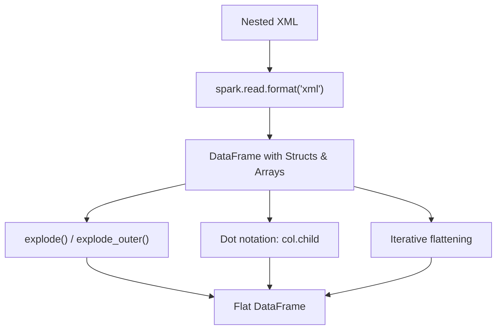

# Nested XML

Techniques for reading and flattening deeply nested XML structures.



---

## Dot Notation for Struct Fields

Access nested struct fields directly:

```python
df = spark.read.format("xml").option("rowTag", "DWHBatch").load(xml_file)

df.select(
    "Header.BatchId",
    "Header.TotalNoOfRecords",
    "Records.Issuance",
).show()
```

> **Source:** `src/spark_xml/nested/nested_xml.py`

---

## Explode Arrays

Use `explode()` to turn array elements into rows:

```python
from pyspark.sql.functions import col, explode

df = spark.read.format("xml").option("rowTag", "catalog").load(xml_file)

flat_df = (
    df.withColumn("book", explode(col("book")))
    .select("dt_creation", "book.*")
)
flat_df.show(truncate=False)
```

> **Source:** `src/spark_xml/nested/array_of_struct.py`

---

## Positional Explode

Use `posexplode()` to keep the array index alongside the value:

```python
from pyspark.sql.functions import col, posexplode

books = spark.read.format("xml").option("rowTag", "foo").load(xml_file)

books = (
    books.select(posexplode(col("bar")))
    .withColumnRenamed("col", "bar")
    .select("pos", "bar.sum", "bar.periods.start", "bar.periods.end")
)
books.show(truncate=False)
```

> **Source:** `src/spark_xml/stack_overlfow/stack_overflow_array.py`

---

## Iterative Flattening

Recursively flatten all `StructType` and `ArrayType` columns in a single pass:

```python
from pyspark.sql import DataFrame
from pyspark.sql.types import ArrayType, StructType


def flatten_iterative(dataframe: DataFrame) -> DataFrame:
    """Recursively flatten all nested structs and arrays."""
    df = dataframe
    flag = True
    while flag:
        flag = False
        for field in df.schema.fields:
            field_names = [f.name for f in df.schema.fields]
            if isinstance(field.dataType, ArrayType):
                flag = True
                others = [n for n in field_names if n != field.name]
                others.append(f"explode_outer({field.name}) as {field.name}")
                df = df.selectExpr(*others)
            elif isinstance(field.dataType, StructType):
                flag = True
                struct_cols = [
                    f"{field.name}.{child.name} as {field.name}_{child.name}"
                    for child in field.dataType.fields
                ]
                others = [n for n in field_names if n != field.name]
                others.extend(struct_cols)
                df = df.selectExpr(*others)
    return df
```

Usage:

```python
df = spark.read.format("xml").option("rowTag", "DWHBatch").load(xml_file)
flat_df = flatten_iterative(df)
flat_df.show(truncate=False)
```

> **Source:** `src/spark_xml/nested/nested_xml.py`

---

## Parse XML Column (from_xml JVM Bridge)

Parse XML stored in a string column into a struct:

```python
# Infer schema from the XML column
payload_schema = ext_schema_of_xml_df(spark, df.select("content"))

# Parse XML column
parsed = df.withColumn(
    "parsed",
    ext_from_xml(spark, df.content, payload_schema, {"rowTag": "Level_0"})
)

# Access nested fields
df2 = parsed.select(
    "parsed._Id0",
    explode_outer("parsed.Level_1.Level_2.Level_3.Level_4").alias("Level_4"),
)
df2.select("_Id0", "Level_4.*").show()
```

> **Source:** `src/spark_xml/nested/parsing_xml_column.py`

---

## Parse XML Column (Python UDF)

Use `xml.etree.ElementTree` in a UDF for simple cases:

```python
import xml.etree.ElementTree as ET
from pyspark.sql.functions import udf
from pyspark.sql.types import StructType, StructField, StringType, FloatType


def parse_xml(xml_str):
    if xml_str is None:
        return None
    root = ET.fromstring(xml_str)
    return (
        root.find("title").text,
        root.find("author").text,
        float(root.find("price").text),
    )


xml_schema = StructType([
    StructField("title", StringType(), True),
    StructField("author", StringType(), True),
    StructField("price", FloatType(), True),
])
parse_xml_udf = udf(parse_xml, xml_schema)

result_df = df.withColumn("parsed", parse_xml_udf("xml_data")).select("id", "parsed.*")
```

> **Source:** `src/spark_xml/stack_overlfow/xml_column/spark_xml_column.py`

!!! tip "When to use which approach"
    - **`from_xml` JVM bridge** — best performance, supports full spark-xml features, requires `spark-xml` JAR
    - **Python UDF** — simpler setup, no JAR dependency, but slower (data serialized between JVM and Python)
