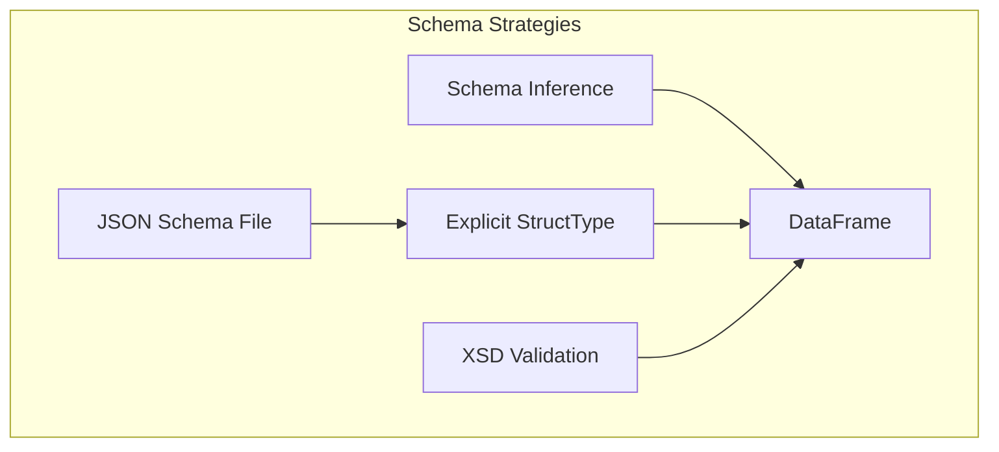

# Schema Handling

Control how XML maps to DataFrame schemas — inferred, explicit, JSON-based, or XSD-validated.



---

## Schema Inference (Default)

spark-xml infers the schema by scanning the XML. Simple but can be inaccurate for complex or sparse documents.

```python
df = spark.read.format("xml").option("rowTag", "person").load(path)
df.printSchema()
```

!!! warning
    Schema inference requires a full pass over the data and may produce incorrect types for nested or optional elements. Use explicit schemas for production.

---

## Explicit StructType

Define the schema in code for full control:

```python
from pyspark.sql.types import (
    ArrayType, DoubleType, LongType, StringType,
    StructField, StructType, TimestampType,
)

schema = StructType([
    StructField("Customers", StructType([
        StructField("Customer", ArrayType(StructType([
            StructField("CompanyName", StringType(), True),
            StructField("ContactName", StringType(), True),
            StructField("FullAddress", StructType([
                StructField("Address", StringType(), True),
                StructField("City", StringType(), True),
                StructField("Country", StringType(), True),
                StructField("PostalCode", LongType(), True),
            ]), True),
            StructField("_CustomerID", StringType(), True),
        ]), True), True),
    ]), True),
    StructField("Orders", StructType([
        StructField("Order", ArrayType(StructType([
            StructField("CustomerID", StringType(), True),
            StructField("OrderDate", TimestampType(), True),
            StructField("ShipInfo", StructType([
                StructField("Freight", DoubleType(), True),
                StructField("ShipCity", StringType(), True),
                StructField("_ShippedDate", TimestampType(), True),
            ]), True),
        ]), True), True),
    ]), True),
])

orders = (
    spark.read.format("com.databricks.spark.xml")
    .option("rowTag", "Root")
    .schema(schema)
    .load(xml_file)
)
```

> **Source:** `src/spark_xml/schema/xml_schema_validator_schema.py`

---

## JSON Schema File

Store the schema externally as JSON and load at read time:

```python
import json
from pyspark.sql.types import StructType

with open("notes_schema.json") as f:
    schema = StructType.fromJson(json.load(f))

df = (
    spark.read.format("xml")
    .option("rowTag", "note")
    .option("excludeAttribute", "true")
    .option("ignoreNamespace", "true")
    .schema(schema)
    .load(xml_file)
)
```

!!! tip "Schema Portability"
    Export a schema with `df.schema.jsonValue()` and save as JSON for reuse across jobs.

> **Source:** `src/spark_xml/schema/json/read_schema_in_json.py`

---

## XSD Validation

Validate each XML row against an XSD schema during read:

```python
# Add XSD to Spark's distributed file system
spark.sparkContext.addFile("orders.xsd")

df = (
    spark.read.format("com.databricks.spark.xml")
    .option("rowTag", "Root")
    .option("rowValidationXSDPath", "orders.xsd")
    .load(xml_file)
)
```

### Strict Validation (FAILFAST)

```python
df = (
    spark.read.format("com.databricks.spark.xml")
    .option("rowTag", "Root")
    .option("rowValidationXSDPath", "orders.xsd")
    .option("mode", "FAILFAST")
    .load(xml_file)
)
```

!!! warning
    `FAILFAST` mode throws an exception on the first invalid row. Use `PERMISSIVE` (default) to capture invalid rows in `_corrupt_record`.

> **Source:** `src/spark_xml/schema/xsd/`

---

## XSD Validation via SQL

```python
spark.sql(f"""
    CREATE TABLE orders USING xml
    OPTIONS (
        path 'file:///{xml_file}',
        rowTag 'Root',
        rowValidationXSDPath 'orders.xsd',
        inferSchema 'false'
    )
""")
spark.sql("SELECT * FROM orders").show()
```

---

## Python-Side XSD Validation

Validate XML files using `xmlschema` outside of Spark:

```python
import xmlschema

schema = xmlschema.XMLSchema("orders.xsd")
try:
    schema.validate("orders.xml")
    print("✅ Valid!")
except xmlschema.XMLSchemaValidationError as e:
    print(f"❌ {e}")
```

> **Source:** `src/spark_xml/util/validation/validate_xml_xsd.py`
