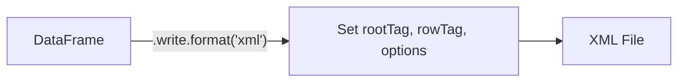

# Writing XML

Write Spark DataFrames to XML files.



---

## Basic Write

```python
df.write.format("xml") \
    .mode("overwrite") \
    .option("rootTag", "people") \
    .option("rowTag", "person") \
    .save(output_path)
```

!!! info "rootTag vs rowTag"
    - **`rootTag`** — the single wrapper element for the entire document (e.g., `<people>`)
    - **`rowTag`** — the repeating element for each DataFrame row (e.g., `<person>`)

---

## Write with Compression

```python
df.write.format("xml") \
    .mode("overwrite") \
    .option("rootTag", "people") \
    .option("rowTag", "person") \
    .option("compression", "gzip") \
    .save(output_path)
```

See [Compression](compression.md) for all supported codecs.

---

## Write with Encoding

```python
df.write.mode("overwrite") \
    .format("xml") \
    .option("rootTag", "catalog") \
    .option("rowTag", "book") \
    .option("version", "1.0") \
    .option("encoding", "UTF-16") \
    .option("charset", "UTF-16") \
    .save(output_path)
```

See [Encoding](encoding.md) for details.

---

## Write from In-Memory Data

```python
data = [("Alice", 30, "Engineering"), ("Bob", 25, "Marketing")]
df = spark.createDataFrame(data, ["name", "age", "department"])

df.write.format("xml") \
    .mode("overwrite") \
    .option("rootTag", "company") \
    .option("rowTag", "employee") \
    .save("employees.xml")
```

---

## Key Write Options

| Option | Description | Default |
|---|---|---|
| `rootTag` | Root wrapper element | `rows` |
| `rowTag` | Per-row element | `row` |
| `declaration` | Include XML declaration | `true` |
| `version` | XML version in declaration | `1.0` |
| `encoding` | Encoding in declaration | `UTF-8` |
| `charset` | Write encoding | `UTF-8` |
| `compression` | Compression codec | *(none)* |
| `nullValue` | String for null values | *(none)* |
| `attributePrefix` | Prefix for attribute columns | `_` |
| `valueTag` | Tag for element text when attributes exist | `_VALUE` |
