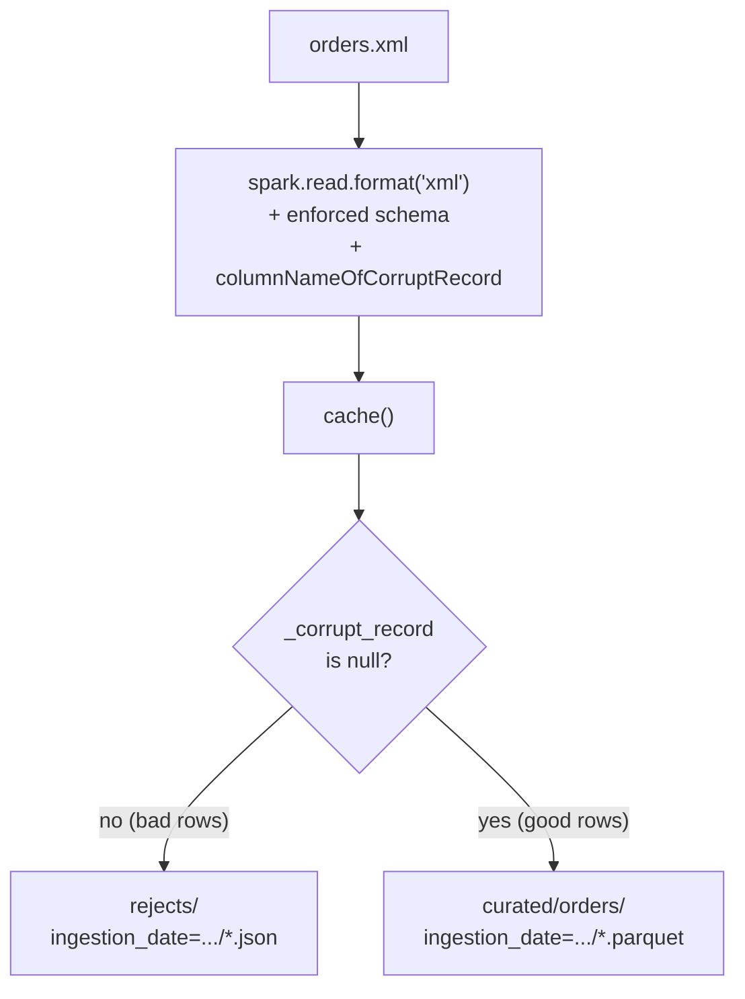

# Enterprise Patterns

Patterns for running spark-xml ingestion in a production batch environment:
a shared `SparkSession` factory, structured logging, enforced schemas, and
corrupt-record quarantine instead of silent data loss.



---

## SparkSession Factory

Use `get_spark_session()` instead of building `SparkSession.builder` inline in
every script. It centralizes master resolution (`SPARK_MASTER` env var),
warehouse directory creation, adaptive query execution, and log level:

```python
from spark_xml.util.session.spark_session_util import get_spark_session

spark = get_spark_session(app_name="etl-pipeline-orders")
```

**Parameters:**

| Parameter | Default | Description |
|---|---|---|
| `app_name` | *(required)* | Spark application name |
| `master` | `SPARK_MASTER` env var, else `local[*]` | Spark master URL |
| `warehouse_dir` | `SPARK_WAREHOUSE` env var, else `/tmp/spark-warehouse` | `spark.sql.warehouse.dir` (created if missing) |
| `log_level` | `"WARN"` | Passed to `sparkContext.setLogLevel` |
| `use_external_spark_xml_jar` | `False` | Set `True` only for Spark < 4.0, to add the Databricks `spark-xml` package |
| `scala_version`, `spark_xml_version` | `"2.12"`, `"0.17.0"` | Used only when `use_external_spark_xml_jar=True` |
| `extra_conf` | `None` | Extra `dict` of Spark configuration overrides |

> **Source:** `src/spark_xml/util/session/spark_session_util.py`

---

## Corrupt-Record Quarantine

Rather than `FAILFAST` (abort the whole batch) or `DROPMALFORMED` (silently
lose rows), enforce a schema with a `_corrupt_record` column, `cache()` the
raw read, split good vs. bad rows, and persist the rejects separately:

```python
raw = (
    spark.read.format("xml")
    .option("rowTag", "Root")
    .option("mode", "PERMISSIVE")
    .option("columnNameOfCorruptRecord", "_corrupt_record")
    .schema(ORDERS_SCHEMA)
    .load(xml_file)
    .cache()  # required: Spark disallows lazily querying only the corrupt-record column
)

rejects = raw.filter(F.col("_corrupt_record").isNotNull())
good = raw.filter(F.col("_corrupt_record").isNull()).drop("_corrupt_record")
```

!!! warning
    Spark raises `UNSUPPORTED_FEATURE.QUERY_ONLY_CORRUPT_RECORD_COLUMN` if you
    query only `_corrupt_record` against a *lazy* (uncached) read. Call
    `.cache()` (or write the parsed result first) before filtering/counting.

---

## Idempotent, Partitioned Sink

Write curated output partitioned by ingestion date with `mode("overwrite")`
so re-running the job for the same date is safe:

```python
from datetime import date

curated_path = output_dir / "curated" / "orders" / f"ingestion_date={date.today().isoformat()}"
orders.write.mode("overwrite").parquet(str(curated_path))
```

---

## Structured Logging

Prefer the standard `logging` module over `print()` so log level, timestamps,
and logger names are consistent and filterable in production:

```python
import logging

logging.basicConfig(level=logging.INFO, format="%(asctime)s %(levelname)s %(name)s - %(message)s")
logger = logging.getLogger("etl_pipeline_orders")

logger.info("Reading orders XML from %s", xml_file)
logger.warning("Quarantining %d corrupt record(s) to %s", reject_count, rejects_path)
```

---

## Full Example

See `examples/enterprise/etl_pipeline_orders.py` for the complete, runnable
pipeline combining all of the above:

```bash
uv run --package spark-xml python examples/enterprise/etl_pipeline_orders.py
```
