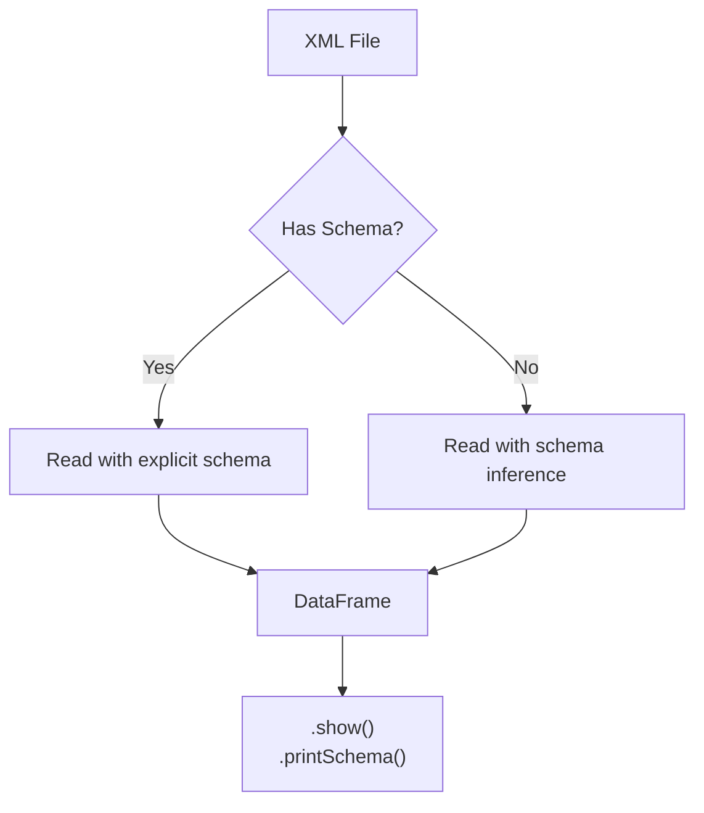

# Reading XML

Read XML files into Spark DataFrames using the `xml` format.



---

## Basic Read

```python
df = (
    spark.read.format("xml")
    .option("rowTag", "person")
    .load(xml_file_path)
)
df.show(truncate=False)
df.printSchema()
```

!!! info "`rowTag` is required"
    The `rowTag` option specifies which XML element maps to a DataFrame row. Without it, spark-xml cannot parse the file.

---

## Read with Explicit Schema

```python
from pyspark.sql.types import StructType, StructField, StringType, LongType

schema = StructType([
    StructField("name", StringType(), True),
    StructField("age", LongType(), True),
])

df = (
    spark.read.format("xml")
    .option("rowTag", "person")
    .schema(schema)
    .load(xml_file)
)
```

!!! tip "Performance"
    Providing an explicit schema avoids a full scan for inference and is strongly recommended for production workloads or deeply nested XML.

---

## Read with JSON Schema

Load the schema from an external JSON file:

```python
import json
from pyspark.sql.types import StructType

with open("schema/notes_schema.json") as f:
    schema = StructType.fromJson(json.load(f))

df = (
    spark.read.format("xml")
    .option("rowTag", "note")
    .option("excludeAttribute", "true")
    .option("ignoreNamespace", "true")
    .schema(schema)
    .load(xml_file)
)
```

> **Source:** `examples/schema/json/read_schema_in_json.py`

---

## Read from HTTP / API

Fetch XML from a remote API, write to a temp file, then read with spark-xml:

```python
import tempfile
import requests

data = requests.get(url=url, verify=ca_path).text

with tempfile.NamedTemporaryFile(delete=False, suffix=".xml") as f:
    f.write(data.encode("utf-8"))
    temp_path = f.name

options = {"rowTag": "person", "multiLine": True, "mode": "FAILFAST"}
df = spark.read.format("xml").options(**options).load(temp_path)
```

> **Source:** `examples/collection/read_api_xml_collection.py`

---

## Read via Pandas Bridge

Use `pandas.read_xml()` then convert to a Spark DataFrame:

```python
import pandas as pd

pdf = pd.read_xml(xml_string)
spark_df = spark.createDataFrame(pdf)
```

> **Source:** `examples/collection/read_xml_string_pandas.py`

---

## Parse XML String Column

Parse XML stored as a string column using Spark 4's built-in `from_xml` and
`schema_of_xml` functions — no JVM bridge required:

```python
from pyspark.sql.functions import from_xml, schema_of_xml, lit
```

Usage:

```python
options = {"rowTag": "Level_0"}

# Infer the schema from a representative row, then parse the column.
sample = df.select("content").first()["content"]
payload_schema = df.select(schema_of_xml(lit(sample), options)).first()[0]
parsed = df.withColumn("parsed", from_xml("content", payload_schema, options))
```

> **Source:** `examples/nested/parsing_xml_column.py`

---

## Date / Time Parsing

### Default Parsing (ISO 8601)

```python
from pyspark.sql.types import StructType, StructField, StringType, TimestampType, DateType

schema = StructType([
    StructField("id", StringType(), True),
    StructField("created_at", TimestampType(), True),
    StructField("birth_date", DateType(), True),
])

df = spark.read.format("xml").option("rowTag", "record").schema(schema).load(path)
```

### Custom Date Format

```python
df = (
    spark.read.format("xml")
    .option("rowTag", "record")
    .option("dateFormat", "dd-MM-yyyy")
    .option("columnNameOfCorruptRecord", "_corrupt_record")
    .option("mode", "PERMISSIVE")
    .schema(schema)
    .load(xml_file)
)
```

> **Source:** `examples/reader/date_time/`

---

## Key Read Options

| Option | Description | Default |
|---|---|---|
| `rowTag` | XML element mapped to rows | *(required)* |
| `schema` | Explicit `StructType` | inferred |
| `excludeAttribute` | Skip XML attributes | `false` |
| `ignoreNamespace` | Strip namespace prefixes | `false` |
| `mode` | `PERMISSIVE` / `FAILFAST` / `DROPMALFORMED` | `PERMISSIVE` |
| `charset` | Character encoding | `UTF-8` |
| `multiLine` | Multi-line XML parsing | `false` |
| `dateFormat` | Custom date pattern | ISO 8601 |
| `timestampFormat` | Custom timestamp pattern | ISO 8601 |
| `columnNameOfCorruptRecord` | Column for malformed rows | `_corrupt_record` |
| `rowValidationXSDPath` | XSD for row validation | *(none)* |
