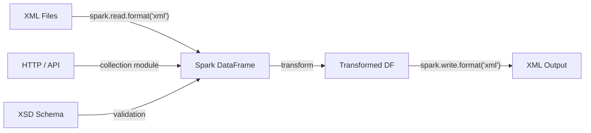

# Spark XML — PySpark XML Processing

A comprehensive PySpark project demonstrating XML reading, writing, parsing, validating, and transforming using the **built-in XML data source** in Apache Spark 4.0+ (`spark.read.format("xml")`, `from_xml`, `schema_of_xml`).



---

## Features

| Feature | Description | Module |
|---|---|---|
| **Read / Write** | Round-trip XML through DataFrames | `reader/`, `writer/` |
| **Schema Handling** | Explicit `StructType`, JSON schema, XSD validation | `schema/` |
| **Nested XML** | Flatten structs & arrays with `explode` | `nested/` |
| **Encoding** | UTF-8, UTF-16, ISO-8859-1 support | `encoding/` |
| **Compression** | gzip, bzip2, deflate, snappy | `compression/` |
| **Namespaces** | Preserve or ignore XML namespaces | `namespace/` |
| **Attributes** | Map XML attributes to columns with prefix | `attribute/` |
| **Value Tags** | Access `_VALUE` for mixed-content elements | `value_tag/` |
| **SQL Interface** | `CREATE TABLE USING xml` | `sql/` |
| **Error Handling** | `PERMISSIVE` / `FAILFAST` corrupt record handling | `error/` |
| **Utilities** | XML/XSD generation, validation, encoding detection | `util/` |

---

## Quick Start

```bash
# Install dependencies
uv sync

# Run any example script
uv run python examples/compression/spark_xml_gzip.py
```

```python
from pyspark.sql import SparkSession

spark = SparkSession.builder.master("local[*]").appName("spark-xml").getOrCreate()

# Read XML
df = spark.read.format("xml").option("rowTag", "person").load("people.xml")
df.show()

# Write XML
df.write.format("xml") \
    .option("rootTag", "people") \
    .option("rowTag", "person") \
    .save("output.xml")
```

---

## Project Structure

```
spark-xml/
├── src/spark_xml/        # Reusable library / helper / utility code
│   └── util/             # XML data generation, XSD generation & validation
├── examples/             # Runnable usage / demo scripts (one dir per feature)
├── docs/                 # This documentation (MkDocs)
├── pyproject.toml        # Project config & dependencies
├── mkdocs.yml            # MkDocs configuration
└── README.md
```

!!! tip "Next Steps"
    Head to [Getting Started](getting-started.md) for installation and environment setup, or jump straight to the [User Guide](guide/reading.md).
