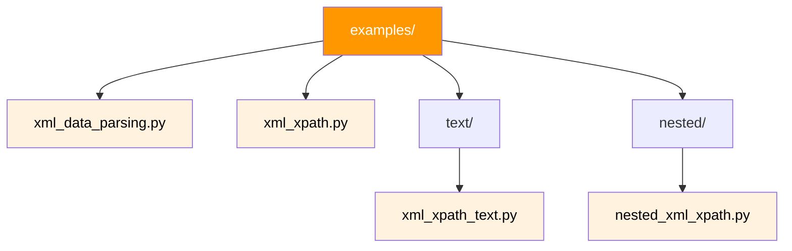

# API Reference

Source code inventory and module descriptions for the `spark-xpath` project.

---

## Module Overview



---

## Modules

### `examples/xml_data_parsing.py`

:material-tag: **Basic Parsing** · :material-file-document: [Example](examples/basic-parsing.md)

Demonstrates loading **inline XML strings** into a PySpark DataFrame and
extracting values with `xpath_string` and wildcard expressions.

| Aspect | Detail |
|---|---|
| XPath functions used | `xpath_string` |
| Input method | Inline XML strings via `createDataFrame()` |
| Number of records | 2 XML messages |
| Key pattern | Wildcard extraction (`Msg/Header/*`) |

```python
# Core pattern
data = ["<Msg><Header><tag1>value</tag1>...</Header>...</Msg>"]
df = spark.createDataFrame(data, StringType()).withColumnRenamed("value", "data")
df.createOrReplaceTempView("xml_df")
spark.sql("SELECT xpath_string(data, 'Msg/Header/tag1') FROM xml_df")
```

---

### `examples/xml_xpath.py`

:material-tag: **Credit Evaluation** · :material-file-document: [Example](examples/credit-evaluation.md)

The most complex module — parses **namespaced credit-evaluation XML** from
Experian/Equifax and applies conditional business logic with `CASE` expressions.

| Aspect | Detail |
|---|---|
| XPath functions used | `xpath_string`, `xpath_boolean` |
| Input method | Inline XML strings (5 records) |
| Number of records | 5 credit applications |
| Key patterns | Namespace stripping, attribute selectors (`[@cxArrayIndex=1]`), boolean predicates, `CASE` logic |

**Extracted fields include:**

- Application metadata (date, status, reference number)
- Equifax risk model scores and reason codes
- Experian risk model scores and identifiers
- Boolean flags for model validation
- Computed `finalScore` using multi-condition `CASE`

---

### `examples/xml_xpath_numeric.py`

:material-tag: **Numeric Extraction** · :material-file-document: [Example](examples/numeric-extraction.md)

Demonstrates `xpath_int`, `xpath_double`, inline arithmetic (subtotals, tax),
and `GROUP BY` aggregations on xpath-extracted numeric values.

| Aspect | Detail |
|---|---|
| XPath functions used | `xpath_int`, `xpath_double`, `xpath_string` |
| Input method | Inline XML strings (4 order records) |
| Key patterns | Arithmetic on extracted values, `ROUND()`, `SUM()`/`AVG()` aggregation |

---

### `examples/xml_xpath_conditional.py`

:material-tag: **Conditional Logic** · :material-file-document: [Example](examples/conditional-logic.md)

Demonstrates `xpath_boolean` in `WHERE` filters, multi-branch `CASE`
expressions, `COALESCE`/`NULLIF` fallbacks for missing elements, and
conditional computation.

| Aspect | Detail |
|---|---|
| XPath functions used | `xpath_boolean`, `xpath_int`, `xpath_double`, `xpath_string` |
| Input method | Inline XML strings (5 employee records) |
| Key patterns | `WHERE xpath_boolean(...)`, `CASE`, `COALESCE(NULLIF(..., ''))` |

---

### `examples/xml_xpath_flatten.py`

:material-tag: **Array Flattening** · :material-file-document: [Example](examples/array-flattening.md)

Demonstrates `explode()`, `posexplode()`, `arrays_zip()`, and `LATERAL VIEW`
for flattening xpath arrays into individual rows with aggregation.

| Aspect | Detail |
|---|---|
| XPath functions used | `xpath`, `xpath_string` |
| Input method | Inline XML strings (2 catalog records) |
| Key patterns | `explode(xpath(...))`, `arrays_zip`, `posexplode`, CTE + aggregation |

---

### `examples/text/xml_xpath_text.py`

:material-tag: **Array Extraction** · :material-file-document: [Example](examples/basic-parsing.md#array-extraction-with-xpath)

Demonstrates the `xpath()` function for extracting **arrays** of values from
repeating XML elements using the PySpark DataFrame API.

| Aspect | Detail |
|---|---|
| XPath functions used | `xpath` (returns `ARRAY<STRING>`) |
| Input method | Inline XML string via `createDataFrame()` |
| Number of records | 1 |
| Key pattern | `xpath(df.x, lit('a/b/text()'))` with `/text()` suffix |
| API style | PySpark DataFrame API (not SQL) |

```python
# Core pattern
from pyspark.sql.functions import xpath, lit

df.select(xpath(df.x, lit('a/b/text()')).alias('values')).collect()
# Returns: [Row(values=['b1', 'b2', 'b3'])]
```

---

### `examples/nested/nested_xml_xpath.py`

:material-tag: **File-based XML** · :material-file-document: [Example](examples/nested-xml.md)

Reads **whole XML files** from disk using `spark.read.text(wholetext=True)` and
extracts values from deeply nested document structures.

| Aspect | Detail |
|---|---|
| XPath functions used | `xpath_string` |
| Input method | XML file via `spark.read.text(wholetext=True)` |
| Key pattern | `wholetext=True` for multi-line XML |
| Environment | Requires `DATA_HOME` environment variable |

!!! tip "When to use this pattern"
    Use `spark.read.text(wholetext=True)` when your XML is stored as files on
    disk rather than as inline strings in your code.

---

## Test Module

### `tests/xml/test_xml_array_xpath.py`

:material-tag: **Test Suite** · :material-file-document: [Testing Guide](testing.md)

Comprehensive pytest test suite with **6 test cases** covering all major XPath
patterns.

**`test_xml_array_xpath.py`** — 6 tests (string, wildcard, array, boolean, namespace, multi-row)

| Test | Function Tested | Pattern |
|---|---|---|
| `test_xpath_string_extracts_header_fields` | `xpath_string` | Named field extraction |
| `test_xpath_string_wildcard` | `xpath_string` | Wildcard `*` matching |
| `test_xpath_array_extraction` | `xpath` | Array of repeating elements |
| `test_xpath_boolean` | `xpath_boolean` | Predicate evaluation |
| `test_xpath_with_namespaced_xml` | `xpath_string` | Namespace prefix stripping |
| `test_xpath_multiple_rows` | `xpath_string` | Multi-row consistency |

**`test_xpath_numeric.py`** — 5 tests (int, double, arithmetic, missing, aggregation)

| Test | Function Tested | Pattern |
|---|---|---|
| `test_xpath_int_extracts_integer` | `xpath_int` | Integer extraction |
| `test_xpath_double_extracts_decimal` | `xpath_double` | Double extraction |
| `test_xpath_numeric_arithmetic` | `xpath_int` × `xpath_double` | Inline math |
| `test_xpath_int_missing_element_returns_zero` | `xpath_int` | Missing → 0 |
| `test_xpath_numeric_aggregation` | `SUM`/`AVG` on `xpath_int` | Aggregation |

**`test_xpath_conditional.py`** — 4 tests (WHERE filter, CASE, COALESCE, combined)

| Test | Function Tested | Pattern |
|---|---|---|
| `test_xpath_boolean_where_filter` | `xpath_boolean` | WHERE clause filtering |
| `test_case_on_xpath_values` | `xpath_int` | CASE categorization |
| `test_coalesce_fallback_for_missing_element` | `xpath_string` | COALESCE + NULLIF |
| `test_combined_boolean_and_case` | `xpath_boolean` | Conditional computation |

**`test_xpath_flatten.py`** — 5 tests (explode, zip, posexplode, parent context, aggregation)

| Test | Function Tested | Pattern |
|---|---|---|
| `test_explode_xpath_array` | `xpath` + `explode` | Basic array flattening |
| `test_arrays_zip_parallel_arrays` | `xpath` + `arrays_zip` | Parallel array zipping |
| `test_posexplode_tracks_position` | `xpath` + `posexplode` | Position tracking |
| `test_explode_with_parent_context` | `xpath` + `xpath_string` | Parent context retention |
| `test_aggregation_after_explode` | `xpath` + `explode` + `SUM` | Post-flatten aggregation |

**Fixture:** Session-scoped `SparkSession` shared across all tests for performance.

---

## Configuration Files

| File | Purpose |
|---|---|
| `pyproject.toml` | Project metadata, dependencies, and dev tools (managed by uv) |
| `mkdocs.yml` | Documentation site configuration (Material theme) |
| `uv.lock` | Locked dependency versions for reproducible installs |
| `.github/workflows/ci.yml` | GitHub Actions CI pipeline (pytest + mkdocs build) |

---

## Spark XPath Function Quick Reference

For use in any module — all functions operate on a `STRING` column containing XML:

| Function | Returns | Use When |
|---|---|---|
| `xpath_string(col, expr)` | `STRING` | You need the first matching text value |
| `xpath(col, expr)` | `ARRAY<STRING>` | You need all matching values |
| `xpath_boolean(col, expr)` | `BOOLEAN` | You need to test a condition |
| `xpath_int(col, expr)` | `INT` | You need an integer value |
| `xpath_double(col, expr)` | `DOUBLE` | You need a decimal value |
| `xpath_long(col, expr)` | `LONG` | You need a large integer value |
| `xpath_short(col, expr)` | `SHORT` | You need a small integer value |
| `xpath_float(col, expr)` | `FLOAT` | You need a float value |
| `xpath_number(col, expr)` | `DOUBLE` | Alias for xpath_double |

See the [XPath Functions Reference](xpath-functions.md) for full documentation
and examples.
