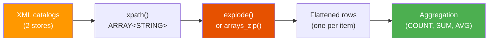

# Array Flattening

This example demonstrates **exploding XPath arrays** into individual rows,
zipping parallel arrays together, tracking element positions, and performing
aggregations on flattened data.

:material-file-code: **Source:** `src/xpath/xml_xpath_flatten.py`  
:material-test-tube: **Tests:** `tests/xpath/test_xpath_flatten.py`

---

## Data Flow



---

## The XML

Each row is a product catalog for a store, containing multiple items with
names, prices, and tags:

```xml title="Sample catalog"
<catalog>
  <store>Downtown</store>
  <item>
    <name>Laptop</name>
    <price>999.99</price>
    <tag>electronics</tag>
    <tag>computing</tag>
  </item>
  <item>
    <name>Mouse</name>
    <price>29.99</price>
    <tag>electronics</tag>
    <tag>accessory</tag>
  </item>
  <item>
    <name>Desk</name>
    <price>249.00</price>
    <tag>furniture</tag>
    <tag>office</tag>
  </item>
</catalog>
```

| Store | Items |
|---|---|
| Downtown | Laptop ($999.99), Mouse ($29.99), Desk ($249.00) |
| Airport | Headphones ($199.00), Charger ($39.99) |

---

## Pattern 1 — Basic explode

Flatten repeating elements into individual rows with `explode()`:

```sql title="Explode item names"
SELECT
    xpath_string(data, 'catalog/store')              AS store,
    explode(xpath(data, 'catalog/item/name/text()')) AS item_name  -- (1)!
FROM catalogs
```

1.  `xpath()` returns `ARRAY<STRING>` → `explode()` creates one row per element.

??? success "Expected output"
    | store | item_name |
    |---|---|
    | Downtown | Laptop |
    | Downtown | Mouse |
    | Downtown | Desk |
    | Airport | Headphones |
    | Airport | Charger |

!!! info "How explode works"
    Each array element becomes a **new row**, while non-array columns
    (`store`) are duplicated for each exploded row.

---

## Pattern 2 — Zip Parallel Arrays

When you have **parallel arrays** (names and prices in the same order), use
`arrays_zip` + `explode` to keep them aligned:

```sql title="Zip names + prices"
SELECT
    xpath_string(data, 'catalog/store') AS store,
    zipped.`0`                          AS item_name,
    zipped.`1`                          AS item_price
FROM catalogs
LATERAL VIEW explode(
    arrays_zip(                                              -- (1)!
        xpath(data, 'catalog/item/name/text()'),
        xpath(data, 'catalog/item/price/text()')
    )
) t AS zipped                                                -- (2)!
```

1.  `arrays_zip` pairs up elements by position: `[{"0":"Laptop","1":"999.99"}, ...]`
2.  `LATERAL VIEW explode(...) t AS zipped` unpacks each struct into a column named `zipped`; access fields via `.0`, `.1`.

??? success "Expected output"
    | store | item_name | item_price |
    |---|---|---|
    | Downtown | Laptop | 999.99 |
    | Downtown | Mouse | 29.99 |
    | Downtown | Desk | 249.00 |
    | Airport | Headphones | 199.00 |
    | Airport | Charger | 39.99 |

!!! warning "Array alignment"
    `arrays_zip` assumes both `xpath()` calls return arrays of the **same length**
    in the **same order**. This works when the XML elements are siblings under
    the same parent (e.g., `<name>` and `<price>` both inside `<item>`).

---

## Pattern 3 — Position Tracking with posexplode

Use `posexplode` to get the **0-based index** of each element:

```sql title="Tags with positions"
SELECT
    xpath_string(data, 'catalog/store')  AS store,
    pos + 1                              AS tag_position,  -- (1)!
    tag
FROM catalogs
LATERAL VIEW posexplode(
    xpath(data, 'catalog/item/tag/text()')
) AS pos, tag
```

1.  `posexplode` returns a 0-based index (`pos`). Add 1 for human-readable numbering.

??? success "Expected output (Downtown store)"
    | store | tag_position | tag |
    |---|---|---|
    | Downtown | 1 | electronics |
    | Downtown | 2 | computing |
    | Downtown | 3 | electronics |
    | Downtown | 4 | accessory |
    | Downtown | 5 | furniture |
    | Downtown | 6 | office |

---

## Pattern 4 — CTE + Computed Columns

Combine a CTE with `arrays_zip` to add computed columns on flattened data:

```sql title="Items with tax calculation"
WITH store_items AS (
    SELECT
        xpath_string(data, 'catalog/store') AS store,
        arrays_zip(
            xpath(data, 'catalog/item/name/text()'),
            xpath(data, 'catalog/item/price/text()')
        ) AS items
    FROM catalogs
)
SELECT
    store,
    item.`0`                                   AS name,      -- (1)!
    CAST(item.`1` AS DOUBLE)                   AS price,
    ROUND(CAST(item.`1` AS DOUBLE) * 1.08, 2)  AS price_with_tax
FROM store_items
LATERAL VIEW explode(items) t AS item
ORDER BY store, price DESC
```

1.  `arrays_zip` returns struct columns accessed by position: `.0`, `.1`, etc.

??? success "Expected output"
    | store | name | price | price_with_tax |
    |---|---|---|---|
    | Airport | Headphones | 199.00 | 214.92 |
    | Airport | Charger | 39.99 | 43.19 |
    | Downtown | Laptop | 999.99 | 1079.99 |
    | Downtown | Desk | 249.00 | 268.92 |
    | Downtown | Mouse | 29.99 | 32.39 |

---

## Pattern 5 — Aggregation After Flattening

Explode first, then aggregate for store-level summaries:

```sql title="Store-level aggregation"
WITH flattened AS (
    SELECT
        xpath_string(data, 'catalog/store')               AS store,
        explode(xpath(data, 'catalog/item/price/text()')) AS price_str
    FROM catalogs
)
SELECT
    store,
    COUNT(*)                                  AS item_count,
    ROUND(SUM(CAST(price_str AS DOUBLE)), 2)  AS total_value,
    ROUND(AVG(CAST(price_str AS DOUBLE)), 2)  AS avg_price
FROM flattened
GROUP BY store
```

??? success "Expected output"
    | store | item_count | total_value | avg_price |
    |---|---|---|---|
    | Downtown | 3 | 1278.98 | 426.33 |
    | Airport | 2 | 238.99 | 119.50 |

---

## Functions Used

| Function | Purpose |
|---|---|
| `xpath(col, 'path/text()')` | Extract array of all matching text nodes |
| `explode(array)` | Flatten array → one row per element |
| `posexplode(array)` | Flatten with 0-based position index |
| `arrays_zip(arr1, arr2)` | Pair up elements from parallel arrays |
| `LATERAL VIEW` | SQL syntax for exploding alongside other columns |
| `CAST(str AS DOUBLE)` | Convert string array elements to numbers |

---

## Running

```bash
uv run python src/xpath/xml_xpath_flatten.py
```

---

## Key Takeaways

| Concept | Pattern |
|---|---|
| Flatten repeating elements | `explode(xpath(data, 'path/text()'))` |
| Keep parent context | `xpath_string(data, '...')` alongside `explode(...)` |
| Zip parallel arrays | `arrays_zip(xpath(...), xpath(...))` |
| Position tracking | `posexplode(xpath(...)) AS pos, val` |
| Post-flatten aggregation | CTE with explode → GROUP BY |
| String → number | `CAST(price_str AS DOUBLE)` |
