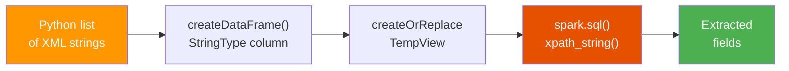

# Basic XML Parsing

This example shows how to load **inline XML strings** into a PySpark DataFrame
and extract values using `xpath_string` and `xpath`.

:material-file-code: **Source:** `src/xpath/xml_data_parsing.py`  
:material-file-code: **Array Source:** `src/xpath/text/xml_xpath_text.py`

---

## Data Flow



---

## The XML

This example uses a simple message format with a `Header` and a `Body`
containing repeating `Pair` elements:

```xml title="Sample XML structure"
<Msg>
  <Header>
    <tag1>some str1</tag1>
    <tag2>2</tag2>
    <tag3>2022-02-16 10:39:26.730</tag3>
  </Header>
  <Body>
    <Pair><N>N1</N><V>V1</V></Pair>
    <Pair><N>N2</N><V>V2</V></Pair>
    <Pair><N>N3</N><V>V3</V></Pair>
  </Body>
</Msg>
```

!!! note "Multi-row dataset"
    The actual source file contains **two** XML strings (two rows in the
    DataFrame), each with different header values and body pairs.

---

## Code Walkthrough

### Step 1 — Create the DataFrame

```python title="src/xpath/xml_data_parsing.py" linenums="1"
from pyspark.sql import SparkSession
from pyspark.sql.types import StringType

spark = SparkSession.builder.master("local[*]").appName("xml_data").getOrCreate()

data = [
    "<Msg><Header><tag1>some str1</tag1><tag2>2</tag2>"
    "<tag3>2022-02-16 10:39:26.730</tag3></Header>"
    "<Body><Pair><N>N1</N><V>V1</V></Pair>"
    "<Pair><N>N2</N><V>V2</V></Pair>"
    "<Pair><N>N3</N><V>V3</V></Pair></Body></Msg>",

    "<Msg><Header><tag1>some str2</tag1><tag2>5</tag2>"
    "<tag3>2022-02-17 10:39:26.730</tag3></Header>"
    "<Body><Pair><N>N4</N><V>V4</V></Pair>"
    "<Pair><N>N5</N><V>V5</V></Pair></Body></Msg>",
]

df = spark.createDataFrame(data, StringType()) \
    .withColumnRenamed("value", "data")       # (1)!

df.createOrReplaceTempView("xml_df")          # (2)!
```

1.  PySpark assigns the default column name `value` when creating from strings.
    We rename it to `data` for clarity in SQL expressions.
2.  Registering a temp view lets us use Spark SQL to query this DataFrame.

??? info "DataFrame schema"
    ```
    root
     |-- data: string (nullable = true)
    ```

---

### Step 2 — Extract with Wildcard

```sql title="Wildcard extraction"
SELECT xpath_string(data, 'Msg/Header/*') FROM xml_df
```

The wildcard `*` matches the **first** child element under `Header`.

??? success "Expected output"
    | xpath_string(data, Msg/Header/*) |
    |---|
    | `some str1` |
    | `some str2` |

---

### Step 3 — Extract Specific Fields

```sql title="Named field extraction"
SELECT
    xpath_string(data, 'Msg/Header/tag1') AS tag1,
    xpath_string(data, 'Msg/Header/tag2') AS tag2,
    xpath_string(data, 'Msg/Header/tag3') AS tag3
FROM xml_df
```

??? success "Expected output"
    | tag1 | tag2 | tag3 |
    |---|---|---|
    | `some str1` | `2` | `2022-02-16 10:39:26.730` |
    | `some str2` | `5` | `2022-02-17 10:39:26.730` |

!!! tip "Return type is always STRING"
    Even though `tag2` contains a number, `xpath_string` returns it as a string.
    Use `xpath_int` or `CAST` if you need a numeric type.

---

## Array Extraction with xpath()

When XML contains **repeating elements**, use `xpath()` to extract all values
into an array.

=== "PySpark DataFrame API"

    ```python title="src/xpath/text/xml_xpath_text.py"
    from pyspark.sql.functions import xpath, lit

    df = spark.createDataFrame(
        [('<a><b>b1</b><b>b2</b><b>b3</b><c>c1</c><c>c2</c></a>',)],
        ['x']
    )

    df.select(xpath(df.x, lit('a/b/text()')).alias('b_values')).show()
    df.select(xpath(df.x, lit('a/c/text()')).alias('c_values')).show()
    ```

=== "Spark SQL"

    ```sql
    SELECT
        xpath(data, 'Msg/Body/Pair/N/text()') AS names,
        xpath(data, 'Msg/Body/Pair/V/text()') AS values
    FROM xml_df
    ```

??? success "Expected output"
    **`a/b/text()`:**

    | b_values |
    |---|
    | `[b1, b2, b3]` |

    **`a/c/text()`:**

    | c_values |
    |---|
    | `[c1, c2]` |

    **Body pairs (row 1):**

    | names | values |
    |---|---|
    | `[N1, N2, N3]` | `[V1, V2, V3]` |

!!! tip "The `text()` suffix"
    Use `/text()` at the end of the XPath when you want the **text content**
    of matching elements. Without it, `xpath()` may return empty strings.

---

## Running This Example

```bash
uv run python src/xpath/xml_data_parsing.py
```

---

## Key Takeaways

| Concept | Pattern |
|---|---|
| Load inline XML | `spark.createDataFrame(list, StringType())` |
| Rename column | `.withColumnRenamed("value", "data")` |
| Enable SQL | `.createOrReplaceTempView("name")` |
| Extract single value | `xpath_string(col, 'path')` |
| Wildcard first child | `xpath_string(col, 'Parent/*')` |
| Extract array | `xpath(col, 'path/text()')` |

---

## Next Steps

- :material-file-tree: [Nested XML](nested-xml.md) — Read whole XML files from disk
- :material-bank: [Credit Evaluation](credit-evaluation.md) — Namespaces + business logic
