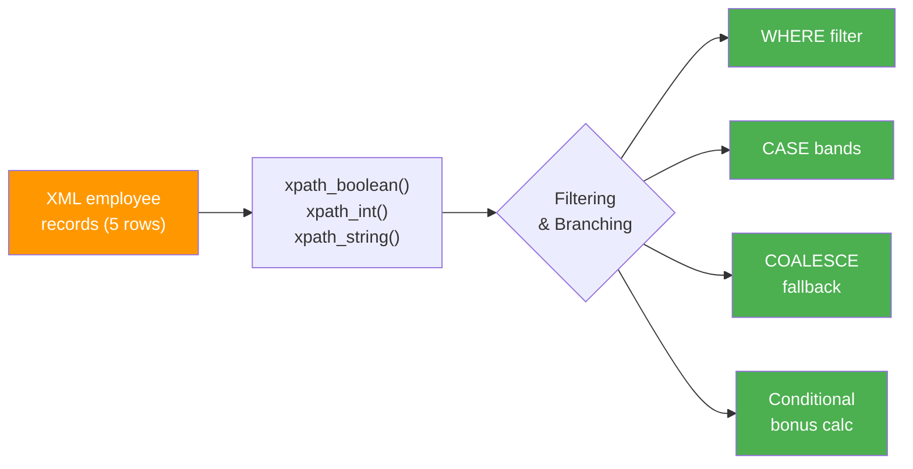

# Conditional Logic

This example demonstrates **filtering, branching, and fallback** patterns
using `xpath_boolean` in `WHERE` clauses, `CASE` expressions for multi-branch
logic, and `COALESCE` for handling missing XML elements.

:material-file-code: **Source:** `examples/xml_xpath_conditional.py`  
:material-test-tube: **Tests:** `tests/xpath/test_xpath_conditional.py`

---

## Data Flow



---

## The XML

Each row is an employee record with salary, level, remote status, and bonus percentage:

```xml title="Sample employee"
<employee>
  <id>E001</id>
  <name>Alice</name>
  <department>Engineering</department>
  <salary>120000</salary>
  <level>Senior</level>
  <remote>true</remote>
  <bonus_pct>0.15</bonus_pct>
</employee>
```

| ID | Name | Department | Salary | Level | Remote | Bonus % |
|---|---|---|---|---|---|---|
| E001 | Alice | Engineering | 120,000 | Senior | ✅ | 15% |
| E002 | Bob | Sales | 85,000 | Mid | ❌ | 10% |
| E003 | Carol | Engineering | 95,000 | Mid | ✅ | 12% |
| E004 | Dave | HR | 70,000 | Junior | ❌ | 5% |
| E005 | Eve | Engineering | 150,000 | Lead | ✅ | 20% |

---

## Pattern 1 — WHERE Filtering with xpath_boolean

Use `xpath_boolean` in a `WHERE` clause to filter rows based on XML content:

```sql title="Filter high earners"
SELECT
    xpath_string(data, 'employee/name')       AS name,
    xpath_int(data, 'employee/salary')        AS salary,
    xpath_string(data, 'employee/department') AS dept
FROM employees
WHERE xpath_boolean(data, 'employee[salary >= 100000]')  -- (1)!
```

1.  The XPath predicate `[salary >= 100000]` evaluates inside the XML — only
    rows where the condition is true pass through.

??? success "Expected output"
    | name | salary | dept |
    |---|---|---|
    | Alice | 120000 | Engineering |
    | Eve | 150000 | Engineering |

!!! tip "Boolean predicates are powerful"
    You can use `and`, `or`, comparison operators, and even functions inside
    XPath predicates:

    ```sql
    WHERE xpath_boolean(data, 'employee[salary >= 100000 and department="Engineering"]')
    ```

---

## Pattern 2 — Multi-Branch CASE

Categorize extracted values using SQL `CASE` expressions:

```sql title="Salary band classification"
SELECT
    xpath_string(data, 'employee/name')  AS name,
    xpath_int(data, 'employee/salary')   AS salary,
    CASE
        WHEN xpath_int(data, 'employee/salary') >= 140000 THEN 'Band 4 - Executive'
        WHEN xpath_int(data, 'employee/salary') >= 100000 THEN 'Band 3 - Senior'
        WHEN xpath_int(data, 'employee/salary') >= 80000  THEN 'Band 2 - Mid'
        ELSE 'Band 1 - Entry'
    END AS salary_band                                       -- (1)!
FROM employees
```

1.  CASE evaluates top-to-bottom; the first matching branch wins.

??? success "Expected output"
    | name | salary | salary_band |
    |---|---|---|
    | Alice | 120000 | Band 3 - Senior |
    | Bob | 85000 | Band 2 - Mid |
    | Carol | 95000 | Band 2 - Mid |
    | Dave | 70000 | Band 1 - Entry |
    | Eve | 150000 | Band 4 - Executive |

---

## Pattern 3 — COALESCE Fallback

When XML elements may be **missing**, use `COALESCE` with `NULLIF` to provide
fallback values:

```sql title="Fallback for missing elements"
SELECT
    xpath_string(data, 'employee/name') AS name,
    COALESCE(
        NULLIF(xpath_string(data, 'employee/title'), ''),  -- (1)!
        NULLIF(xpath_string(data, 'employee/level'), ''),  -- (2)!
        'Unknown'                                          -- (3)!
    ) AS display_title
FROM employees
```

1.  Try `<title>` first — `NULLIF(..., '')` converts empty string to `null`.
2.  Fall back to `<level>` if title is missing.
3.  Final fallback: literal string `'Unknown'`.

!!! info "Why NULLIF?"
    `xpath_string` returns an **empty string** `""` (not `null`) when an
    element doesn't exist. `NULLIF(value, '')` converts that to `null` so
    `COALESCE` can skip it.

??? success "Expected output"
    | name | display_title |
    |---|---|
    | Alice | Senior |
    | Bob | Mid |
    | Carol | Mid |
    | Dave | Junior |
    | Eve | Lead |

---

## Pattern 4 — Conditional Computation

Combine `xpath_boolean` inside a `CASE` to compute different values per row:

```sql title="Remote worker bonus adjustment"
SELECT
    xpath_string(data, 'employee/name')        AS name,
    xpath_int(data, 'employee/salary')         AS salary,
    xpath_string(data, 'employee/remote')      AS remote,
    xpath_double(data, 'employee/bonus_pct')   AS bonus_pct,
    CASE
        WHEN xpath_boolean(data, 'employee[remote="true"]')    -- (1)!
            THEN ROUND(
                xpath_int(data, 'employee/salary')
                * xpath_double(data, 'employee/bonus_pct')
                * 1.1,                                         -- (2)!
                2
            )
        ELSE ROUND(
            xpath_int(data, 'employee/salary')
            * xpath_double(data, 'employee/bonus_pct'),
            2
        )
    END AS bonus_amount
FROM employees
```

1.  `xpath_boolean` checks if `<remote>` contains `"true"`.
2.  Remote workers get a 10% bonus uplift (× 1.1).

??? success "Expected output"
    | name | salary | remote | bonus_pct | bonus_amount |
    |---|---|---|---|---|
    | Alice | 120000 | true | 0.15 | 19800.00 |
    | Bob | 85000 | false | 0.10 | 8500.00 |
    | Carol | 95000 | true | 0.12 | 12540.00 |
    | Dave | 70000 | false | 0.05 | 3500.00 |
    | Eve | 150000 | true | 0.20 | 33000.00 |

---

## Pattern Summary

| Pattern | When to Use | Key Functions |
|---|---|---|
| `WHERE xpath_boolean(...)` | Filter rows by XML content | `xpath_boolean` |
| `CASE WHEN xpath_int(...) >= N` | Categorize/band values | `xpath_int`, `xpath_string` |
| `COALESCE(NULLIF(..., ''), ...)` | Handle missing elements | `xpath_string`, `NULLIF`, `COALESCE` |
| `CASE WHEN xpath_boolean(...)` | Conditional computation | `xpath_boolean`, `xpath_int`, `xpath_double` |

---

## Running

```bash
uv run python examples/xml_xpath_conditional.py
```

---

## Key Takeaways

| Concept | Pattern |
|---|---|
| Filter rows | `WHERE xpath_boolean(data, 'elem[predicate]')` |
| Classify values | `CASE WHEN xpath_int(...) >= N THEN 'label'` |
| Missing element fallback | `COALESCE(NULLIF(xpath_string(...), ''), default)` |
| Conditional math | `CASE WHEN xpath_boolean(...) THEN expr * factor` |
| Empty → null | `NULLIF(xpath_string(data, 'path'), '')` |
