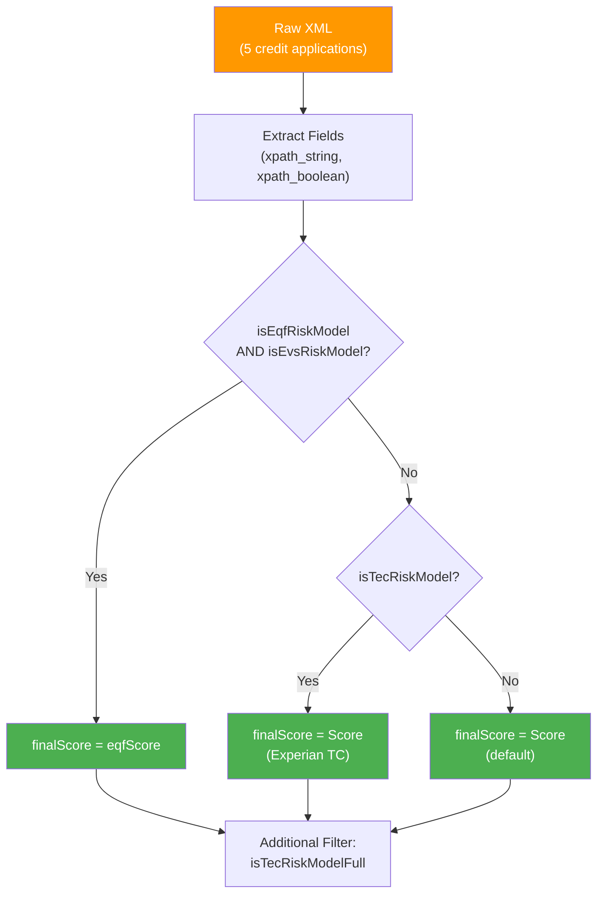

# Credit Evaluation XML

This is the most complex example — it parses **namespaced credit-evaluation XML**
from Experian and applies conditional business logic using `CASE` expressions
combined with `xpath_string`, `xpath_boolean`, and string comparisons.

:material-file-code: **Source:** `examples/xml_xpath.py`

---

## Business Logic Flow



---

## The XML Structure

Each record is a namespaced credit evaluation response containing three main
sections:

```xml title="Simplified structure"
<ns0:RespNewCreditEvaluation xmlns:ns0="http://eda.experian.com/bpc/">
  <InboundResponse>

    <!-- Section 1: Application metadata -->
    <DV-Application>
      <ApplicationNumber>000000008767050</ApplicationNumber>
      <ApplicationCreationDate>2023-03-21</ApplicationCreationDate>
      <ApplicationStatus>Approved</ApplicationStatus>
      <ReferenceNumber>zppCi1214d230</ReferenceNumber>
    </DV-Application>

    <!-- Section 2: Decision results -->
    <DV-Results>
      <RST cxArrayIndex="1">
        <CreditClass>INN88</CreditClass>
        <LiabilityIndicator>I</LiabilityIndicator>
        <DecisionCategory>Approve</DecisionCategory>
        <InitialRiskGroup>8</InitialRiskGroup>
      </RST>
    </DV-Results>

    <!-- Section 3: Bureau scores (Experian + Equifax) -->
    <BureauResult>
      <EXP>
        <RiskModel cxArrayIndex="1">
          <ScoreID>TC</ScoreID>
          <Score>533</Score>
          <Evaluation>P</Evaluation>
        </RiskModel>
      </EXP>
      <EQU>
        <RiskModel cxArrayIndex="1">
          <Score>590</Score>
          <ModelID>4</ModelID>
          <ModelNumber>5322</ModelNumber>
        </RiskModel>
      </EQU>
    </BureauResult>

  </InboundResponse>
</ns0:RespNewCreditEvaluation>
```

!!! warning "Namespace handling"
    The XML uses `ns0:` prefix, but Spark **automatically strips** namespace
    prefixes. Always use the **local name** in XPath expressions:

    ```sql
    -- ✅ Correct: use local name
    xpath_string(data, 'RespNewCreditEvaluation/InboundResponse/...')

    -- ❌ Wrong: don't include prefix
    xpath_string(data, 'ns0:RespNewCreditEvaluation/InboundResponse/...')
    ```

---

## Dataset

The source file contains **5 credit application records** as inline XML strings,
each representing a different applicant:

| # | ApplicationNumber | EXP Score | EQU Score | EQU ModelID |
|---|---|---|---|---|
| 1 | 000000008767050 | 533 (TC) | 590 | 4 |
| 2 | 000000008767044 | — | 990 | 4 |
| 3 | 000000008784476 | — (BIS/FSR) | — | — |
| 4 | 000000008784481 | — | 917 | 4 |
| 5 | *(additional)* | — | — | — |

!!! note "Not all records have both bureaus"
    Some records only have Equifax (`EQU`) data, others only Experian (`EXP`),
    and some have both. The business logic handles all cases.

---

## Full SQL Query Walkthrough

The query uses a **CTE** (`WITH` clause) to first extract all fields, then
applies business logic in the outer query.

### Step 1 — Field Extraction (CTE)

```sql title="Extract all fields from XML" linenums="1"
WITH riskModeCalc AS (
    SELECT
        data,

        -- Application metadata
        xpath_string(data,
            'RespNewCreditEvaluation/InboundResponse'
            '/DV-Application/ApplicationCreationDate'
        ) AS INQUIRY_DATE,                                      -- (1)!

        xpath_string(data,
            'RespNewCreditEvaluation/InboundResponse'
            '/DV-Application/ApplicationStatus'
        ) AS REPORT_TYPE,

        -- Decision results
        xpath_string(data,
            'RespNewCreditEvaluation/InboundResponse'
            '/DV-Results/RST[@cxArrayIndex=1]/LiabilityIndicator'
        ) AS LIABILITY_TYPES,                                   -- (2)!

        -- Equifax risk model fields
        xpath_string(data,
            'RespNewCreditEvaluation/InboundResponse'
            '/BureauResult/EQU/RiskModel[@cxArrayIndex=1]/ModelID'
        ) AS eqfRiskModelId,

        xpath_string(data,
            'RespNewCreditEvaluation/InboundResponse'
            '/BureauResult/EQU/RiskModel[@cxArrayIndex=1]/Score'
        ) AS eqfScore,

        xpath_string(data,
            'RespNewCreditEvaluation/InboundResponse'
            '/BureauResult/EQU/RiskModel[@cxArrayIndex=1]/ModelNumber'
        ) AS eqfModelNumber,

        -- Equifax reason codes
        xpath_string(data,
            'RespNewCreditEvaluation/InboundResponse'
            '/BureauResult/EQU/RiskModel[@cxArrayIndex=1]/ReasonCode1'
        ) AS eqfReasonCode1,

        xpath_string(data,
            'RespNewCreditEvaluation/InboundResponse'
            '/BureauResult/EQU/RiskModel[@cxArrayIndex=1]/ReasonCode2'
        ) AS eqfReasonCode2,

        xpath_string(data,
            'RespNewCreditEvaluation/InboundResponse'
            '/BureauResult/EQU/RiskModel[@cxArrayIndex=1]/ReasonCode3'
        ) AS eqfReasonCode3,

        xpath_string(data,
            'RespNewCreditEvaluation/InboundResponse'
            '/BureauResult/EQU/RiskModel[@cxArrayIndex=1]/ReasonCode4'
        ) AS eqfReasonCode4,

        -- Experian fields
        xpath_string(data,
            'RespNewCreditEvaluation/InboundResponse'
            '/BureauResult/EXP/RiskModel[@cxArrayIndex=1]/ScoreID'
        ) AS evsRiskModel,

        xpath_string(data,
            'RespNewCreditEvaluation/InboundResponse'
            '/BureauResult/EXP/RiskModel[@cxArrayIndex=1]/Score'
        ) AS Score,

        -- Boolean flags
        xpath_boolean(data,                                     -- (3)!
            'RespNewCreditEvaluation/InboundResponse/BureauResult'
            '/EQU/RiskModel[@cxArrayIndex=1]'
            '[ ModelID >= 2 and ModelID <= 4 ]'
        ) AS isEqfRiskModel,

        xpath_string(data,
            'RespNewCreditEvaluation/InboundResponse'
            '/BureauResult/EXP/RiskModel[@cxArrayIndex=1]/ScoreID'
        ) == 'EV' AS isEvsRiskModel,                            -- (4)!

        xpath_string(data,
            'RespNewCreditEvaluation/InboundResponse'
            '/BureauResult/EXP/RiskModel[@cxArrayIndex=1]/ScoreID'
        ) == 'TC' AS isTecRiskModel

    FROM xml_data
)
```

1.  Extracts the application creation date as a string.
2.  Uses `[@cxArrayIndex=1]` attribute selector to pick the first result set.
3.  `xpath_boolean` with an inline predicate: checks if ModelID is between 2 and 4.
4.  String comparison (`== 'EV'`) creates a boolean flag from `xpath_string` result.

### Step 2 — Business Logic (CASE)

```sql title="Apply scoring rules" linenums="1"
SELECT *,
    CASE
        WHEN isEqfRiskModel AND isEvsRiskModel THEN eqfScore   -- (1)!
        WHEN isTecRiskModel THEN Score                          -- (2)!
        ELSE Score                                              -- (3)!
    END AS finalScore,

    isTecRiskModel AND (
        instr(Score, '9') == 1                                  -- (4)!
        OR (CAST(Score AS INT) >= 0 AND CAST(Score AS INT) < 1000)
    ) AS isTecRiskModelFull

FROM riskModeCalc
```

1.  If both Equifax and Experian EV models exist → use Equifax score.
2.  If only Experian TC model exists → use Experian score.
3.  Default fallback → use available score.
4.  Additional validation: TC score starts with '9' or is in range 0–999.

---

## Extracted Fields Reference

| Field | XPath | Description |
|---|---|---|
| `INQUIRY_DATE` | `.../DV-Application/ApplicationCreationDate` | Application date |
| `REPORT_TYPE` | `.../DV-Application/ApplicationStatus` | Approved / Declined |
| `LIABILITY_TYPES` | `.../DV-Results/RST[@cxArrayIndex=1]/LiabilityIndicator` | I=Individual, B=Both |
| `eqfScore` | `.../BureauResult/EQU/RiskModel[@cxArrayIndex=1]/Score` | Equifax credit score |
| `eqfRiskModelId` | `.../BureauResult/EQU/RiskModel[@cxArrayIndex=1]/ModelID` | Equifax model ID |
| `evsRiskModel` | `.../BureauResult/EXP/RiskModel[@cxArrayIndex=1]/ScoreID` | Experian score type (TC/EV) |
| `Score` | `.../BureauResult/EXP/RiskModel[@cxArrayIndex=1]/Score` | Experian raw score |
| `isEqfRiskModel` | `xpath_boolean(... [ModelID >= 2 and ModelID <= 4])` | Equifax model in valid range |
| `isEvsRiskModel` | `ScoreID == 'EV'` | Is Experian EV model |
| `isTecRiskModel` | `ScoreID == 'TC'` | Is Experian TC model |

---

## XPath Techniques Used

### Attribute Selectors

```sql
-- Select RiskModel where cxArrayIndex = 1
xpath_string(data, '.../RiskModel[@cxArrayIndex=1]/Score')
```

### Boolean Predicates with Range

```sql
-- Check if ModelID is between 2 and 4 (inclusive)
xpath_boolean(data, '.../RiskModel[@cxArrayIndex=1][ ModelID >= 2 and ModelID <= 4 ]')
```

### String Comparison as Boolean

```sql
-- Compare xpath_string result with a literal to produce a boolean column
xpath_string(data, '.../ScoreID') == 'TC' AS isTecRiskModel
```

### CAST for Numeric Comparison

```sql
-- Cast string result to INT for numeric comparison
CAST(xpath_string(data, '.../Score') AS INT) >= 0
```

### INSTR for Pattern Matching

```sql
-- Check if score starts with '9'
instr(Score, '9') == 1
```

---

## Running

```bash
uv run python examples/xml_xpath.py
```

??? info "What to expect"
    The script prints the full DataFrame including all extracted fields,
    `finalScore`, and `isTecRiskModelFull` for all 5 application records.
    Output is wide — use a terminal with at least 200 columns or redirect
    to a file:

    ```bash
    uv run python examples/xml_xpath.py 2>/dev/null | less -S
    ```

---

## Key Takeaways

| Concept | Pattern |
|---|---|
| Namespace stripping | Use local names (`RespNewCreditEvaluation`, not `ns0:RespNewCreditEvaluation`) |
| Attribute selector | `RiskModel[@cxArrayIndex=1]` |
| Boolean predicate | `xpath_boolean(data, '...[ModelID >= 2 and ModelID <= 4]')` |
| String → boolean | `xpath_string(data, '...') == 'TC' AS flag` |
| CTE for reuse | Extract fields once in CTE, apply logic in outer query |
| Multi-bureau logic | CASE expression to select score based on available models |

---

## Next Steps

- :material-code-braces: [Basic Parsing](basic-parsing.md) — Start with simpler XML
- :material-file-tree: [Nested XML](nested-xml.md) — Read XML files from disk
- :material-function-variant: [XPath Functions Reference](../xpath-functions.md) — Full function catalog
