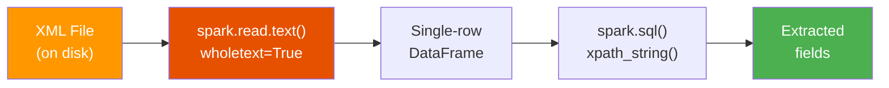

# Nested XML Parsing

This example reads a **whole XML file** from disk and extracts values from
deeply nested elements — a common pattern when processing XML exports from
enterprise systems.

:material-file-code: **Source:** `src/xpath/nested/nested_xml_xpath.py`

---

## Data Flow



---

## The XML Structure

This example works with a DWH (Data Warehouse) batch export containing nested
records. A typical structure looks like:

```xml title="nested_xml.xml (example)"
<?xml version="1.0" encoding="UTF-8"?>
<DWHBatch>
  <Header>
    <BatchId>BATCH-20230321-001</BatchId>
    <BatchDate>2023-03-21</BatchDate>
    <TotalNoOfRecords>42</TotalNoOfRecords>
  </Header>
  <Records>
    <Issuance>
      <Entry>
        <PolicyNumber>POL-001</PolicyNumber>
        <EffectiveDate>2023-01-15</EffectiveDate>
        <Premium>1250.00</Premium>
        <Status>Active</Status>
      </Entry>
      <Entry>
        <PolicyNumber>POL-002</PolicyNumber>
        <EffectiveDate>2023-02-20</EffectiveDate>
        <Premium>890.50</Premium>
        <Status>Pending</Status>
      </Entry>
    </Issuance>
  </Records>
</DWHBatch>
```

---

## Loading XML Files

### The `wholetext=True` Pattern

When XML is stored as a **file** (not inline strings), use `spark.read.text()`
with `wholetext=True` to load the entire file into a single DataFrame row:

```python title="src/xpath/nested/nested_xml_xpath.py" linenums="1"
import os
from pyspark.sql import SparkSession

spark = SparkSession.builder.master("local[*]").appName("xml_data").getOrCreate()

xml_file = os.environ["DATA_HOME"] + "/file_data/xml/nested_xml.xml"  # (1)!

df = spark.read.text(paths=xml_file, wholetext=True)  # (2)!
df.createOrReplaceTempView("policy_center")
```

1.  `DATA_HOME` is an environment variable pointing to your data root directory.
2.  `wholetext=True` reads the **entire file** as a single string in one row.

!!! warning "Without `wholetext=True`"
    Spark reads each **line** as a separate row by default, which **breaks**
    multi-line XML documents. Always use `wholetext=True` for XML files.

    === "✅ Correct: wholetext=True"
        ```
        +------------------------------------------+
        |value                                     |
        +------------------------------------------+
        |<DWHBatch><Header>...</Header>...</DWHBatch>|  ← 1 row, entire file
        +------------------------------------------+
        ```

    === "❌ Wrong: default (line-by-line)"
        ```
        +----------------------------------------+
        |value                                   |
        +----------------------------------------+
        |<?xml version="1.0" encoding="UTF-8"?> |  ← row 1
        |<DWHBatch>                              |  ← row 2
        |  <Header>                              |  ← row 3
        |    ...                                 |  ← broken!
        +----------------------------------------+
        ```

??? info "DataFrame schema"
    ```
    root
     |-- value: string (nullable = true)
    ```

    Note the column is named `value` (the default for `read.text()`), not `data`.

---

## Extracting Nested Fields

### Header Metadata

```sql title="Extract batch header fields"
SELECT
    xpath_string(value, 'DWHBatch/Header/BatchId')          AS batch_id,
    xpath_string(value, 'DWHBatch/Header/BatchDate')        AS batch_date,
    xpath_string(value, 'DWHBatch/Header/TotalNoOfRecords') AS total_records
FROM policy_center
```

??? success "Expected output"
    | batch_id | batch_date | total_records |
    |---|---|---|
    | `BATCH-20230321-001` | `2023-03-21` | `42` |

### Nested Records

```sql title="Extract first issuance entry"
SELECT
    xpath_string(value, 'DWHBatch/Records/Issuance/Entry/PolicyNumber')  AS policy,
    xpath_string(value, 'DWHBatch/Records/Issuance/Entry/Premium')       AS premium,
    xpath_string(value, 'DWHBatch/Records/Issuance/Entry/Status')        AS status
FROM policy_center
```

!!! tip "This returns the **first** matching entry"
    `xpath_string` always returns the first match. To get all entries, use
    `xpath()` with `/text()`.

### Extracting All Records as Arrays

```sql title="Get all policy numbers as an array"
SELECT
    xpath(value, 'DWHBatch/Records/Issuance/Entry/PolicyNumber/text()') AS policies,
    xpath(value, 'DWHBatch/Records/Issuance/Entry/Premium/text()')      AS premiums
FROM policy_center
```

??? success "Expected output"
    | policies | premiums |
    |---|---|
    | `[POL-001, POL-002]` | `[1250.00, 890.50]` |

### Using Wildcards for Quick Exploration

```sql title="Wildcard matches first child"
SELECT xpath_string(value, 'DWHBatch/Records/Issuance/Entry/*') AS first_field
FROM policy_center
```

---

## Advanced Patterns

### Counting Records with XPath

```sql
SELECT
    xpath_number(value, 'count(DWHBatch/Records/Issuance/Entry)') AS num_entries
FROM policy_center
```

### Selecting by Position

```sql title="Get the second entry"
SELECT
    xpath_string(value, 'DWHBatch/Records/Issuance/Entry[2]/PolicyNumber') AS second_policy
FROM policy_center
```

### Combining Header + Record Data

```sql title="CTE to combine batch metadata with records"
WITH batch_info AS (
    SELECT
        xpath_string(value, 'DWHBatch/Header/BatchId')    AS batch_id,
        xpath(value, 'DWHBatch/Records/Issuance/Entry/PolicyNumber/text()') AS policies
    FROM policy_center
)
SELECT batch_id, explode(policies) AS policy_number
FROM batch_info
```

---

## Environment Setup

Set the `DATA_HOME` environment variable before running:

=== "Linux / macOS"

    ```bash
    export DATA_HOME=/path/to/data
    uv run python src/xpath/nested/nested_xml_xpath.py
    ```

=== "Windows"

    ```powershell
    $env:DATA_HOME = "C:\path\to\data"
    uv run python src/xpath/nested/nested_xml_xpath.py
    ```

---

## Tips for Large XML Files

!!! tip "Memory considerations"
    `wholetext=True` loads the entire file into **one partition**. For very
    large files (hundreds of MB), consider:

    - Splitting the XML into multiple smaller files before loading
    - Using a streaming XML parser as a preprocessing step
    - Using the `spark-xml` library for row-level XML parsing

!!! tip "Multiple XML files"
    You can load a **directory** of XML files:

    ```python
    df = spark.read.text(paths="data/xml_files/", wholetext=True)
    # Each file becomes one row
    ```

---

## Key Takeaways

| Concept | Pattern |
|---|---|
| Read whole XML file | `spark.read.text(path, wholetext=True)` |
| Default column name | `value` (from `read.text`) |
| Extract nested field | `xpath_string(value, 'Root/Level1/Level2/Field')` |
| Extract all children | `xpath(value, 'Root/Items/Item/text()')` |
| Position selector | `xpath_string(value, 'Root/Items/Item[2]/Field')` |
| Count elements | `xpath_number(value, 'count(Root/Items/Item)')` |

---

## Next Steps

- :material-code-braces: [Basic Parsing](basic-parsing.md) — Inline XML strings
- :material-bank: [Credit Evaluation](credit-evaluation.md) — Namespaces + business logic
