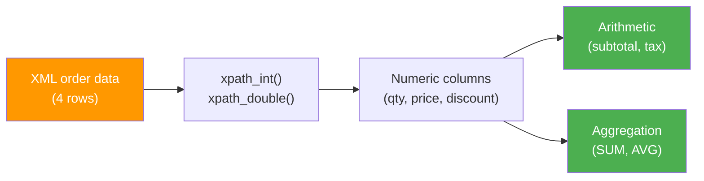

# Numeric Extraction

This example demonstrates extracting **numeric values** from XML using
`xpath_int`, `xpath_double`, and performing arithmetic and aggregations.

:material-file-code: **Source:** `examples/xml_xpath_numeric.py`  
:material-test-tube: **Tests:** `tests/xpath/test_xpath_numeric.py`

---

## Data Flow



---

## The XML

Each row is an order with numeric fields for quantity, price, discount, and tax:

```xml title="Sample order"
<order>
  <id>1001</id>
  <product>Widget A</product>
  <quantity>5</quantity>
  <unit_price>29.99</unit_price>
  <discount>0.10</discount>
  <tax_rate>0.08</tax_rate>
</order>
```

The dataset contains 4 orders:

| Order ID | Product | Qty | Unit Price | Discount | Tax Rate |
|---|---|---|---|---|---|
| 1001 | Widget A | 5 | 29.99 | 10% | 8% |
| 1002 | Widget B | 12 | 14.50 | 0% | 8% |
| 1003 | Widget C | 1 | 199.00 | 15% | 10% |
| 1004 | Widget A | 100 | 29.99 | 20% | 8% |

---

## Code Walkthrough

### Step 1 — Setup

```python title="examples/xml_xpath_numeric.py" linenums="1"
from pyspark.sql import SparkSession
from pyspark.sql.types import StringType

spark = SparkSession.builder.master("local[*]").appName("xml_xpath_numeric").getOrCreate()

data = [
    "<order><id>1001</id><product>Widget A</product>"
    "<quantity>5</quantity><unit_price>29.99</unit_price>"
    "<discount>0.10</discount><tax_rate>0.08</tax_rate></order>",
    # ... 3 more orders
]

df = spark.createDataFrame(data, StringType()).withColumnRenamed("value", "data")
df.createOrReplaceTempView("orders")
```

### Step 2 — Extract and Compute

```sql title="Numeric extraction + arithmetic"
SELECT
    xpath_int(data, 'order/id')            AS order_id,    -- (1)!
    xpath_string(data, 'order/product')    AS product,
    xpath_int(data, 'order/quantity')      AS qty,         -- (2)!
    xpath_double(data, 'order/unit_price') AS price,       -- (3)!
    xpath_double(data, 'order/discount')   AS discount,
    xpath_double(data, 'order/tax_rate')   AS tax_rate,
    ROUND(
        xpath_int(data, 'order/quantity')
        * xpath_double(data, 'order/unit_price')
        * (1 - xpath_double(data, 'order/discount')),
        2
    )                                      AS subtotal,    -- (4)!
    ROUND(
        xpath_int(data, 'order/quantity')
        * xpath_double(data, 'order/unit_price')
        * (1 - xpath_double(data, 'order/discount'))
        * (1 + xpath_double(data, 'order/tax_rate')),
        2
    )                                      AS total_with_tax
FROM orders
```

1.  `xpath_int` returns `INT` — perfect for whole numbers like IDs and quantities.
2.  Integer extraction — returns `0` if element is missing or non-numeric.
3.  `xpath_double` returns `DOUBLE` — use for prices and decimal values.
4.  Inline arithmetic: `qty × price × (1 - discount)`.

??? success "Expected output"
    | order_id | product | qty | price | discount | tax_rate | subtotal | total_with_tax |
    |---|---|---|---|---|---|---|---|
    | 1001 | Widget A | 5 | 29.99 | 0.1 | 0.08 | 134.96 | 145.75 |
    | 1002 | Widget B | 12 | 14.50 | 0.0 | 0.08 | 174.00 | 187.92 |
    | 1003 | Widget C | 1 | 199.00 | 0.15 | 0.10 | 169.15 | 186.07 |
    | 1004 | Widget A | 100 | 29.99 | 0.20 | 0.08 | 2399.20 | 2591.14 |

---

### Step 3 — Aggregation

Group by product and compute totals using `SUM()` on xpath-extracted values:

```sql title="Group-by aggregation"
SELECT
    xpath_string(data, 'order/product')    AS product,
    SUM(xpath_int(data, 'order/quantity')) AS total_qty,
    ROUND(SUM(
        xpath_int(data, 'order/quantity')
        * xpath_double(data, 'order/unit_price')
    ), 2)                                  AS gross_revenue
FROM orders
GROUP BY xpath_string(data, 'order/product')
```

??? success "Expected output"
    | product | total_qty | gross_revenue |
    |---|---|---|
    | Widget A | 105 | 3148.95 |
    | Widget B | 12 | 174.00 |
    | Widget C | 1 | 199.00 |

---

## Numeric Functions at a Glance

| Function | Returns | Best For |
|---|---|---|
| `xpath_int` | `INT` | Whole numbers (IDs, quantities, counts) |
| `xpath_long` | `LONG` | Large whole numbers |
| `xpath_short` | `SHORT` | Small whole numbers |
| `xpath_float` | `FLOAT` | Approximate decimals |
| `xpath_double` | `DOUBLE` | Precise decimals (prices, rates) |
| `xpath_number` | `DOUBLE` | Alias for `xpath_double` |

!!! tip "Missing elements return 0"
    All numeric xpath functions return `0` (not `null`) when the element
    doesn't exist. Use `NULLIF(..., 0)` if you need null semantics:

    ```sql
    NULLIF(xpath_int(data, 'order/optional_field'), 0)
    ```

---

## Running

```bash
uv run python examples/xml_xpath_numeric.py
```

---

## Key Takeaways

| Concept | Pattern |
|---|---|
| Integer extraction | `xpath_int(col, 'path')` |
| Decimal extraction | `xpath_double(col, 'path')` |
| Inline arithmetic | `xpath_int(...) * xpath_double(...)` |
| Rounding | `ROUND(expression, 2)` |
| Aggregation | `SUM(xpath_int(...))` in `GROUP BY` |
| Missing → 0 | Numeric functions return 0, not null |
