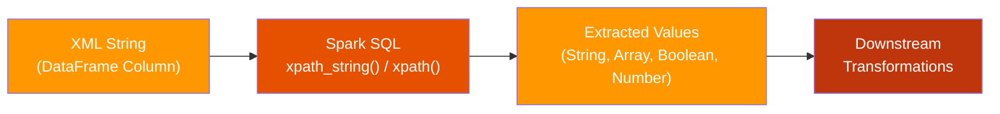

# Spark XPath

**Extract and transform XML data in PySpark using XPath functions** — production-ready
patterns for parsing inline XML strings, reading XML files, handling namespaces,
and applying business logic at scale.

---

## :material-star-shooting: Features

<div class="grid cards" markdown>

-   :material-xml:{ .lg .middle } **XPath Extraction**

    ---

    Use `xpath_string`, `xpath`, `xpath_boolean`, and numeric XPath functions
    directly inside Spark SQL expressions.

    [:octicons-arrow-right-24: Functions Reference](xpath-functions.md)

-   :material-file-tree:{ .lg .middle } **Nested XML**

    ---

    Parse deeply nested and multi-level XML documents — including whole-file
    reads with `wholetext=True`.

    [:octicons-arrow-right-24: Nested XML Example](examples/nested-xml.md)

-   :material-shield-check:{ .lg .middle } **Namespace Handling**

    ---

    Spark automatically strips namespace prefixes. Just use local element names —
    no manual namespace registration needed.

    [:octicons-arrow-right-24: Credit Evaluation Example](examples/credit-evaluation.md)

-   :material-test-tube:{ .lg .middle } **Test Suite**

    ---

    Comprehensive pytest test suite with session-scoped SparkSession fixtures
    covering all XPath patterns.

    [:octicons-arrow-right-24: Testing Guide](testing.md)

</div>

---

## :material-clock-fast: Quick Start

=== "Spark SQL"

    ```sql
    SELECT
        xpath_string(data, 'book/title') AS title,
        xpath_string(data, 'book/year')  AS year
    FROM books
    ```

=== "PySpark DataFrame API"

    ```python
    from pyspark.sql.functions import xpath, lit

    df.select(
        xpath(df.data, lit('book/title/text()')).alias('title')
    ).show()
    ```

=== "xpath_boolean"

    ```sql
    SELECT xpath_boolean(data, 'root/item[score >= 5]') AS high_score
    FROM items
    ```

---

## :material-sitemap: Architecture



All XPath operations execute **inside the Spark engine**, meaning they distribute
across the cluster just like any other Spark transformation — no UDFs, no Python
serialization overhead.

---

## :material-navigation: Documentation

| Page | Description |
|---|---|
| :material-rocket-launch: [Getting Started](getting-started.md) | Installation, prerequisites & your first query |
| :material-function-variant: [XPath Functions Reference](xpath-functions.md) | Complete reference for all Spark XPath functions |
| :material-code-braces: [Basic Parsing](examples/basic-parsing.md) | Inline XML strings → extracted fields |
| :material-file-tree: [Nested XML](examples/nested-xml.md) | Whole-file reads & deeply nested documents |
| :material-bank: [Credit Evaluation](examples/credit-evaluation.md) | Real-world namespaced XML with business logic |
| :material-package-variant: [API Reference](api-reference.md) | Source module inventory & code structure |
| :material-test-tube: [Testing Guide](testing.md) | Running tests, writing tests & CI integration |

---

## :material-folder-multiple: Project Structure

```
spark-xpath/
├── src/xpath/
│   ├── xml_data_parsing.py      # Basic inline XML parsing
│   ├── xml_xpath.py             # Credit evaluation XPath + CASE logic
│   ├── text/
│   │   └── xml_xpath_text.py    # Array extraction with xpath()
│   └── nested/
│       └── nested_xml_xpath.py  # Whole-file nested XML parsing
├── tests/xml/
│   └── test_xml_array_xpath.py  # 6 pytest test cases
├── docs/                        # This documentation (MkDocs)
├── pyproject.toml               # Project config (uv managed)
└── mkdocs.yml                   # Documentation config
```

---

## :material-tools: Tech Stack

| Component | Technology |
|---|---|
| Language | Python ≥ 3.11 |
| Data Processing | PySpark (< 4.0) |
| Package Manager | [uv](https://docs.astral.sh/uv/) |
| Testing | pytest + pytest-mock + pytest-sugar |
| Documentation | MkDocs with Material theme |
| CI/CD | GitHub Actions |
