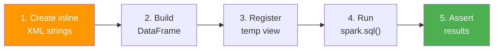

# Testing Guide

## Running Tests

=== "Full suite"

    ```bash
    uv run pytest tests/ -v
    ```

=== "Single file"

    ```bash
    uv run pytest tests/xml/test_xml_array_xpath.py -v
    ```

=== "Single test"

    ```bash
    uv run pytest tests/xml/test_xml_array_xpath.py::test_xpath_boolean -v
    ```

=== "With short tracebacks"

    ```bash
    uv run pytest tests/ -v --tb=short
    ```

??? success "Expected output (full suite)"
    ```
    tests/xml/test_xml_array_xpath.py::test_xpath_string_extracts_header_fields PASSED
    tests/xml/test_xml_array_xpath.py::test_xpath_string_wildcard PASSED
    tests/xml/test_xml_array_xpath.py::test_xpath_array_extraction PASSED
    tests/xml/test_xml_array_xpath.py::test_xpath_boolean PASSED
    tests/xml/test_xml_array_xpath.py::test_xpath_with_namespaced_xml PASSED
    tests/xml/test_xml_array_xpath.py::test_xpath_multiple_rows PASSED

    ========================= 6 passed =========================
    ```

---

## Test Structure

```
tests/
├── __init__.py
└── xml/
    ├── __init__.py
    └── test_xml_array_xpath.py   # 6 test cases
```

---

## Test Inventory

| Test | XPath Function | What It Verifies |
|---|---|---|
| `test_xpath_string_extracts_header_fields` | `xpath_string` | Extract specific named fields from `<Header>` |
| `test_xpath_string_wildcard` | `xpath_string` | Wildcard `*` returns first child text |
| `test_xpath_array_extraction` | `xpath` | Returns `ARRAY<STRING>` from repeating elements |
| `test_xpath_boolean` | `xpath_boolean` | Predicate evaluation across multiple rows |
| `test_xpath_with_namespaced_xml` | `xpath_string` | Namespace prefix stripping works correctly |
| `test_xpath_multiple_rows` | `xpath_string` | XPath extraction works across 3+ rows |

---

## SparkSession Fixture

A **session-scoped** Spark fixture is shared across all tests to avoid the
overhead of starting/stopping the JVM for each test:

```python title="tests/xml/test_xml_array_xpath.py" linenums="1"
import pytest
from pyspark.sql import SparkSession


@pytest.fixture(scope="session")
def spark():
    """Create a shared SparkSession for all tests in this module."""
    spark = (
        SparkSession.builder
        .master("local[*]")
        .appName("XML Processing Test")
        .getOrCreate()
    )
    yield spark
    spark.stop()
```

!!! tip "Why session scope?"
    Starting a SparkSession takes **2–5 seconds** due to JVM initialization.
    Session scope creates it once and reuses it across all tests, making the
    full suite run in seconds instead of minutes.

!!! warning "Unique temp view names"
    Each test should use a **unique temp view name** (e.g., `test_xml_header`,
    `test_xml_bool`) to avoid cross-test interference when sharing a single
    SparkSession.

---

## Writing a New Test

Follow this pattern to add a new test:

```python title="tests/xml/test_my_feature.py" linenums="1"
from pyspark.sql.types import StringType


def test_extract_book_title(spark):
    """Extract title from a simple book XML element.

    Verifies that xpath_string correctly navigates a simple
    two-level XML structure.
    """
    # Arrange
    xml = ["<book><title>PySpark Cookbook</title></book>"]
    df = spark.createDataFrame(xml, StringType()).withColumnRenamed("value", "data")
    df.createOrReplaceTempView("test_books")  # (1)!

    # Act
    result = spark.sql(
        "SELECT xpath_string(data, 'book/title') AS title FROM test_books"
    )
    titles = [row.title for row in result.collect()]

    # Assert
    assert titles == ["PySpark Cookbook"]
```

1.  Use a unique view name prefixed with `test_` to avoid collisions.

### Step-by-Step



1. **Arrange** — Create inline XML strings as a Python list
2. **Build** — `spark.createDataFrame(data, StringType())` + rename column to `data`
3. **Register** — `df.createOrReplaceTempView("unique_name")`
4. **Act** — Execute XPath via `spark.sql()` and `collect()` the results
5. **Assert** — Compare with expected values using `assert`

---

## Test Patterns

### Testing Multiple Rows

```python
def test_multi_row_extraction(spark):
    """Verify XPath works consistently across multiple rows."""
    data = [
        "<item><name>A</name></item>",
        "<item><name>B</name></item>",
        "<item><name>C</name></item>",
    ]
    df = spark.createDataFrame(data, StringType()).withColumnRenamed("value", "data")
    df.createOrReplaceTempView("test_multi")

    result = spark.sql(
        "SELECT xpath_string(data, 'item/name') AS name FROM test_multi"
    )
    names = sorted([row.name for row in result.collect()])
    assert names == ["A", "B", "C"]
```

### Testing Boolean Conditions

```python
def test_boolean_filtering(spark):
    """Verify xpath_boolean returns correct true/false per row."""
    data = [
        "<root><score>10</score></root>",  # true
        "<root><score>3</score></root>",   # false
    ]
    df = spark.createDataFrame(data, StringType()).withColumnRenamed("value", "data")
    df.createOrReplaceTempView("test_bool")

    result = spark.sql(
        "SELECT xpath_boolean(data, 'root[score >= 5]') AS high FROM test_bool"
    )
    rows = result.collect()

    assert rows[0].high is True
    assert rows[1].high is False
```

### Testing Namespaced XML

```python
def test_namespace_stripping(spark):
    """Namespace prefixes are automatically stripped by Spark."""
    data = [
        '<ns0:Root xmlns:ns0="http://example.com">'
        '<Child>hello</Child></ns0:Root>',
    ]
    df = spark.createDataFrame(data, StringType()).withColumnRenamed("value", "data")
    df.createOrReplaceTempView("test_ns")

    result = spark.sql(
        "SELECT xpath_string(data, 'Root/Child') AS val FROM test_ns"
    )
    assert result.collect()[0].val == "hello"
```

---

## CI Integration

Tests run automatically on every **push** and **pull request** via
GitHub Actions:

```yaml title=".github/workflows/ci.yml (excerpt)"
jobs:
  test:
    strategy:
      matrix:
        python-version: ["3.11", "3.12"]
    steps:
      - uses: actions/checkout@v4
      - uses: astral-sh/setup-uv@v5
      - run: uv sync
      - run: uv run pytest tests/ -v
```

The matrix covers Python **3.11** and **3.12** to ensure compatibility.

---

## Test Dependencies

Defined in `pyproject.toml` under `[dependency-groups] dev`:

| Package | Purpose |
|---|---|
| `pytest` | Test runner and framework |
| `pytest-mock` | Mocking support (`mocker` fixture) |
| `pytest-sugar` | Pretty progress bar and test output |

---

## Debugging Tips

!!! tip "Print DataFrame contents"
    Use `.show(truncate=False)` inside a test to inspect intermediate results:

    ```python
    result = spark.sql("SELECT xpath(x, 'a/b/text()') AS items FROM test_data")
    result.show(truncate=False)  # prints full content during pytest -s
    ```

    Run with `pytest -s` to see print output.

!!! tip "Check the Spark plan"
    Use `.explain()` to see how Spark executes your query:

    ```python
    spark.sql("SELECT xpath_string(data, 'Root/Child') FROM test_data").explain()
    ```

!!! tip "Isolate a failing test"
    Run a single test with verbose output and full tracebacks:

    ```bash
    uv run pytest tests/xml/test_xml_array_xpath.py::test_xpath_boolean -v --tb=long -s
    ```
