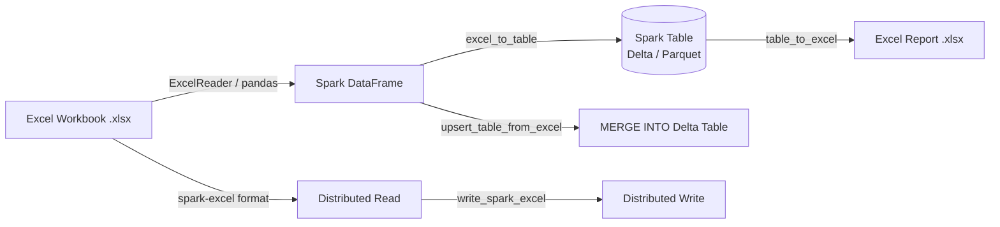

# PySpark Excel Datasource

Reusable PySpark utilities for the classic **Data Architect** workflow: read Excel
workbooks into Spark DataFrames, land them as governed Spark tables (Delta
recommended), and export tables/queries back out to Excel for business users —
locally, on OSS Spark clusters, or on **Databricks Runtime 15.x+**.

## Architecture



## Two ways to read/write Excel

<div class="grid cards" markdown>

-   :material-file-table:{ .lg .middle } **pandas bridge (default)**

    ---

    `ExcelReader` / `ExcelWriter` wrap `pandas.read_excel` / `pandas.ExcelWriter`
    (openpyxl/xlsxwriter). Zero JVM dependencies — runs anywhere PySpark runs.
    Best for reporting-sized workbooks (thousands of rows).

-   :material-server-network:{ .lg .middle } **spark-excel (distributed)**

    ---

    `read_spark_excel` / `write_spark_excel` drive Spark's native
    `.format(...)` API against the `com.crealytics:spark-excel` connector (or
    Databricks' built-in `excel` format on DBR 17.1+). Scales across executors
    for cluster-sized workbooks.

</div>

## Topics

<div class="grid cards" markdown>

-   :material-file-document:{ .lg .middle } **[Data Source](data-source/index.md)**

    ---

    Reading and writing Excel files, plus the spark-excel distributed connector

-   :material-table:{ .lg .middle } **[Table Integration](table-integration/index.md)**

    ---

    `excel_to_table`, `table_to_excel`, and `upsert_table_from_excel` (MERGE INTO)

-   :material-cog:{ .lg .middle } **[Properties](properties/index.md)**

    ---

    Header rows, sheet/column selection, NA values, dtypes, and formatting

-   :material-code-braces:{ .lg .middle } **[Schema](schema/index.md)**

    ---

    Explicit StructType/DDL schemas and inference behavior

-   :material-alert-circle:{ .lg .middle } **[Error Handling](error-handling/index.md)**

    ---

    Missing files/sheets and quarantining malformed rows

-   :simple-databricks:{ .lg .middle } **[Databricks](databricks-runtime/index.md)**

    ---

    Running on Databricks Runtime 15.x+ with the spark-excel Maven library, or
    DBR 17.1+ with the built-in Excel connector

</div>

## Quick Start

!!! tip "No cluster needed"
    All examples run locally with `local[*]` mode — just install PySpark and Java 17.

=== "Using the pys_excel library"
    ```python
    from pys_excel import get_spark, ExcelReader, excel_to_table, print_dataframe

    spark = get_spark("quickstart")  # (1)!

    df = ExcelReader(spark).sheet("Employees").read("data/employees.xlsx")  # (2)!
    print_dataframe(df, title="Employees")

    excel_to_table(spark, "data/employees.xlsx", "sales.employees", sheet_name="Employees")  # (3)!

    spark.stop()
    ```

    1. Handles `JAVA_HOME`, `SPARK_MASTER`, Hive-catalog config automatically.
    2. Wraps `pandas.read_excel()` and bridges to `spark.createDataFrame()`.
    3. Reads the sheet and calls `df.write.saveAsTable(...)` in one call.

=== "Raw PySpark + pandas"
    ```python
    import os
    import pandas as pd
    from pyspark.sql import SparkSession

    spark = (
        SparkSession.builder.appName("excel-quickstart")
        .master(os.environ.get("SPARK_MASTER", "local[*]"))
        .enableHiveSupport()
        .getOrCreate()
    )
    spark.sparkContext.setLogLevel("WARN")

    pdf = pd.read_excel("data/employees.xlsx", sheet_name="Employees")
    df = spark.createDataFrame(pdf)
    df.write.mode("overwrite").saveAsTable("sales.employees")

    spark.stop()
    ```

## Installation

=== "uv (Recommended)"
    ```bash
    cd pyspark-excel-ds
    uv sync --group dev
    # Optional: Delta Lake support for MERGE INTO upserts
    uv sync --group dev --extra delta
    ```

=== "pip"
    ```bash
    pip install -e ".[delta]"
    ```

## Project Structure

```text
pyspark-excel-ds/
├── src/pys_excel/              # Reusable library
│   ├── __init__.py             # Public API
│   ├── config.py               # SparkSession, DATA_HOME, sample workbook generator
│   ├── _logging.py             # Rich-powered logging & print helpers
│   ├── reader/                 # ExcelReader fluent API (pandas bridge)
│   ├── writer/                 # ExcelWriter fluent API (pandas bridge)
│   ├── table/                  # excel_to_table / table_to_excel / upsert_table_from_excel
│   └── spark_excel.py          # Distributed I/O via spark-excel / Databricks native format
├── examples/
│   ├── 01_data_source/         # Read/write basics + distributed spark-excel I/O
│   ├── 02_table_integration/   # Excel <-> Spark table workflows
│   ├── 03_properties/          # Header/skiprows, sheets, NA values, formatting
│   ├── 04_schema/              # Explicit schema, inference
│   └── 05_error_handling/      # Missing files, malformed rows
├── tests/                      # pytest test suite
├── scripts/                    # Sample data generator, example runner
├── docs/                       # This documentation (MkDocs Material)
├── Makefile                    # test, lint, docs, build, etc.
└── pyproject.toml              # hatchling build, ruff, mypy, bandit config
```

## Development

```bash
make install          # Install with dev dependencies
make ci               # Full CI: format, lint, type-check, security, compile
make test             # Run pytest
make docs             # Build documentation
make check-all        # All quality checks
```

## Serving Docs Locally

```bash
uv run mkdocs serve
```

Then open [http://127.0.0.1:8000](http://127.0.0.1:8000).
