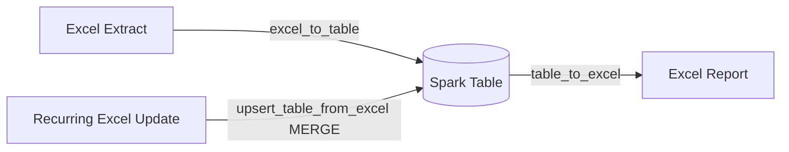

# Table Integration

The primary Data Architect workflow this project supports: turn Excel
extracts into governed Spark tables, and turn tables/queries back into Excel
reports.



## Functions

| Function | Direction | Use case |
|----------|-----------|----------|
| [`excel_to_table`](excel-to-table.md) | Excel → Table | Initial/full-refresh load of an Excel extract into a Spark table |
| [`upsert_table_from_excel`](upsert-merge.md) | Excel → Table | Recurring incremental loads — MERGE by business key instead of overwrite |
| [`table_to_excel`](table-to-excel.md) | Table → Excel | Export a table or ad-hoc SQL query to a workbook for business users |

## Choosing a table format

- **Delta** (recommended) — ACID transactions, schema evolution, time travel,
  and `MERGE INTO` support (required for `upsert_table_from_excel`). Built
  into every Databricks Runtime; locally requires the optional `delta-spark`
  dependency (`uv sync --extra delta`).
- **Parquet** — no extra dependency, works everywhere, but no `MERGE INTO`
  support — only use for full-refresh (`excel_to_table`) workflows.

```python
# Delta (production default)
excel_to_table(spark, "extract.xlsx", "sales.employees", sheet_name="Employees", file_format="delta")

# Parquet (no Delta dependency)
excel_to_table(spark, "extract.xlsx", "sales.employees", sheet_name="Employees", file_format="parquet")
```
