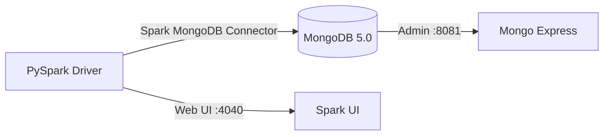

# PySpark MongoDB — Documentation Instructions (MkDocs Material)

## Theme & Config (mkdocs.yml)

Use **MkDocs Material** with the project's standard palette and feature set:

```yaml
theme:
  name: material
  palette:
    - scheme: default
      primary: deep orange
      accent: orange
      toggle:
        icon: material/brightness-7
        name: Switch to dark mode
    - scheme: slate
      primary: deep orange
      accent: orange
      toggle:
        icon: material/brightness-4
        name: Switch to light mode
  features:
    - navigation.tabs
    - navigation.sections
    - navigation.expand
    - navigation.top
    - navigation.indexes
    - search.highlight
    - search.suggest
    - content.code.copy
    - content.code.annotate
```

Always include these plugins:

```yaml
plugins:
  - search
  - include-markdown
```

Always include these markdown extensions:

```yaml
markdown_extensions:
  - admonition
  - attr_list
  - md_in_html
  - tables
  - pymdownx.details
  - pymdownx.inlinehilite
  - pymdownx.highlight:
      anchor_linenums: true
      line_spans: __span
      pygments_lang_class: true
  - pymdownx.superfences:
      custom_fences:
        - name: mermaid
          class: mermaid
          format: !!python/name:pymdownx.superfences.fence_code_format
  - pymdownx.tabbed:
      alternate_style: true
  - pymdownx.snippets:
      base_path: ["."]
  - toc:
      permalink: true
```

## Code Blocks

### Snippet include (preferred — keeps docs in sync with source)

````markdown
```python title="src/mongondb/mongodb_collection.py"
--8<-- "src/mongondb/mongodb_collection.py"
```
````

### Tabbed install options

````markdown
=== "uv (Recommended)"
    ```bash
    uv add pyspark
    ```

=== "pip"
    ```bash
    pip install pyspark
    ```

=== "conda"
    ```bash
    conda install -c conda-forge pyspark
    ```
````

### Code annotations

```python
spark = (
    SparkSession.builder
    .master("local[*]")                          # (1)!
    .config(
        "spark.jars.packages",
        "org.mongodb.spark:mongo-spark-connector_2.13:10.1.1",
    )                                            # (2)!
    .getOrCreate()
)
```

1. Use all available CPU cores.
2. Maven coordinates for the MongoDB Spark Connector.

## Admonitions

```markdown
!!! tip "Local development"
    Start MongoDB with `docker compose up -d` before running any PySpark script.

!!! warning "Java required"
    Java 11 must be on your `PATH`. The MongoDB Spark Connector requires a JVM.

!!! note "Connector version"
    Use `mongo-spark-connector_2.13:10.1.1` for Spark 3.5.x with Scala 2.13.

!!! success "Good fit"
    - Batch ETL from/to MongoDB
    - Aggregation pipelines too complex for the MongoDB aggregation framework

!!! failure "Not a good fit"
    - Real-time streaming (use Kafka + Structured Streaming instead)
    - Sub-second latency queries (query MongoDB directly)
```

## Architecture Diagrams (Mermaid)

````markdown

````

## Page Structure

Every documentation page should follow this order:

1. **Short description** — what this page covers and when to use it.
2. **Architecture diagram** (mermaid) — showing Spark ↔ MongoDB data flow.
3. **Prerequisites** — Docker, Java, Python, uv.
4. **Infrastructure setup** — `docker compose up` instructions.
5. **SparkSession snippet** — with code annotations.
6. **Run the example** — exact bash command.
7. **Configuration reference** — table of key Spark + MongoDB configs.
8. **When to use / not use** — `!!! success` and `!!! failure` admonitions.
9. **Full example** — `--8<--` snippet include from `src/`.

## Serving Docs Locally

```bash
uv run mkdocs serve
```
