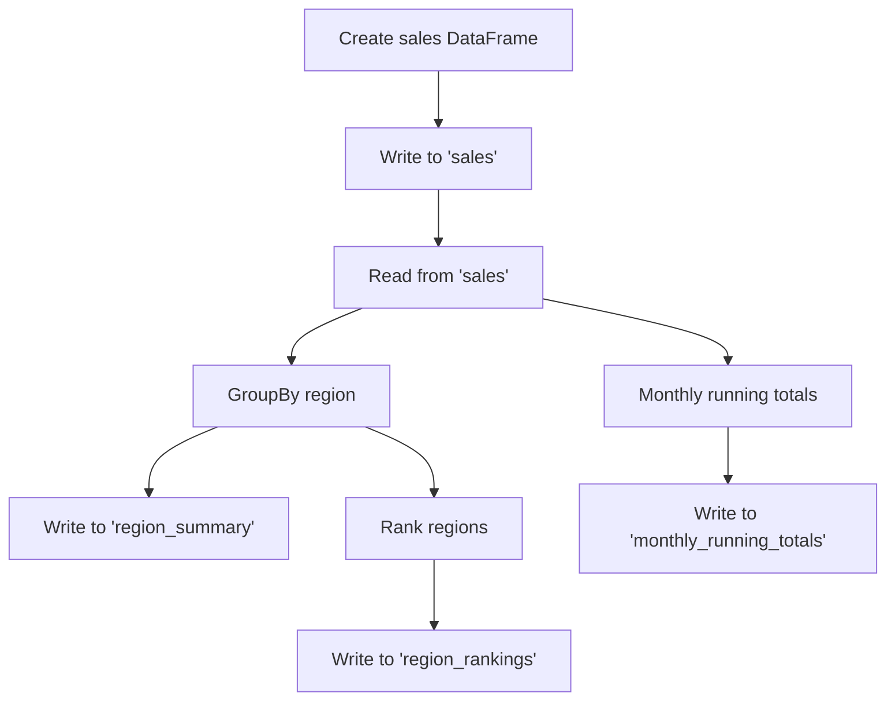

# Aggregations & Window Functions

This example demonstrates advanced DataFrame operations against MongoDB:
groupBy aggregations, running totals with window functions, and region rankings.

## Data Flow



## Prerequisites

- MongoDB running via Docker Compose ([setup](../infrastructure/index.md))
- Java 11 on `PATH`
- Dependencies installed (`uv sync`)

## Run

```bash
uv run python src/mongondb/mongodb_aggregations.py
```

## What It Does

### 1. Create sales data

A DataFrame of regional sales with month, category, and revenue:

```python
sales = spark.createDataFrame(
    [
        ("North", "2024-01", "Electronics", 1200.00),
        ("North", "2024-01", "Clothing", 450.50),
        # ... 12 rows across 3 regions, 2 months, 2 categories
    ],
    ["region", "month", "category", "revenue"],
)
```

### 2. Aggregate by region

```python
region_summary = (
    sales_from_mongo
    .groupBy("region")
    .agg(
        F.round(F.sum("revenue"), 2).alias("total_revenue"),       # (1)!
        F.round(F.avg("revenue"), 2).alias("avg_revenue"),
        F.countDistinct("category").alias("categories"),           # (2)!
        F.count("*").alias("transaction_count"),
    )
    .orderBy(F.desc("total_revenue"))
)
```

1. `F.round()` avoids floating-point noise in the output.
2. `countDistinct` counts unique categories per region.

### 3. Running totals with window functions

A window function computes the cumulative revenue per region, ordered by month:

```python
w = (
    Window
    .partitionBy("region")     # (1)!
    .orderBy("month")          # (2)!
    .rowsBetween(Window.unboundedPreceding, 0)  # (3)!
)

monthly_running = (
    sales_from_mongo
    .groupBy("region", "month")
    .agg(F.round(F.sum("revenue"), 2).alias("monthly_revenue"))
    .withColumn("running_total", F.round(F.sum("monthly_revenue").over(w), 2))
    .orderBy("region", "month")
)
```

1. Each region gets its own running total.
2. Months are processed in chronological order.
3. The frame spans from the first row to the current row — a classic running total.

### 4. Rank regions

`dense_rank()` assigns a rank to each region based on total revenue:

```python
rank_window = Window.orderBy(F.desc("total_revenue"))

ranked_regions = (
    region_summary
    .withColumn("rank", F.dense_rank().over(rank_window))
    .select("rank", "region", "total_revenue", "avg_revenue")
)
```

!!! tip "dense_rank vs rank vs row_number"
    - `dense_rank()` — no gaps in ranking (1, 2, 2, 3)
    - `rank()` — gaps after ties (1, 2, 2, 4)
    - `row_number()` — unique per row, non-deterministic for ties

## Collections Created

| Collection               | Description                               |
| ------------------------ | ----------------------------------------- |
| `sales`                  | Raw sales data (12 rows)                  |
| `region_summary`         | Revenue aggregated by region              |
| `monthly_running_totals` | Monthly revenue with cumulative totals    |
| `region_rankings`        | Regions ranked by total revenue           |

## Full Source

```python title="src/mongondb/mongodb_aggregations.py"
--8<-- "src/mongondb/mongodb_aggregations.py"
```
