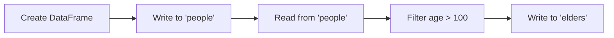

# Collections — Read, Write & Filter

This example demonstrates the fundamental MongoDB ↔ PySpark workflow: creating a
DataFrame, writing it to a collection, reading it back, filtering, and writing
the results to a new collection.

## Data Flow



## Prerequisites

- MongoDB running via Docker Compose ([setup](../infrastructure/index.md))
- Java 11 on `PATH`
- Dependencies installed (`uv sync`)

## Run

```bash
uv run python src/mongondb/mongodb_collection.py
```

## What It Does

### 1. Create sample data

A DataFrame of characters with name and age:

```python
people = spark.createDataFrame(
    [
        ("Bilbo Baggins", 50),
        ("Gandalf", 1000),
        ("Thorin", 195),
        # ...
        ("Bombur", None),  # (1)!
    ],
    ["name", "age"],
)
```

1. `None` values are stored as `null` in MongoDB and handled gracefully by filters.

### 2. Write to MongoDB

```python
(people.write
 .format("mongodb")           # (1)!
 .mode("overwrite")           # (2)!
 .option("database", MONGO_DB)
 .option("collection", "people")
 .save())
```

1. The `mongodb` format is provided by the Spark MongoDB Connector.
2. `overwrite` drops and recreates the collection. Use `append` to add documents.

### 3. Read back from MongoDB

```python
people_from_mongo = (
    spark.read
    .format("mongodb")
    .option("database", MONGO_DB)
    .option("collection", "people")
    .load()
)
```

!!! note "Schema inference"
    The connector infers the schema from a sample of documents. For production
    workloads, provide an explicit schema with `.schema(...)` to avoid
    sampling overhead.

### 4. Filter and write results

```python
elders = (
    people_from_mongo
    .filter(F.col("age").isNotNull())
    .filter(F.col("age") > 100)
    .orderBy(F.desc("age"))
)
```

Filtered results are written to the `elders` collection for downstream
consumption.

## Collections Created

| Collection | Documents | Description                    |
| ---------- | --------- | ------------------------------ |
| `people`   | 10        | All characters                 |
| `elders`   | 5         | Characters with age > 100      |

## Full Source

```python title="src/mongondb/mongodb_collection.py"
--8<-- "src/mongondb/mongodb_collection.py"
```
