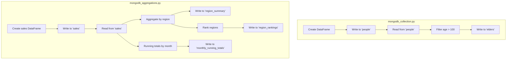

# Examples

Two PySpark scripts demonstrate progressively advanced MongoDB integration
patterns.

## Overview

| Script | What it covers |
| ------ | -------------- |
| [`mongodb_collection.py`](collections.md) | Write, read, filter, write filtered results |
| [`mongodb_aggregations.py`](aggregations.md) | GroupBy, window functions, running totals, rankings |

## Data Flow



## Running

```bash
# Collections example
uv run python src/mongondb/mongodb_collection.py

# Aggregations example
uv run python src/mongondb/mongodb_aggregations.py
```

!!! tip "Start MongoDB first"
    Both scripts require a running MongoDB instance. See the
    [infrastructure guide](../infrastructure/index.md) for setup.
