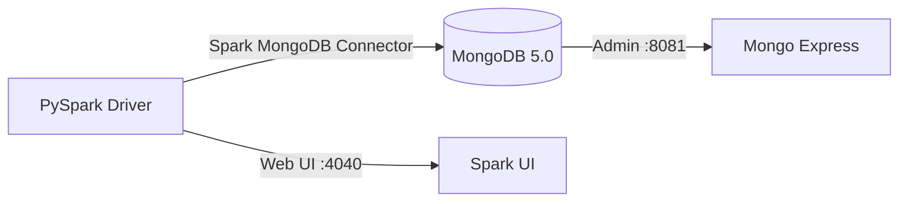

# PySpark MongoDB Tutorial

A hands-on tutorial for reading from and writing to MongoDB using PySpark and the
[Spark MongoDB Connector](https://www.mongodb.com/docs/spark-connector/current/).



## What You'll Learn

- Standing up MongoDB with Docker Compose
- Configuring PySpark with the MongoDB Spark Connector
- Writing DataFrames to MongoDB collections
- Reading collections back into DataFrames
- Filtering, aggregating, and transforming data with round-trip persistence
- Window functions with MongoDB as the data store

## Quick Start

```bash
# 1. Start MongoDB
cd infra/docker && docker compose up -d && cd -

# 2. Install dependencies
uv sync

# 3. Run the collections example
uv run python src/mongondb/mongodb_collection.py

# 4. Run the aggregations example
uv run python src/mongondb/mongodb_aggregations.py

# 5. Browse data in Mongo Express
open http://localhost:8081
```

## Project Structure

```
pyspark-monogdb/
├── infra/docker/docker-compose.yml   # MongoDB + Mongo Express
├── src/mongondb/
│   ├── mongodb_collection.py         # CRUD basics
│   └── mongodb_aggregations.py       # Aggregations & window functions
├── docs/                             # This documentation
├── mkdocs.yml
├── pyproject.toml
└── requirements.txt
```

## Tech Stack

| Component               | Version                                              |
| ----------------------- | ---------------------------------------------------- |
| Python                  | 3.11                                                 |
| PySpark                 | 3.5.x (< 4.0.0)                                     |
| MongoDB Spark Connector | `mongo-spark-connector_2.12:10.4.0`                  |
| MongoDB (Docker)        | 5.0.17                                               |
| Mongo Express (Docker)  | latest                                               |
| Documentation           | MkDocs Material ≥ 9.7                                |
| Package management      | uv                                                   |
