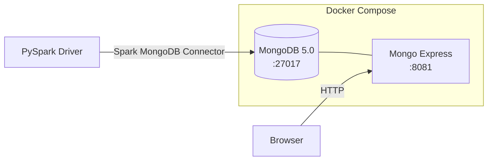

# Infrastructure

The project uses Docker Compose to run MongoDB and Mongo Express for local
development.

## Architecture



## Services

| Service       | Image            | Port  | Purpose                    |
| ------------- | ---------------- | ----- | -------------------------- |
| `mongo`       | `mongo:5.0.17`   | 27017 | MongoDB server             |
| `mongo-express` | `mongo-express` | 8081  | Web-based MongoDB admin UI |

## Docker Compose File

```yaml title="infra/docker/docker-compose.yml"
--8<-- "infra/docker/docker-compose.yml"
```

## Usage

### Start

```bash
cd infra/docker
docker compose up -d
```

### Stop (keep data)

```bash
docker compose down
```

### Stop and remove volumes (data loss)

```bash
docker compose down -v
```

!!! warning "Data persistence"
    The `mongo-data` named volume persists data across restarts. Use `down -v`
    only when you want a clean slate.

## Default Credentials

| Setting  | Value   |
| -------- | ------- |
| Username | `mongo` |
| Password | `mongo` |
| Database | `tutorial` |

!!! note "Development only"
    These credentials are for local development. Never use default passwords in
    production environments.

## Mongo Express

After starting the stack, open [http://localhost:8081](http://localhost:8081) to:

- Browse databases and collections
- View, edit, and delete documents
- Run queries directly in the browser

Login with `mongo` / `mongo`.

## Port Reference

| Port  | Service       | Notes                                    |
| ----- | ------------- | ---------------------------------------- |
| 27017 | MongoDB       | Primary MongoDB wire protocol port       |
| 8081  | Mongo Express | Web admin UI (depends on `mongo` service)|
| 4040  | Spark UI      | Only when `spark.ui.enabled=true`        |
