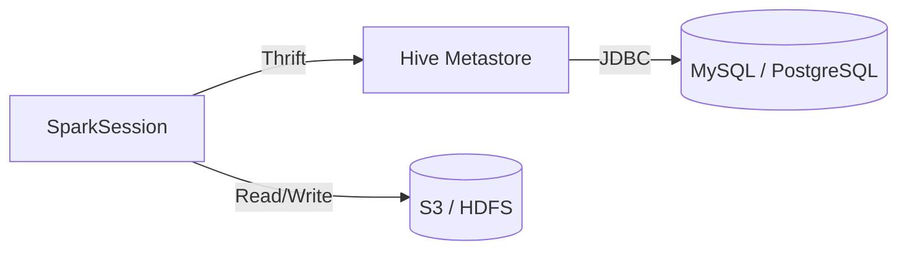
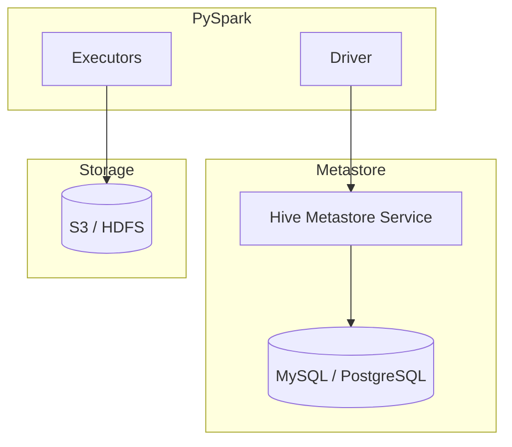

# MkDocs — PySpark Metastore Documentation

## Docs Layout

```
docs/
├── index.md                      # Landing page
├── README.md                     # Overview of metastore concepts
├── metastore/
│   ├── README.md                 # Catalog comparison table
│   ├── memory/README.md          # In-memory catalog
│   ├── hive/README.md            # Hive Metastore
│   ├── glue/README.md            # AWS Glue Data Catalog
│   ├── iceberg/README.md         # Iceberg catalogs
│   ├── delta_lake/README.md      # Delta Lake catalog
│   └── external/README.md        # External RDBMS metastore
└── warehouse/
    └── README.md                 # spark.sql.warehouse.dir
```

## Page Structure for Catalog Pages

Every metastore catalog page should follow this order:

1. **Title & one-line description** — what this catalog is.
2. **Architecture diagram** — Mermaid flowchart showing Spark ↔ Metastore ↔ Storage.
3. **Key configuration** — table of Spark configs with descriptions.
4. **SparkSession snippet** — annotated Python code block.
5. **SQL examples** — `SHOW CATALOGS`, `CREATE TABLE`, `SELECT`.
6. **When to use / not use** — `!!! success` and `!!! failure` admonitions.
7. **Full source** — `--8<--` snippet include from `src/`.

### Example skeleton

```markdown
# Hive Metastore

The Hive Metastore stores table metadata in an external RDBMS.

## Architecture



## Configuration

| Config | Value | Description |
|--------|-------|-------------|
| `hive.metastore.uris` | `thrift://host:9083` | Metastore Thrift endpoint |
| `spark.sql.warehouse.dir` | `/user/hive/warehouse` | Managed table location |
| `spark.sql.catalogImplementation` | `hive` | Use Hive catalog |

## SparkSession

```python title="src/metastore/hive/remote/hive_metastore.py"
--8<-- "src/metastore/hive/remote/hive_metastore.py"
```

!!! success "Good fit"
    - Centralised metadata across Spark, Hive, Presto
    - Production data lakes with external RDBMS

!!! failure "Not a good fit"
    - Local development without Docker
    - Serverless / ephemeral jobs
```

## Catalog Comparison Table

The `docs/metastore/README.md` must include a comparison table covering all catalog types:

| Catalog Type | Config Class | Use Case | Persistence |
|---|---|---|---|
| In-Memory | (default) | Development / testing | None |
| Hive | `HiveCatalog` | Traditional data lakes | High |
| Glue | `AWSGlueDataCatalog` | AWS ecosystems | High |
| Iceberg | `SparkCatalog` | ACID / time travel | High |
| Delta Lake | `DeltaCatalog` | Lakehouse | High |
| JDBC | `JDBCTableCatalog` | RDBMS integration | Medium |
| REST | `SparkCatalog` (rest) | Cloud-native APIs | High |
| Unity Catalog | Databricks UC | Enterprise governance | High |

## Architecture Diagrams

Use Mermaid for every catalog page that involves a remote service:



## Admonitions

Use these admonition types consistently:

- `!!! tip` — shortcuts and productivity hints.
- `!!! warning` — prerequisite warnings (Java, Docker, credentials).
- `!!! note` — supplementary context.
- `!!! success "Good fit"` — recommended use cases.
- `!!! failure "Not a good fit"` — anti-patterns.

## Code Blocks

### Source file includes (preferred)

```markdown
```python title="src/metastore/glue/glue_metastore.py"
--8<-- "src/metastore/glue/glue_metastore.py"
```
```

### Annotated config snippets

```python
spark = (SparkSession.builder
         .config("hive.metastore.uris", "thrift://localhost:9083")  # (1)!
         .config("spark.sql.warehouse.dir", "/user/hive/warehouse") # (2)!
         .enableHiveSupport()                                        # (3)!
         .getOrCreate())
```
1. Thrift endpoint of the Hive Metastore service.
2. Root directory for managed table data.
3. Required to enable Hive integration in Spark.

## Cross-References

Link between related pages using relative paths:

```markdown
See [Hive Metastore](../hive/README.md) for persistent metadata storage.
See [Warehouse](../../warehouse/README.md) for `spark.sql.warehouse.dir` details.
```
