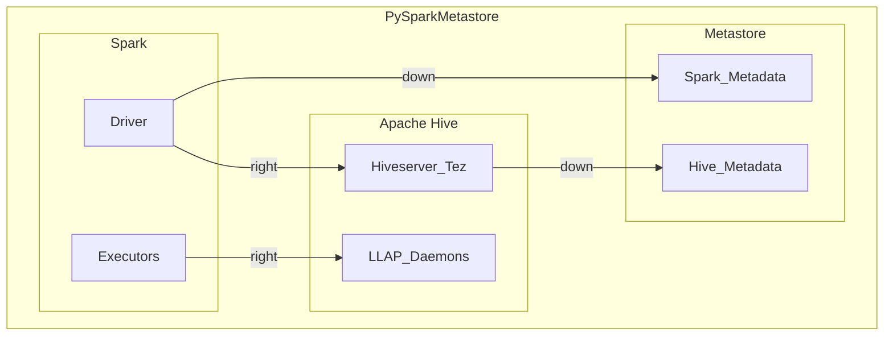

# Metastore

The **Metastore** (often referred to as `metastore_db`) is a relational database used by data processing engines like Hive, Presto, and Spark to efficiently manage metadata for persistent entities such as databases, tables, columns, and partitions. This metadata enables fast access and querying of structured data.



## Key configuration

```properties
hive.metastore.uris
```

This property specifies the URI(s) for the Hive Metastore service.

By default, **Spark SQL** uses an in-memory catalog/metastore backed by an embedded Apache Derby database.

---

## Spark Warehouse

The **spark-warehouse** directory is where Spark SQL stores managed tables and their data. This location can be configured to suit your environment.

Key configuration:

```properties
spark.sql.warehouse.dir
```

This property sets the path for the Spark SQL warehouse directory.

---

## Enabling Hive Metastore in Spark

To use the Hive Metastore with Spark, enable Hive support when creating your `SparkSession`:

```python
from pyspark.sql import SparkSession

spark = SparkSession.builder \
    .appName("MyApp") \
    .enableHiveSupport() \
    .getOrCreate()
```

By default, this uses an `embedded Apache Derby database`, but you can configure Spark to use other databases (e.g., MySQL) for the metastore.

To inspect the external catalog being used:

```scala
println(spark.sharedState.externalCatalog.unwrapped)
```

---

**References:**

- [Spark SQL, DataFrames and Datasets Guide](https://spark.apache.org/docs/latest/sql-programming-guide.html)
- [Hive Metastore Documentation](https://cwiki.apache.org/confluence/display/Hive/AdminManual+MetastoreAdmin)
