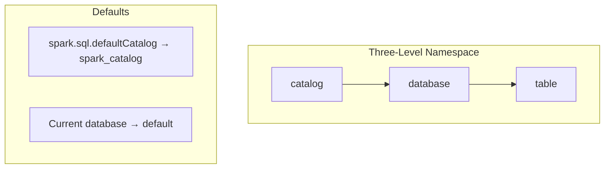

# Catalog Namespace Resolution

Spark 3+ uses a **three-level namespace** (`catalog.database.table`) for fully qualified table
references. Understanding namespace resolution is critical for multi-catalog environments.

---

## Namespace Hierarchy



!!! note
    The default catalog is `spark_catalog` unless overridden via
    `spark.sql.defaultCatalog`. The default database is always `default`.

---

## Resolution Rules

When you reference a table, Spark resolves missing parts of the namespace using session defaults:

| # | Reference Style          | Catalog Used             | Database Used    | Table     |
|---|--------------------------|--------------------------|------------------|-----------|
| 1 | `cat.mydb.my_table`     | `cat`                    | `mydb`           | `my_table`|
| 2 | `mydb.my_table`         | *(default catalog)*      | `mydb`           | `my_table`|
| 3 | `my_table`              | *(default catalog)*      | *(current db)*   | `my_table`|

1. **Fully qualified** (`catalog.database.table`) — no ambiguity; catalog and database are explicit.
2. **Two-level** (`database.table`) — catalog is filled from `spark.sql.defaultCatalog`.
3. **One-level** (`table`) — both catalog and database come from session defaults.

!!! warning
    Changing the default catalog or database affects **all** subsequent queries in the session.
    Always be explicit when running in shared or long-lived sessions.

---

## Code Examples

From [`src/catalog/namespace/catalog_namespace_resolution.py`](../../../src/catalog/namespace/catalog_namespace_resolution.py):

```python
from pyspark.sql import SparkSession

spark = SparkSession.builder.getOrCreate()

# Three-level: explicit catalog, database, table
spark.sql("SELECT * FROM spark_catalog.default.my_table")  # (1)!

# Two-level: uses default catalog
spark.sql("SELECT * FROM default.my_table")  # (2)!

# One-level: uses default catalog + current database
spark.sql("SELECT * FROM my_table")  # (3)!

# Switch context
spark.sql("USE CATALOG my_catalog")  # (4)!
spark.sql("USE my_database")
```

1. Fully qualified — always resolves to `spark_catalog.default.my_table` regardless of session state.
2. Equivalent to `spark_catalog.default.my_table` when the default catalog is `spark_catalog`.
3. Resolves using whatever catalog and database are currently active.
4. All subsequent unqualified queries will resolve against `my_catalog`.

---

## SQL Reference

### Setting Defaults

```sql
-- Override the default catalog for the session
SET spark.sql.defaultCatalog = my_catalog;

-- Switch active catalog / database
USE CATALOG my_catalog;
USE DATABASE my_database;
```

### Listing Objects

```sql
-- Show all registered catalogs
SHOW CATALOGS;

-- Show databases within a catalog
SHOW DATABASES IN my_catalog;

-- Show tables within a specific database
SHOW TABLES IN my_catalog.my_database;
```

### Creating Across Namespaces

```sql
-- Fully qualified CREATE TABLE
CREATE TABLE my_catalog.my_database.new_table (
    id   INT,
    name STRING
);
```

---

## Resolution Behaviour Summary

| Reference            | Catalog     | Database    | Table      |
|----------------------|-------------|-------------|------------|
| `my_table`           | *(default)* | *(current)* | `my_table` |
| `mydb.my_table`      | *(default)* | `mydb`      | `my_table` |
| `cat.mydb.my_table`  | `cat`       | `mydb`      | `my_table` |

---

## Best Practices

!!! tip
    Always use **fully qualified names** (`catalog.database.table`) in production code to avoid
    ambiguity and reduce the risk of queries silently targeting the wrong table.

!!! warning
    `USE CATALOG` and `USE DATABASE` modify **session-level state**. In notebooks or shared
    Spark sessions, another cell or thread may change the context between your statements.
