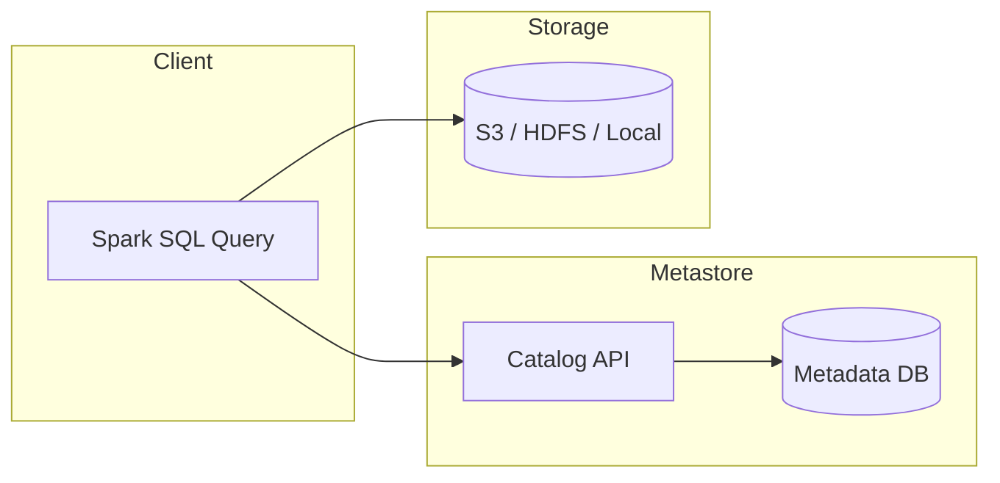

# PySpark Metastore

A comprehensive reference for configuring and using **catalog and metastore backends** with Apache Spark 3.5.x.

## What is a Metastore?

A metastore is a **metadata repository** that stores information about databases, tables, columns, partitions, and storage locations. It allows Spark to treat files in HDFS, S3, or local storage as structured SQL tables.



## Catalog Types

| Catalog | Backend | Persistence | Best For |
|---------|---------|-------------|----------|
| [In-Memory](metastore/memory/README.md) | Embedded Derby | Session only | Development, testing |
| [Spark Built-in](metastore/spark/README.md) | Derby on disk | Local disk | Local prototyping |
| [Hive](metastore/hive/README.md) | MySQL / PostgreSQL | Durable | Production data lakes |
| [AWS Glue](metastore/glue/README.md) | AWS Glue Service | Durable | AWS ecosystems |
| [Iceberg](metastore/iceberg/README.md) | Hive / Hadoop / REST | Durable | ACID, time travel |
| [Delta Lake](metastore/delta_lake/README.md) | Hive / Unity Catalog | Durable | Lakehouse architecture |
| [External RDBMS](metastore/external/README.md) | MySQL / PostgreSQL | Durable | Custom Hive backend |
| [JDBC](metastore/jdbc/README.md) | Any RDBMS | Durable | Direct RDBMS queries |
| [REST](metastore/rest/README.md) | REST API | Durable | Cloud-native / SaaS |
| [Hadoop](metastore/hadoop/README.md) | HDFS filesystem | Durable | Iceberg on HDFS |
| [Multi-Catalog](metastore/multi_catalog/README.md) | Multiple backends | Mixed | Federated queries |
| [Custom](metastore/custom/README.md) | User-defined | User-defined | Special requirements |
| [Unity Catalog](metastore/unity_catalog/README.md) | Databricks | Durable | Enterprise governance |

## Quick Start

```python
from pyspark.sql import SparkSession

# Simplest setup — in-memory catalog (no external dependencies)
spark = (SparkSession.builder
         .appName("quick-start")
         .master("local[*]")
         .config("spark.sql.shuffle.partitions", "4")
         .getOrCreate())

spark.sql("CREATE TABLE default.demo (id INT, name STRING)")
spark.sql("INSERT INTO default.demo VALUES (1, 'Alice'), (2, 'Bob')")
spark.sql("SELECT * FROM default.demo").show()
spark.stop()
```

## Three-Level Namespace

Spark 3+ uses a three-level namespace: `catalog.database.table`.

See [Namespace Resolution](catalog/namespace/README.md) for details.

## Warehouse Directory

The `spark.sql.warehouse.dir` config controls where managed table data is stored.

See [Warehouse](warehouse/README.md) for details.
