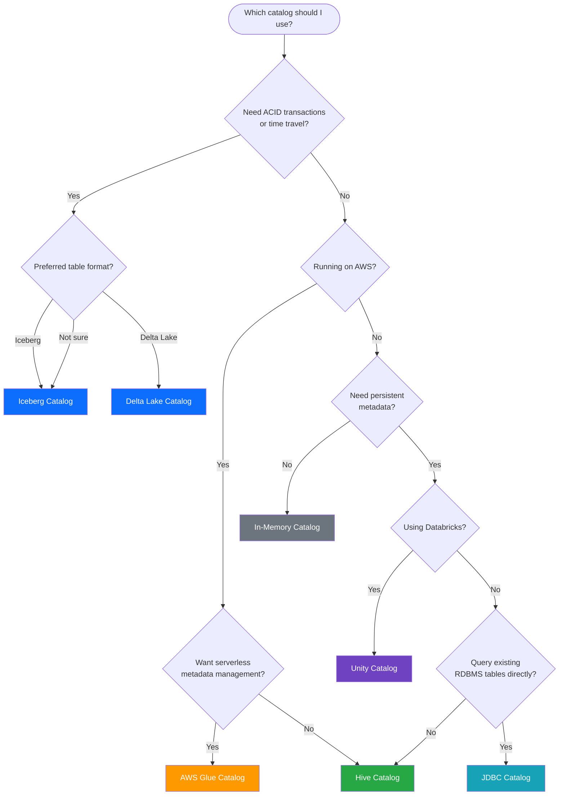

# Catalog Types

A guide to every catalog backend supported by Apache Spark 3.5.x — when to use each one, how they compare, and how to register them.

---

## Comprehensive Comparison

| Catalog Type | Config Class | Backend | Use Case | Persistence | ACID | Time Travel | Cloud Integration |
|---|---|---|---|---|---|---|---|
| [In-Memory](memory/README.md) | *(default)* | Embedded Derby | Development, testing | Session only | :material-close: | :material-close: | None |
| [Spark Built-in](spark/README.md) | *(default with warehouse)* | Derby on disk | Local prototyping | Local disk | :material-close: | :material-close: | None |
| [Hive](hive/README.md) | `HiveMetastoreCatalog` | MySQL / PostgreSQL / Derby | Production data lakes | Durable | :material-close: | :material-close: | Any |
| [AWS Glue](glue/README.md) | `AWSGlueDataCatalog` | AWS Glue Service | AWS-native data lakes | Durable | :material-close: | :material-close: | AWS |
| [Iceberg](iceberg/README.md) | `SparkCatalog` | Hive / Hadoop / REST / JDBC | ACID tables, analytics | Durable | :material-check: | :material-check: | Any |
| [Delta Lake](delta_lake/README.md) | `DeltaCatalog` | Hive / Unity Catalog | Lakehouse architecture | Durable | :material-check: | :material-check: | Any |
| [External RDBMS](external/README.md) | `HiveMetastoreCatalog` | MySQL / PostgreSQL | Custom Hive backend | Durable | :material-close: | :material-close: | Any |
| [JDBC](jdbc/README.md) | `JDBCTableCatalog` | Any RDBMS | Direct RDBMS queries | Durable | Depends on DB | :material-close: | Any |
| [REST](rest/README.md) | `RESTCatalog` | REST API | Cloud-native / SaaS | Durable | Depends on impl | Depends on impl | Any |
| [Hadoop](hadoop/README.md) | `HadoopCatalog` | HDFS filesystem | Iceberg on HDFS | Durable | :material-check: | :material-check: | HDFS |
| [Multi-Catalog](multi_catalog/README.md) | *(multiple)* | Multiple backends | Federated queries | Mixed | Mixed | Mixed | Any |
| [Custom](custom/README.md) | User-defined | User-defined | Special requirements | User-defined | User-defined | User-defined | User-defined |
| [Unity Catalog](unity_catalog/README.md) | `UnityCatalog` | Databricks | Enterprise governance | Durable | :material-check: | :material-check: | Databricks |

---

## Decision Flowchart

Use this flowchart to pick the right catalog for your use case:



---

## Catalog Descriptions

### In-Memory Catalog

The default Spark catalog. Metadata lives only for the duration of the `SparkSession` and is backed by an embedded Derby instance in a temporary directory. Ideal for quick experiments, unit tests, and notebooks.

→ [Full guide](memory/README.md)

### Spark Built-in Catalog

Similar to in-memory but writes Derby files to a local `spark-warehouse/` directory, providing basic persistence across restarts. Suitable for local prototyping when no external database is available.

→ [Full guide](spark/README.md)

### Hive Catalog

The industry-standard persistent metastore. Stores metadata in MySQL, PostgreSQL, or Derby and optionally exposes a Thrift service for multi-user access. The backbone of most production data lake deployments.

→ [Full guide](hive/README.md)

### AWS Glue Catalog

A fully managed, serverless metadata store from AWS. Drop-in replacement for the Hive Metastore in AWS environments — no infrastructure to manage, and integrates natively with Athena, Redshift Spectrum, and Lake Formation.

→ [Full guide](glue/README.md)

### Iceberg Catalog

Apache Iceberg brings **ACID transactions**, **schema evolution**, **time travel**, and **partition evolution** to data lakes. The Iceberg `SparkCatalog` can be backed by Hive, Hadoop (filesystem), REST, or JDBC.

→ [Full guide](iceberg/README.md)

### Delta Lake Catalog

Delta Lake provides ACID transactions, scalable metadata handling, and time travel on top of Parquet files. Tightly integrated with the Databricks ecosystem and supports both open-source and Unity Catalog backends.

→ [Full guide](delta_lake/README.md)

### External RDBMS Catalog

Configures the Hive Metastore to use an external MySQL or PostgreSQL database instead of embedded Derby. This is the recommended production setup for any Hive-based deployment.

→ [Full guide](external/README.md)

### JDBC Catalog

Exposes tables from an existing RDBMS (MySQL, PostgreSQL, Oracle, etc.) directly as Spark tables — no data movement required. Useful for hybrid queries that join data lake files with relational data.

→ [Full guide](jdbc/README.md)

### REST Catalog

A cloud-native catalog interface that communicates with a metadata service over HTTP/REST. Used by services like Tabular, Snowflake's Polaris, and other SaaS platforms implementing the Iceberg REST catalog spec.

→ [Full guide](rest/README.md)

### Hadoop Catalog

A filesystem-based Iceberg catalog that stores metadata directly in HDFS (or S3). No external database required — metadata is managed as files alongside the data. Simplest Iceberg setup for HDFS environments.

→ [Full guide](hadoop/README.md)

### Multi-Catalog

Spark 3+ supports registering **multiple catalogs simultaneously**, enabling federated queries across different backends in a single session. Query Hive tables joined with Iceberg tables and JDBC sources.

→ [Full guide](multi_catalog/README.md)

### Custom Catalog

Build your own catalog plugin by implementing `CatalogPlugin`, `TableCatalog`, or `StagingTableCatalog`. For niche use cases where no existing catalog fits your metadata backend.

→ [Full guide](custom/README.md)

### Unity Catalog

Databricks' enterprise governance layer providing centralized access control, auditing, lineage, and data sharing across workspaces. Supports Delta Lake, Iceberg, and external tables.

→ [Full guide](unity_catalog/README.md)

---

## Registration Snippets

### Hive Catalog

```python
spark = (SparkSession.builder
         .config("spark.sql.catalogImplementation", "hive")
         .config("hive.metastore.uris", "thrift://metastore:9083")
         .enableHiveSupport()
         .getOrCreate())
```

### AWS Glue Catalog

```python
spark = (SparkSession.builder
         .config("spark.sql.catalogImplementation", "hive")
         .config("spark.hadoop.hive.metastore.client.factory.class",
                 "com.amazonaws.glue.catalog.metastore.AWSGlueDataCatalogHiveClientFactory")
         .enableHiveSupport()
         .getOrCreate())
```

### Iceberg Catalog (Hive-backed)

```python
spark = (SparkSession.builder
         .config("spark.sql.catalog.iceberg_catalog",
                 "org.apache.iceberg.spark.SparkCatalog")
         .config("spark.sql.catalog.iceberg_catalog.type", "hive")
         .config("spark.sql.catalog.iceberg_catalog.uri",
                 "thrift://metastore:9083")
         .getOrCreate())
```

### Delta Lake Catalog

```python
spark = (SparkSession.builder
         .config("spark.sql.catalog.delta_catalog",
                 "org.apache.spark.sql.delta.catalog.DeltaCatalog")
         .config("spark.sql.extensions",
                 "io.delta.sql.DeltaSparkSessionExtension")
         .getOrCreate())
```

### JDBC Catalog

```python
spark = (SparkSession.builder
         .config("spark.sql.catalog.pg",
                 "org.apache.spark.sql.execution.datasources.v2.jdbc.JDBCTableCatalog")
         .config("spark.sql.catalog.pg.url",
                 "jdbc:postgresql://db-host:5432/mydb")
         .config("spark.sql.catalog.pg.driver",
                 "org.postgresql.Driver")
         .getOrCreate())
```

### REST Catalog (Iceberg)

```python
spark = (SparkSession.builder
         .config("spark.sql.catalog.rest_catalog",
                 "org.apache.iceberg.spark.SparkCatalog")
         .config("spark.sql.catalog.rest_catalog.type", "rest")
         .config("spark.sql.catalog.rest_catalog.uri",
                 "https://catalog-service.example.com")
         .getOrCreate())
```

### Hadoop Catalog (Iceberg)

```python
spark = (SparkSession.builder
         .config("spark.sql.catalog.hadoop_catalog",
                 "org.apache.iceberg.spark.SparkCatalog")
         .config("spark.sql.catalog.hadoop_catalog.type", "hadoop")
         .config("spark.sql.catalog.hadoop_catalog.warehouse",
                 "hdfs:///iceberg/warehouse")
         .getOrCreate())
```

!!! tip "Multiple Catalogs"
    You can register **all of the above** in a single `SparkSession` and query across them:
    ```sql
    SELECT h.*, i.version
    FROM spark_catalog.default.customers h
    JOIN iceberg_catalog.analytics.snapshots i
      ON h.id = i.customer_id;
    ```

!!! warning "JAR Dependencies"
    Each catalog requires its own set of JARs on the classpath. Use `--packages` or `--jars` when submitting your Spark application. Missing JARs produce `ClassNotFoundException` at runtime.
