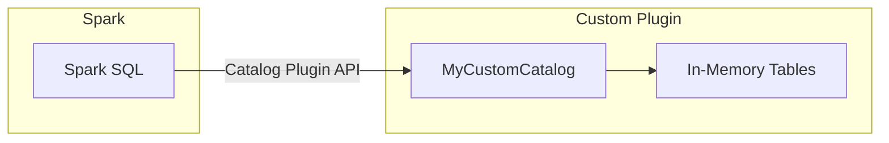

# Custom Catalog

Spark's Catalog Plugin API (DataSource V2) lets you implement a custom
`TableCatalog` with `SupportsNamespaces` for bespoke metadata management. Use
this when no built-in catalog fits your storage or governance model.

## Architecture



## Key Interfaces

| Interface | Purpose |
|-----------|---------|
| `TableCatalog` | Core catalog contract — load, list, create, alter, and drop tables |
| `SupportsNamespaces` | Namespace management — list, create, drop namespaces |
| `Table` | Represents a single table — exposes name, schema, and capabilities |
| `Identifier` | Namespace-qualified table name (`Identifier.of(namespace, name)`) |

## Implementation Overview

The reference implementation defines two classes:

### `MyCustomTable(Table)`

Wraps a table name, schema, and capability set.

```python
from pyspark.sql.connector import Table
from pyspark.sql.types import StringType, StructField, StructType


class MyCustomTable(Table):
    def __init__(self, name, schema):
        self._name = name
        self._schema = schema

    def name(self):
        return self._name  # (1)!

    def schema(self):
        return self._schema  # (2)!

    def capabilities(self):
        return {"BATCH_READ"}  # (3)!
```

1. Logical table name returned to Spark.
2. `StructType` describing the table columns.
3. Capabilities advertise what operations the table supports (e.g., `BATCH_READ`, `BATCH_WRITE`).

### `MyCustomCatalog(TableCatalog, SupportsNamespaces)`

Manages an in-memory registry of tables and namespaces.

```python
from pyspark.sql.connector import Identifier, TableCatalog
from pyspark.sql.connector.catalog import SupportsNamespaces
from pyspark.sql.types import IntegerType, StringType, StructField, StructType


class MyCustomCatalog(TableCatalog, SupportsNamespaces):
    def __init__(self):
        self.tables = {
            "default.sample_table": MyCustomTable(
                "sample_table",
                StructType([
                    StructField("id", StringType(), True),
                    StructField("value", StringType(), True),
                ]),
            ),
            "default.another_table": MyCustomTable(
                "another_table",
                StructType([
                    StructField("number", IntegerType(), True),
                    StructField("description", StringType(), True),
                ]),
            ),
        }
        self.namespaces = {"default"}

    def listTables(self, namespace):  # (1)!
        ns = ".".join(namespace)
        return [
            Identifier.of(ns, name.split(".")[1])
            for name in self.tables
            if name.startswith(ns + ".")
        ]

    def loadTable(self, ident):  # (2)!
        key = ".".join(ident.namespace) + "." + ident.name
        if key in self.tables:
            return self.tables[key]
        raise Exception(f"Table {key} not found.")

    def name(self):
        return "custom"

    # ── SupportsNamespaces ────────────────────────────
    def listNamespaces(self):
        return [[ns] for ns in self.namespaces]

    def namespaceExists(self, namespace):
        return ".".join(namespace) in self.namespaces

    def createNamespace(self, namespace, metadata=None):
        self.namespaces.add(".".join(namespace))

    def dropNamespace(self, namespace):
        self.namespaces.discard(".".join(namespace))
```

1. Returns all `Identifier` objects whose namespace prefix matches.
2. Resolves a fully-qualified identifier to a `MyCustomTable` instance.

## SparkSession Registration

```python
from pyspark.sql import SparkSession

spark = (
    SparkSession.builder
    .config("spark.sql.catalog.custom",
            "metastore.custom.custom_catalog.MyCustomCatalog")  # (1)!
    .config("spark.sql.catalog.custom.myparam", "value")  # (2)!
    .getOrCreate()
)
```

1. The fully-qualified Python class path. Spark loads this via the Catalog Plugin API.
2. Arbitrary key-value parameters forwarded to the catalog's `initialize()` method.

## Configuration

| Property | Value | Description |
|----------|-------|-------------|
| `spark.sql.catalog.custom` | `metastore.custom.custom_catalog.MyCustomCatalog` | Fully-qualified class implementing `TableCatalog` |
| `spark.sql.catalog.custom.myparam` | `value` | Custom parameter passed to the catalog at init |

## SQL Examples

```sql
-- List tables registered in the custom catalog
SHOW TABLES IN custom.default;

-- Query a table
SELECT * FROM custom.default.sample_table;

-- Query another table
SELECT * FROM custom.default.another_table;

-- List namespaces
SHOW NAMESPACES IN custom;
```

## Implementation Checklist

When building your own catalog, implement (at minimum) these methods:

| Method | Interface | Required |
|--------|-----------|----------|
| `name()` | `TableCatalog` | ✅ |
| `listTables(namespace)` | `TableCatalog` | ✅ |
| `loadTable(ident)` | `TableCatalog` | ✅ |
| `createTable(ident, schema, partitions, properties)` | `TableCatalog` | Optional |
| `alterTable(ident, changes)` | `TableCatalog` | Optional |
| `dropTable(ident)` | `TableCatalog` | Optional |
| `listNamespaces()` | `SupportsNamespaces` | ✅ |
| `namespaceExists(namespace)` | `SupportsNamespaces` | ✅ |
| `createNamespace(namespace, metadata)` | `SupportsNamespaces` | Optional |
| `dropNamespace(namespace)` | `SupportsNamespaces` | Optional |

## When to Use

!!! success "Good fit"

    - **Proprietary metadata systems** — wrap an internal metadata API as a Spark catalog.
    - **Custom storage backends** — expose a non-standard store (graph DB, key-value, etc.) to Spark SQL.
    - **API-driven catalogs** — turn any HTTP service into a queryable catalog.
    - **Testing and prototyping** — build in-memory catalogs for unit tests.

!!! failure "Not a good fit"

    - **Standard use cases** — Hive, Iceberg, JDBC, and Glue catalogs already cover most needs.
    - **Production workloads without thorough testing** — custom catalogs must handle edge cases (concurrency, schema evolution, error handling).

!!! note

    Custom catalogs must be on the **Spark classpath**. Package the module into a
    JAR (for JVM) or ensure the Python module is importable by all executors
    (e.g., via `--py-files` or installed in the environment).

## Full Source

:material-file-code: [`src/metastore/custom/custom_catalog.py`](../../../src/metastore/custom/custom_catalog.py)
