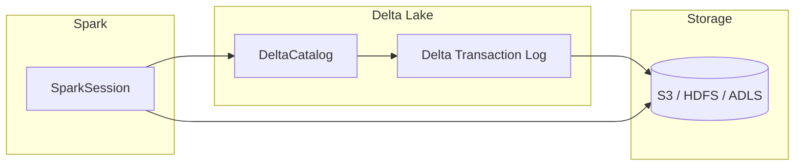

# Delta Lake Catalog

Delta Lake provides **ACID transactions**, scalable metadata handling, and
**time travel** on data lakes. Tables are registered via `DeltaCatalog`, which
replaces the built-in Spark catalog with Delta-aware metadata management.

---

## Architecture



---

## Configuration Reference

| Property | Description | Example |
|---|---|---|
| `spark.sql.catalog.spark_catalog` | Replaces default catalog with Delta | `org.apache.spark.sql.delta.catalog.DeltaCatalog` |
| `spark.sql.extensions` | Delta SQL extensions | `io.delta.sql.DeltaSparkSessionExtension` |
| `spark.sql.warehouse.dir` | Default warehouse path | `s3://my-bucket/delta` |
| `spark.databricks.delta.catalog.enabled` | Enable Delta catalog integration | `true` |
| `spark.hadoop.fs.s3a.impl` | S3A filesystem implementation | `org.apache.hadoop.fs.s3a.S3AFileSystem` |
| `spark.hadoop.fs.s3a.aws.credentials.provider` | AWS credentials provider chain | `com.amazonaws.auth.DefaultAWSCredentialsProviderChain` |
| `spark.hadoop.fs.s3a.path.style.access` | Use path-style S3 access | `true` |
| `spark.hadoop.fs.s3a.fast.upload` | Enable fast multi-part upload | `true` |

---

## SparkSession Setup

```python title="src/metastore/delta_lake/delta_lake_catalog.py"
from pyspark.sql import SparkSession

spark = (
    SparkSession.builder.appName("DeltaCatalog")
    .config(
        "spark.sql.catalog.spark_catalog",
        "org.apache.spark.sql.delta.catalog.DeltaCatalog",  # (1)!
    )
    .config(
        "spark.sql.extensions",
        "io.delta.sql.DeltaSparkSessionExtension",  # (2)!
    )
    .config("spark.sql.warehouse.dir", "s3://my-bucket/delta")
    .config("spark.databricks.delta.catalog.enabled", "true")
    .config("spark.hadoop.fs.s3a.impl", "org.apache.hadoop.fs.s3a.S3AFileSystem")
    .config(
        "spark.hadoop.fs.s3a.aws.credentials.provider",
        "com.amazonaws.auth.DefaultAWSCredentialsProviderChain",
    )
    .config("spark.hadoop.fs.s3a.path.style.access", "true")
    .config("spark.hadoop.fs.s3a.fast.upload", "true")
    .getOrCreate()
)

# Optional: Set log level for easier debugging
spark.sparkContext.setLogLevel("WARN")
```

1. Replaces the default `spark_catalog` with Delta's `DeltaCatalog`, enabling
   Delta-aware `CREATE TABLE`, `ALTER TABLE`, and metadata resolution.
2. Adds Delta-specific SQL syntax — `MERGE INTO`, `VACUUM`, `DESCRIBE HISTORY`,
   `OPTIMIZE`, and more.

---

## Integration Modes

### Hive Metastore Integration

The default choice for **open-source** Delta Lake deployments. Delta tables are
registered in the Hive Metastore and visible to any Hive-compatible engine.

```python
.config("spark.sql.catalogImplementation", "hive")
.config("hive.metastore.uris", "thrift://metastore:9083")
.enableHiveSupport()
```

### Databricks Unity Catalog Integration

Available in **Databricks** environments, Unity Catalog offers centralised
governance, fine-grained access control, and lineage tracking for Delta tables.

```python
.config("spark.sql.catalog.unity", "com.databricks.sql.transaction.tahoe.catalog.UnityCatalog")
.config("spark.databricks.unityCatalog.enabled", "true")
```

!!! note "Unity Catalog"
    Unity Catalog is a Databricks-managed service. Configuration is typically
    handled by the Databricks runtime — manual setup is only needed for
    external Spark clusters connecting to Databricks.

---

## SQL Examples

### Create and Insert

```sql
-- Create a Delta table
CREATE TABLE events (
    event_id   BIGINT,
    event_type STRING,
    event_ts   TIMESTAMP,
    payload    STRING
) USING DELTA
PARTITIONED BY (event_type);

-- Insert data
INSERT INTO events
VALUES (1, 'click', TIMESTAMP '2024-01-15 10:30:00', '{"page":"/home"}');
```

### Update, Delete, and Merge

```sql
-- Update rows
UPDATE events SET payload = '{"page":"/about"}' WHERE event_id = 1;

-- Delete rows
DELETE FROM events WHERE event_ts < '2023-01-01';

-- Upsert with MERGE
MERGE INTO events AS target
USING updates AS source
ON target.event_id = source.event_id
WHEN MATCHED THEN UPDATE SET *
WHEN NOT MATCHED THEN INSERT *;
```

### Time Travel

```sql
-- Query a previous version
SELECT * FROM events VERSION AS OF 3;

-- Query at a specific timestamp
SELECT * FROM events TIMESTAMP AS OF '2024-01-14 00:00:00';

-- View table history
DESCRIBE HISTORY events;
```

### Table Maintenance

```sql
-- Remove old files no longer referenced by the transaction log
VACUUM events RETAIN 168 HOURS;

-- Compact small files for better read performance
OPTIMIZE events;

-- Z-order for multi-dimensional clustering
OPTIMIZE events ZORDER BY (event_type, event_ts);
```

### Schema Evolution

```sql
-- Add columns (readers automatically pick up new schema)
ALTER TABLE events ADD COLUMNS (
    user_id BIGINT,
    region  STRING
);
```

---

## When to Use

!!! success "Good fit"
    - **Lakehouse architecture** on S3, ADLS, or HDFS
    - **ACID transactions** — `UPDATE`, `DELETE`, `MERGE` on data lakes
    - **Databricks environments** with native Delta integration
    - **Streaming + batch** unification via structured streaming
    - **Regulatory compliance** requiring time travel and audit history

!!! failure "Not a good fit"
    - Multi-engine access beyond Spark (Delta connectors for Trino/Presto exist
      but are less mature than Iceberg's)
    - Simple file-based processing where ACID overhead is unnecessary
    - Environments that cannot add the `delta-spark` package

---

## Tips and Warnings

!!! tip "Full Catalog Integration"
    Enable `spark.databricks.delta.catalog.enabled` for complete Delta catalog
    integration — this ensures `CREATE TABLE`, `ALTER TABLE`, and other DDL
    statements are fully Delta-aware.

!!! warning "Runtime Dependencies"
    Delta Lake requires the `delta-spark` package matching your Spark version.
    Incompatible versions will fail silently or throw `ClassNotFoundException`:

    ```bash
    spark-submit --packages io.delta:delta-spark_2.12:3.1.0 ...
    ```

---

## Full Source

:material-file-code: [`src/metastore/delta_lake/delta_lake_catalog.py`](../../../src/metastore/delta_lake/delta_lake_catalog.py)
