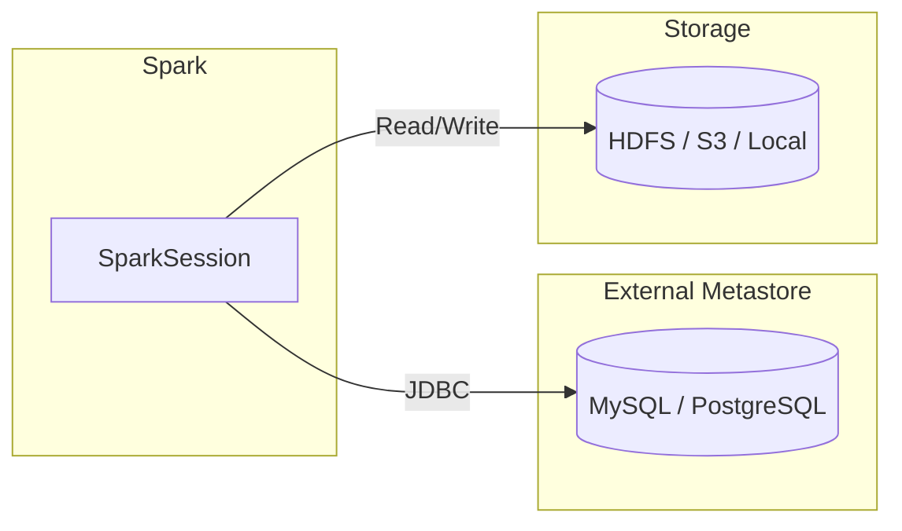

# External RDBMS Metastore

Configure Spark to use an **external relational database** (MySQL, PostgreSQL,
Oracle) as the Hive Metastore backend. The RDBMS stores Hive metadata
(databases, tables, partitions, schemas) while actual data resides on
HDFS, S3, or local storage.

---

## Architecture



---

## Configuration Reference

| Property | Description | Example |
|---|---|---|
| `javax.jdo.option.ConnectionURL` | JDBC URL to the metastore database | `jdbc:mysql://localhost:3306/metastore_db` |
| `javax.jdo.option.ConnectionDriverName` | JDBC driver class | `com.mysql.cj.jdbc.Driver` |
| `javax.jdo.option.ConnectionUserName` | Database username | `hive` |
| `javax.jdo.option.ConnectionPassword` | Database password | `********` |
| `spark.sql.catalogImplementation` | Catalog type | `hive` |
| `hive.metastore.uris` | Thrift URI for remote metastore | `thrift://metastore-host:9083` |
| `hive.metastore.warehouse.dir` | Default warehouse directory | `/user/hive/warehouse` |

---

## Connection Approaches

### Direct JDBC (Embedded Mode)

Spark connects **directly** to the RDBMS via JDBC. No separate Hive Metastore
service needed — Spark embeds the metastore logic in the driver process.

```python title="src/metastore/external/spark_external_metastore.py"
from pyspark.sql import SparkSession


def create_spark_session(app_name: str, metastore_url: str):
    return (
        SparkSession.builder.appName(app_name)
        .config(
            "javax.jdo.option.ConnectionURL", metastore_url  # (1)!
        )
        .config("spark.sql.catalogImplementation", "hive")  # (2)!
        .enableHiveSupport()
        .getOrCreate()
    )


if __name__ == "__main__":
    spark = create_spark_session(
        app_name="SparkSQLExample",
        metastore_url="jdbc:mysql://localhost:3306/my_metastore_db",  # (3)!
    )
    print("Spark session started with Hive metastore support.")
    print("Spark version:", spark.version)
    # Example: List databases
    print("Databases:", spark.sql("SHOW DATABASES").show())
```

1. JDBC connection URL pointing directly at the RDBMS that stores Hive metadata.
2. Tells Spark to use the Hive catalog implementation instead of the default
   in-memory catalog.
3. Replace with your actual MySQL connection string. See database URL examples
   below.

### Remote Thrift (Standalone Hive Metastore Service)

A dedicated **Hive Metastore service** runs as a Thrift server. Spark connects
to the service, which in turn talks to the RDBMS. This is the recommended
approach for shared, multi-user environments.

```python
spark = (
    SparkSession.builder.appName("RemoteMetastore")
    .config("hive.metastore.uris", "thrift://metastore-host:9083")  # (1)!
    .config("spark.sql.catalogImplementation", "hive")
    .enableHiveSupport()
    .getOrCreate()
)
```

1. Points to the Hive Metastore Thrift service. The RDBMS connection is
   configured on the Hive Metastore server side, not in Spark.

---

## Database URL Examples

### MySQL

```properties
javax.jdo.option.ConnectionURL=jdbc:mysql://db-host:3306/metastore_db?createDatabaseIfNotExist=true
javax.jdo.option.ConnectionDriverName=com.mysql.cj.jdbc.Driver
```

### PostgreSQL

```properties
javax.jdo.option.ConnectionURL=jdbc:postgresql://db-host:5432/metastore_db
javax.jdo.option.ConnectionDriverName=org.postgresql.Driver
```

---

## SQL Examples

```sql
-- List all databases in the metastore
SHOW DATABASES;

-- Create a managed table
CREATE TABLE sales.transactions (
    txn_id    BIGINT,
    amount    DECIMAL(10,2),
    txn_date  DATE,
    customer  STRING
) PARTITIONED BY (txn_date);

-- Query the table
SELECT * FROM sales.transactions WHERE txn_date = '2024-01-15';

-- Show table metadata
DESCRIBE EXTENDED sales.transactions;

-- List all tables in a database
SHOW TABLES IN sales;
```

---

## Database Initialisation

!!! note "Hive Schema Tool"
    The metastore database must be initialised with the Hive schema **before**
    Spark can use it. Use the Hive `schematool` utility:

    ```bash
    # MySQL
    schematool -dbType mysql -initSchema

    # PostgreSQL
    schematool -dbType postgres -initSchema
    ```

    Without initialisation, Spark will throw `MetaException` on first access.

---

## When to Use

!!! success "Good fit"
    - **Production setups** requiring durable, shared metadata
    - **Multi-user environments** where multiple Spark applications or engines
      need a consistent view of tables and databases
    - **Existing Hive infrastructure** — migrate metadata to a production-grade
      RDBMS for reliability and backups

!!! failure "Not a good fit"
    - **Local development** — use the default Derby or in-memory metastore
      instead
    - **Ephemeral environments** (CI pipelines, notebooks) where metadata
      does not need to persist across runs
    - **Serverless / managed platforms** that provide their own catalog
      (e.g., Databricks Unity Catalog, AWS Glue)

---

## Tips and Warnings

!!! warning "JDBC Driver on Classpath"
    The RDBMS JDBC driver JAR (e.g., `mysql-connector-j`, `postgresql`) must
    be on Spark's classpath. Add it via `--jars` or `--driver-class-path`:

    ```bash
    spark-submit --jars /path/to/mysql-connector-j-8.0.33.jar ...
    ```

!!! tip "Remote vs Embedded"
    Prefer the **Remote Thrift** approach for production. It centralises
    connection credentials on the metastore server and allows multiple Spark
    clusters to share a single metastore without each needing RDBMS access.

---

## Full Source

:material-file-code: [`src/metastore/external/spark_external_metastore.py`](../../../src/metastore/external/spark_external_metastore.py)
