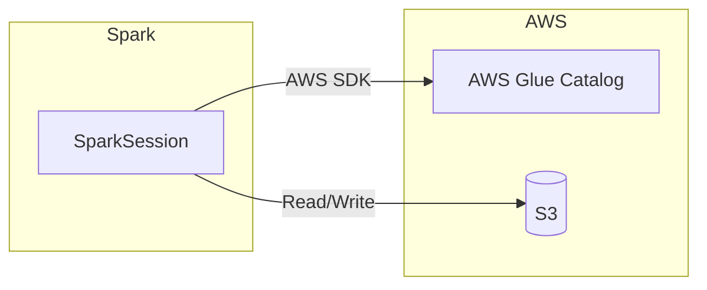

# AWS Glue Data Catalog

Fully managed metastore service from AWS. Drop-in replacement for Hive Metastore in AWS environments — no infrastructure to operate.

---

## Architecture



---

## Key Configuration

| Property | Value / Example | Description |
|---|---|---|
| `spark.sql.catalogImplementation` | `hive` | Required — Glue acts as the Hive-compatible catalog |
| `spark.hadoop.hive.metastore.client.factory.class` | `com.amazonaws.glue.catalog.metastore.AWSGlueDataCatalogHiveClientFactory` | Redirects HMS calls to the Glue API |
| `spark.sql.warehouse.dir` | `s3://my-bucket/warehouse` | S3 location for managed table data |
| `spark.sql.catalog.glue` | `org.apache.iceberg.spark.SparkCatalog` | *(Iceberg)* Named catalog backed by Glue |
| `spark.sql.catalog.glue.catalog-impl` | `org.apache.iceberg.aws.glue.GlueCatalog` | *(Iceberg)* Glue-backed Iceberg catalog |
| `spark.sql.catalog.glue.io-impl` | `org.apache.iceberg.aws.s3.S3FileIO` | *(Iceberg)* S3 file I/O implementation |

---

## SparkSession Setup

### Hive-compatible Glue Catalog

```python title="src/metastore/glue/glue_metastore.py"
import os
from pyspark.sql import SparkSession

warehouse_dir = os.getenv("SPARK_WAREHOUSE", "s3://my-bucket/warehouse")  # (1)!

spark = (
    SparkSession.builder
    .appName("GlueCatalog")
    .config("spark.sql.catalogImplementation", "hive")  # (2)!
    .config("spark.hadoop.hive.metastore.client.factory.class",
            "com.amazonaws.glue.catalog.metastore.AWSGlueDataCatalogHiveClientFactory")  # (3)!
    .config("spark.sql.warehouse.dir", warehouse_dir)
    .enableHiveSupport()
    .getOrCreate()
)
```

1. Warehouse path on S3 — override via environment variable.
2. Tells Spark to use the Hive catalog implementation.
3. Factory class that swaps the Thrift client for the Glue SDK client.

### Iceberg + Glue (dual catalog)

Add a second named catalog (`glue`) that stores Iceberg table metadata in Glue:

```python
spark = (
    SparkSession.builder
    .appName("IcebergGlueCatalog")
    # Hive catalog via Glue
    .config("spark.sql.catalogImplementation", "hive")
    .config("spark.hadoop.hive.metastore.client.factory.class",
            "com.amazonaws.glue.catalog.metastore.AWSGlueDataCatalogHiveClientFactory")
    .config("spark.sql.warehouse.dir", warehouse_dir)
    # Iceberg named catalog
    .config("spark.sql.catalog.glue",
            "org.apache.iceberg.spark.SparkCatalog")  # (1)!
    .config("spark.sql.catalog.glue.catalog-impl",
            "org.apache.iceberg.aws.glue.GlueCatalog")  # (2)!
    .config("spark.sql.catalog.glue.io-impl",
            "org.apache.iceberg.aws.s3.S3FileIO")  # (3)!
    .enableHiveSupport()
    .getOrCreate()
)
```

1. Registers a catalog named `glue` using the Iceberg Spark integration.
2. Iceberg delegates metadata operations to the Glue API.
3. Iceberg reads/writes data files through the S3 File I/O layer.

---

## SQL Examples

### List databases

```sql
SHOW DATABASES;
```

### Create an external table on S3

```sql
CREATE EXTERNAL TABLE events (
    event_id   STRING,
    payload    STRING,
    event_ts   TIMESTAMP
)
STORED AS PARQUET
LOCATION 's3://my-bucket/data/events/';
```

### Query via the Iceberg catalog

```sql
SELECT * FROM glue.analytics.events
WHERE event_ts >= '2024-01-01';
```

---

## IAM Permissions

The Spark driver (or EMR instance role) needs at minimum:

| Action | Purpose |
|---|---|
| `glue:GetDatabase` / `glue:GetDatabases` | List and read databases |
| `glue:GetTable` / `glue:GetTables` | List and read tables |
| `glue:CreateDatabase` | Create new databases |
| `glue:CreateTable` / `glue:UpdateTable` | Create or alter tables |
| `glue:DeleteTable` | Drop tables |
| `glue:GetPartitions` / `glue:CreatePartition` | Partition management |
| `s3:GetObject` / `s3:PutObject` / `s3:DeleteObject` | Read/write data on S3 |

---

## When to Use

!!! success "Good fit"
    - Amazon EMR or AWS Glue ETL jobs
    - Athena interop — tables created in Spark are immediately queryable in Athena
    - AWS-native architectures that want zero-ops metadata management

!!! failure "Not a good fit"
    - Non-AWS environments (Azure, GCP, on-prem)
    - Local development without AWS credentials
    - Multi-cloud deployments that need a portable catalog

!!! tip "Credential resolution"
    Use `DefaultAWSCredentialsProviderChain` — it automatically resolves credentials
    from environment variables, instance profiles, SSO, and the `~/.aws/credentials` file.
    Avoid hard-coding access keys in Spark config.

!!! warning "Glue API rate limits"
    The Glue Data Catalog API enforces per-account rate limits.
    Heavy DDL workloads (thousands of `CREATE TABLE` / `ALTER TABLE` calls)
    can be throttled. Batch partition operations where possible and use
    exponential back-off on retries.

---

## Full Source

```python title="src/metastore/glue/glue_metastore.py"
--8<-- "src/metastore/glue/glue_metastore.py"
```