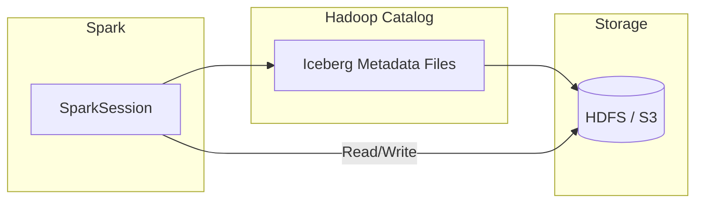

# Hadoop Catalog

The Hadoop catalog is an Iceberg catalog that stores metadata directly on the
filesystem (HDFS, S3, local). No external metastore service is required — table
metadata lives alongside the data as Iceberg metadata files.

## Architecture



## Configuration

| Property | Value | Description |
|----------|-------|-------------|
| `spark.sql.catalog.hadoop_catalog` | `org.apache.iceberg.spark.SparkCatalog` | Register catalog under the name **hadoop_catalog** |
| `spark.sql.catalog.hadoop_catalog.type` | `hadoop` | Use the Hadoop (filesystem) backend |
| `spark.sql.catalog.hadoop_catalog.warehouse` | `hdfs://namenode:8020/warehouse` | Root path for table data and metadata |
| `spark.sql.extensions` | `org.apache.iceberg.spark.extensions.IcebergSparkSessionExtensions` | Enable Iceberg SQL extensions (time travel, procedures) |

## SparkSession Setup

```python
from pyspark.sql import SparkSession

spark = (
    SparkSession.builder
    .appName("HadoopCatalog")
    .config("spark.sql.catalog.hadoop_catalog",
            "org.apache.iceberg.spark.SparkCatalog")  # (1)!
    .config("spark.sql.catalog.hadoop_catalog.type",
            "hadoop")  # (2)!
    .config("spark.sql.catalog.hadoop_catalog.warehouse",
            "hdfs://namenode:8020/warehouse")  # (3)!
    .config("spark.sql.extensions",
            "org.apache.iceberg.spark.extensions."
            "IcebergSparkSessionExtensions")  # (4)!
    .config("spark.sql.shuffle.partitions", "8")
    .enableHiveSupport()
    .getOrCreate()
)

spark.sparkContext.setLogLevel("WARN")
print("SparkSession started with HadoopCatalog and Iceberg extensions.")
```

1. Registers an Iceberg `SparkCatalog` under the logical name `hadoop_catalog`.
2. Selects the **hadoop** backend — metadata is stored as files on the filesystem.
3. The root warehouse directory. All namespaces and tables are created below this path.
4. Enables Iceberg-specific SQL syntax: time-travel queries, `CALL` procedures, etc.

## SQL Examples

### Create a table

```sql
CREATE TABLE hadoop_catalog.db.events (
    event_id   BIGINT,
    event_type STRING,
    ts         TIMESTAMP,
    payload    STRING
) USING iceberg
PARTITIONED BY (days(ts));
```

### Insert data

```sql
INSERT INTO hadoop_catalog.db.events VALUES
    (1, 'click',    TIMESTAMP '2024-03-01 08:00:00', '{"page":"/home"}'),
    (2, 'purchase', TIMESTAMP '2024-03-01 09:15:00', '{"item":"widget"}'),
    (3, 'click',    TIMESTAMP '2024-03-02 14:30:00', '{"page":"/cart"}');
```

### Time-travel queries

```sql
-- Query a specific snapshot by ID
SELECT * FROM hadoop_catalog.db.events VERSION AS OF 1234567890;

-- Query as of a point in time
SELECT * FROM hadoop_catalog.db.events TIMESTAMP AS OF '2024-03-01 12:00:00';
```

### Inspect snapshots and history

```sql
-- List all snapshots
SELECT * FROM hadoop_catalog.db.events.snapshots;

-- View table history
SELECT * FROM hadoop_catalog.db.events.history;

-- Inspect data files
SELECT * FROM hadoop_catalog.db.events.files;
```

### Maintenance procedures

```sql
-- Expire old snapshots (keep last 3 days)
CALL hadoop_catalog.system.expire_snapshots(
    table => 'db.events',
    older_than => TIMESTAMP '2024-02-27 00:00:00'
);

-- Rewrite small files into larger ones
CALL hadoop_catalog.system.rewrite_data_files('db.events');
```

## Comparison with Hive Catalog

| Feature | Hadoop Catalog | Hive Catalog |
|---------|---------------|-------------|
| **External service** | None — metadata on filesystem | Requires Hive Metastore (Thrift) |
| **Locking / concurrency** | No locking — single-writer only | Supports multi-writer via HMS locks |
| **Setup complexity** | Minimal | Moderate (HMS + RDBMS backend) |
| **S3 support** | ⚠️ No atomic rename — unsafe | ✅ Supported (uses HMS for commits) |
| **Multi-engine access** | Limited (no central service) | Good (shared HMS) |
| **Best for** | Dev, testing, single-writer HDFS | Production multi-writer setups |

## When to Use

!!! success "Good fit"

    - **Iceberg without an external metastore** — zero-dependency catalog.
    - **HDFS-native environments** — metadata and data co-located on HDFS.
    - **Development and testing** — spin up quickly with a local or HDFS warehouse.
    - **Single-writer pipelines** — one Spark job owns the table lifecycle.

!!! failure "Not a good fit"

    - **Concurrent writes from multiple engines** — no locking mechanism to prevent conflicts.
    - **Cloud object stores with eventual consistency** — S3 does not support atomic rename.
    - **Multi-engine production setups** — prefer Hive or REST catalog for shared access.

!!! warning

    The Hadoop catalog does **not** support atomic rename on S3. Metadata commits
    can be lost or corrupted under concurrent access. Use the **Hive catalog** or
    **REST catalog** for S3-based Iceberg tables.

!!! tip

    The Hadoop catalog is ideal for **single-writer Iceberg setups on HDFS**.
    For anything more complex — multiple writers, S3 storage, or multi-engine
    access — choose a catalog with proper commit coordination.

## Full Source

:material-file-code: [`src/metastore/haroop_catalog/hadoop_catalog.py`](../../../src/metastore/haroop_catalog/hadoop_catalog.py)
