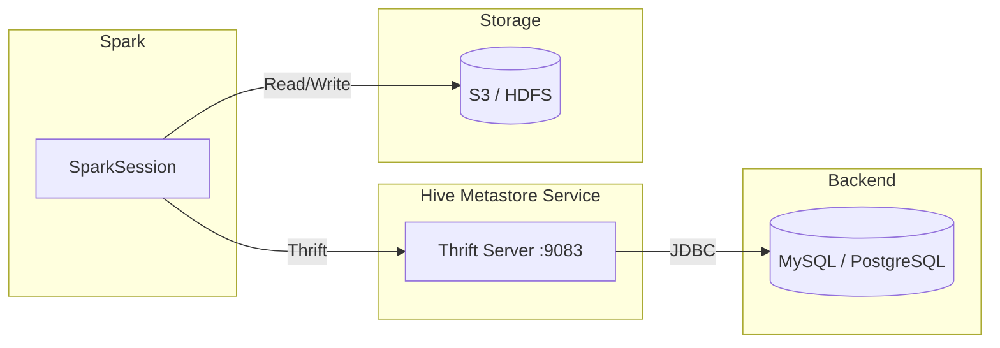

# Hive Metastore

Most widely used metastore for production Spark deployments. Stores metadata in an external RDBMS and exposes it through the Thrift protocol.

---

## Architecture



---

## Key Configuration

| Property | Example | Description |
|---|---|---|
| `hive.metastore.uris` | `thrift://localhost:9083` | Thrift endpoint of the Hive Metastore Service |
| `spark.sql.warehouse.dir` | `/user/hive/warehouse` | Root path for managed table data |
| `spark.sql.catalogImplementation` | `hive` | Must be `hive` when using HMS |
| `javax.jdo.option.ConnectionURL` | `jdbc:mysql://host/metastore` | JDBC URL for the backend RDBMS (embedded mode) |
| `javax.jdo.option.ConnectionDriverName` | `com.mysql.cj.jdbc.Driver` | JDBC driver class (embedded mode) |

---

## SparkSession Variants

### 1 — Remote Hive Metastore (Thrift)

The most common production setup. Spark talks to an external HMS over Thrift.

```python title="src/metastore/hive/remote/hive_metastore.py"
from pyspark.sql import SparkSession

spark = (
    SparkSession.builder
    .appName("hive-spark-schema")
    .config("spark.hive.metastore.uris", "thrift://localhost:9083")  # (1)!
    .config("spark.sql.warehouse.dir", "/user/hive/warehouse")  # (2)!
    .config("hive.metastore.uris", "thrift://localhost:9083")  # (3)!
    .enableHiveSupport()
    .getOrCreate()
)
```

1. Spark-prefixed Thrift URI — picked up by the Spark Hive client.
2. HDFS or S3 path where managed table data is stored.
3. Native Hive property — some Spark versions require both.

### 2 — Embedded Hive (Derby)

No external service needed; an embedded Derby database is used. Useful for quick local experiments with Hive SQL syntax.

```python
spark = (
    SparkSession.builder
    .appName("EmbeddedHive")
    .enableHiveSupport()  # (1)!
    .getOrCreate()
)
```

1. Without setting `hive.metastore.uris`, Spark falls back to an embedded Derby metastore.

### 3 — Hive with Custom RDBMS

Direct JDBC connection to a backend database — skips the Thrift server entirely.

```python
spark = (
    SparkSession.builder
    .appName("HiveCustomDB")
    .config("javax.jdo.option.ConnectionURL",
            "jdbc:mysql://db-host:3306/metastore_db")  # (1)!
    .config("javax.jdo.option.ConnectionDriverName",
            "com.mysql.cj.jdbc.Driver")  # (2)!
    .config("javax.jdo.option.ConnectionUserName", "hive")
    .config("javax.jdo.option.ConnectionPassword", "secret")
    .config("spark.sql.warehouse.dir", "/user/hive/warehouse")
    .enableHiveSupport()
    .getOrCreate()
)
```

1. JDBC URL pointing at the metastore database.
2. Make sure the driver JAR is on the classpath (`--jars` or `spark.jars`).

---

## SQL Examples

### Create a database and a partitioned table

```sql
CREATE DATABASE IF NOT EXISTS analytics;

CREATE TABLE analytics.events (
    event_id   STRING,
    payload    STRING,
    event_date STRING
)
USING parquet
PARTITIONED BY (event_date);
```

### Partition management

```sql
SHOW PARTITIONS analytics.events;

-- Repair partitions added directly to storage
MSCK REPAIR TABLE analytics.events;
```

### Inspect metadata

```sql
DESCRIBE EXTENDED analytics.events;
```

---

## Related Components

### HiveServer2

HiveServer2 provides a JDBC/ODBC interface so BI tools can query Hive tables.
See `src/metastore/hive/server/hive_server.py` for a reference setup.

### LLAP Daemon

LLAP (Live Long and Process) keeps data in memory for sub-second interactive queries on Hive.
See `src/metastore/hive/llp_daemon/hive_llp_daemon.py` for a reference setup.

---

## When to Use

!!! success "Good fit"
    - Production data lakes with centralised metadata
    - Multi-engine access — Spark, Hive, Presto / Trino share the same catalog
    - Long-running clusters that benefit from persistent schema management

!!! failure "Not a good fit"
    - Serverless or ephemeral jobs where standing up HMS is overhead
    - Local development without Docker or a pre-existing Hive installation
    - Use cases that only need a simple in-memory catalog

!!! warning "Java & Hadoop dependencies"
    Hive support pulls in a large dependency tree (Hadoop, Hive JARs, Thrift).
    Ensure `JAVA_HOME` is set and that compatible JAR versions are on the classpath.
    Version mismatches between Spark, Hive, and Hadoop are the most common source of errors.

---

## Full Source — Remote Hive Metastore

```python title="src/metastore/hive/remote/hive_metastore.py"
--8<-- "src/metastore/hive/remote/hive_metastore.py"
```
