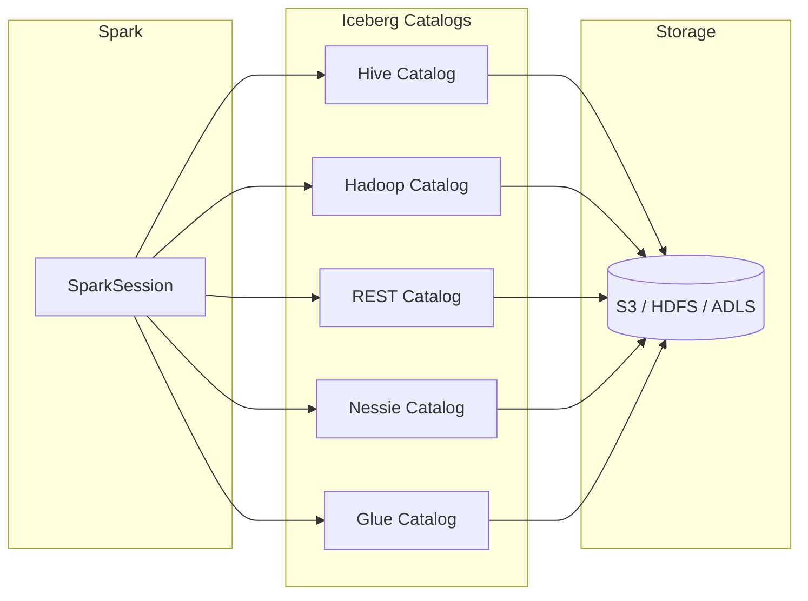

# Apache Iceberg Catalogs

Iceberg supports multiple catalog backends for **ACID-compliant** table management
with time travel, schema evolution, and partition evolution. Each catalog type
plugs into SparkSession via the unified `SparkCatalog` interface.

---

## Architecture



---

## Configuration Reference

| Property | Description | Example |
|---|---|---|
| `spark.sql.catalog.<name>` | Catalog implementation class | `org.apache.iceberg.spark.SparkCatalog` |
| `spark.sql.catalog.<name>.type` | Catalog backend type | `hive`, `hadoop`, `rest`, `nessie` |
| `spark.sql.catalog.<name>.uri` | Catalog service URI | `thrift://metastore:9083` |
| `spark.sql.catalog.<name>.warehouse` | Root warehouse path | `s3://my-bucket/iceberg` |
| `spark.sql.catalog.<name>.io-impl` | FileIO implementation | `org.apache.iceberg.aws.s3.S3FileIO` |
| `spark.sql.catalog.<name>.ref` | Branch reference (Nessie) | `main` |
| `spark.sql.extensions` | Iceberg SQL extensions | `org.apache.iceberg.spark.extensions.IcebergSparkSessionExtensions` |
| `spark.sql.defaultCatalog` | Default catalog for unqualified names | `my_iceberg` |

---

## SparkSession Setup

```python title="src/metastore/iceberg/iceberg_catalog.py"
from pyspark.sql import SparkSession


def create_spark_session(app_name="IcebergCatalog"):
    """
    Create and configure a SparkSession with Iceberg Hive and Hadoop catalogs.
    """
    try:
        spark = (
            SparkSession.builder.appName(app_name)
            # Iceberg Hive Catalog
            .config(
                "spark.sql.catalog.my_iceberg",
                "org.apache.iceberg.spark.SparkCatalog",  # (1)!
            )
            .config("spark.sql.catalog.my_iceberg.type", "hive")  # (2)!
            .config("spark.sql.catalog.my_iceberg.uri", "thrift://metastore:9083")
            .config("spark.sql.catalog.my_iceberg.warehouse", "s3://my-bucket/iceberg")
            .config("spark.sql.defaultCatalog", "my_iceberg")
            # Iceberg Hadoop Catalog
            .config(
                "spark.sql.catalog.iceberg_hadoop",
                "org.apache.iceberg.spark.SparkCatalog",
            )
            .config("spark.sql.catalog.iceberg_hadoop.type", "hadoop")  # (3)!
            .config(
                "spark.sql.catalog.iceberg_hadoop.warehouse",
                "s3://my-bucket/iceberg",
            )
            .getOrCreate()
        )
        print("SparkSession created successfully.")
        return spark
    except Exception as e:
        print(f"Error creating SparkSession: {e}")
        raise
```

1. Register an Iceberg `SparkCatalog` under the name `my_iceberg`.
2. `hive` type delegates metadata to an existing Hive Metastore via Thrift.
3. `hadoop` type stores metadata as JSON files directly on the filesystem.

---

## Catalog Types

### Hive Catalog

Uses an existing **Hive Metastore** (Thrift) for metadata storage. Tables are
visible to any engine that speaks Hive Metastore protocol.

```python
.config("spark.sql.catalog.hive_ice", "org.apache.iceberg.spark.SparkCatalog")
.config("spark.sql.catalog.hive_ice.type", "hive")
.config("spark.sql.catalog.hive_ice.uri", "thrift://metastore:9083")
.config("spark.sql.catalog.hive_ice.warehouse", "s3://my-bucket/iceberg")
```

### Hadoop Catalog

Stores catalog metadata as **JSON files on the filesystem** (HDFS, S3, local).
No external service required — ideal for lightweight or standalone setups.

```python
.config("spark.sql.catalog.hadoop_ice", "org.apache.iceberg.spark.SparkCatalog")
.config("spark.sql.catalog.hadoop_ice.type", "hadoop")
.config("spark.sql.catalog.hadoop_ice.warehouse", "s3://my-bucket/iceberg")
```

### REST Catalog

Connects to a **cloud-native REST API** catalog service. Stateless and suitable
for microservices architectures and managed platforms (e.g., Tabular, Polaris).

```python
.config("spark.sql.catalog.rest_ice", "org.apache.iceberg.spark.SparkCatalog")
.config("spark.sql.catalog.rest_ice.type", "rest")
.config("spark.sql.catalog.rest_ice.uri", "https://my-rest-catalog/api")
```

!!! tip "Cloud-Native Deployments"
    Use the Iceberg REST catalog for cloud-native deployments — it decouples
    catalog metadata from any specific infrastructure and supports multi-engine
    access via a standard API.

### Nessie Catalog

A **Git-like versioned catalog** that supports branching, tagging, and
merging of table states. Enables reproducible data pipelines and isolated
multi-environment workflows.

```python
.config("spark.sql.catalog.nessie_ice", "org.apache.iceberg.spark.SparkCatalog")
.config("spark.sql.catalog.nessie_ice.type", "nessie")
.config("spark.sql.catalog.nessie_ice.uri", "http://localhost:19120/api/v1")
.config("spark.sql.catalog.nessie_ice.ref", "main")
.config("spark.sql.catalog.nessie_ice.warehouse", "s3://my-bucket/iceberg")
```

### Glue Catalog

Uses **AWS Glue Data Catalog** as the Iceberg metastore. See the
[Glue Metastore page](../glue/README.md) for full configuration details.

```python
.config("spark.sql.catalog.glue_ice", "org.apache.iceberg.spark.SparkCatalog")
.config("spark.sql.catalog.glue_ice.catalog-impl",
        "org.apache.iceberg.aws.glue.GlueCatalog")
.config("spark.sql.catalog.glue_ice.warehouse", "s3://my-bucket/iceberg")
.config("spark.sql.catalog.glue_ice.io-impl",
        "org.apache.iceberg.aws.s3.S3FileIO")
```

---

## SQL Examples

### Create and Query Tables

```sql
-- Create a partitioned Iceberg table
CREATE TABLE my_iceberg.db.events (
    event_id   BIGINT,
    event_type STRING,
    event_ts   TIMESTAMP,
    payload    STRING
) USING iceberg
PARTITIONED BY (days(event_ts));

-- Insert data
INSERT INTO my_iceberg.db.events
VALUES (1, 'click', TIMESTAMP '2024-01-15 10:30:00', '{"page":"/home"}');

-- Query
SELECT * FROM my_iceberg.db.events WHERE event_type = 'click';
```

### Time Travel

```sql
-- Travel to a specific snapshot
SELECT * FROM my_iceberg.db.events VERSION AS OF 1234567890;

-- Travel to a point in time
SELECT * FROM my_iceberg.db.events TIMESTAMP AS OF '2024-01-15 00:00:00';

-- List all snapshots
SELECT * FROM my_iceberg.db.events.snapshots;

-- List data files per snapshot
SELECT * FROM my_iceberg.db.events.files;
```

### Schema Evolution

```sql
-- Add new columns without rewriting data
ALTER TABLE my_iceberg.db.events ADD COLUMNS (
    user_id BIGINT,
    region  STRING
);

-- Rename a column
ALTER TABLE my_iceberg.db.events RENAME COLUMN payload TO event_payload;
```

### Table Maintenance

```sql
-- Expire old snapshots (retain last 5 days)
CALL my_iceberg.system.expire_snapshots(
    table => 'db.events',
    older_than => TIMESTAMP '2024-01-10 00:00:00',
    retain_last => 5
);

-- Rollback to a previous snapshot
CALL my_iceberg.system.rollback_to_snapshot('db.events', 1234567890);

-- Rewrite data files for better read performance
CALL my_iceberg.system.rewrite_data_files(table => 'db.events');
```

---

## When to Use

!!! success "Good fit"
    - **ACID transactions** on data lakes (S3, HDFS, ADLS)
    - **Time travel** and snapshot-based auditing
    - **Schema & partition evolution** without rewriting data
    - **Multi-engine access** — Spark, Flink, Trino, Presto, Dremio
    - **Large-scale analytics** with hidden partitioning

!!! failure "Not a good fit"
    - Simple file-based processing (CSV/JSON read-once pipelines)
    - Legacy Hive-only environments that cannot adopt new JARs
    - Very small datasets where ACID overhead is unnecessary

---

## Tips and Warnings

!!! warning "Runtime Dependencies"
    Iceberg requires the `iceberg-spark-runtime` JAR matching your Spark and
    Scala versions. Add it via `--packages` or include it in your fat JAR:

    ```bash
    spark-submit --packages org.apache.iceberg:iceberg-spark-runtime-3.5_2.12:1.5.0 ...
    ```

!!! note "Iceberg SQL Extensions"
    To use stored procedures (`expire_snapshots`, `rollback_to_snapshot`, etc.),
    enable the Iceberg SQL extensions:

    ```python
    .config("spark.sql.extensions",
            "org.apache.iceberg.spark.extensions.IcebergSparkSessionExtensions")
    ```

---

## Full Source

:material-file-code: [`src/metastore/iceberg/iceberg_catalog.py`](../../../src/metastore/iceberg/iceberg_catalog.py)
