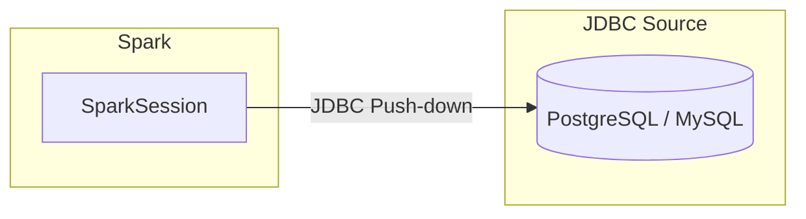

# JDBC Catalog

The JDBC catalog (DataSource V2) allows Spark to **directly query tables in
external relational databases** (PostgreSQL, MySQL, Oracle) as if they were
Spark tables — without importing data.

---

## Architecture



!!! warning "JDBC Catalog ≠ External Metastore"
    The **JDBC Catalog** registers an external RDBMS as a Spark catalog so you
    can query its tables directly via SQL. The
    [External Metastore](../external/README.md) uses an RDBMS to **store Hive
    metadata** (databases, table schemas, partition info). They solve different
    problems:

    | | JDBC Catalog | External Metastore |
    |---|---|---|
    | **Purpose** | Query RDBMS tables from Spark | Store Hive metadata in RDBMS |
    | **Data location** | Stays in the RDBMS | HDFS / S3 / local filesystem |
    | **Catalog class** | `JDBCTableCatalog` | Hive `catalogImplementation` |

---

## Configuration Reference

| Property | Description | Example |
|---|---|---|
| `spark.sql.catalog.jdbc` | JDBC catalog implementation | `org.apache.spark.sql.execution.datasources.v2.jdbc.JDBCTableCatalog` |
| `spark.sql.catalog.jdbc.url` | JDBC connection URL | `jdbc:postgresql://localhost:5432/mydb` |
| `spark.sql.catalog.jdbc.driver` | JDBC driver class | `org.postgresql.Driver` |
| `spark.sql.catalog.jdbc.user` | Database username | `username` |
| `spark.sql.catalog.jdbc.password` | Database password | `********` |

---

## SparkSession Setup

```python title="src/metastore/jdbc_metastore/jdbc_metastore.py"
import os

from pyspark.sql import SparkSession

# Load credentials from environment variables for better security
jdbc_user = os.getenv("JDBC_USER", "username")
jdbc_password = os.getenv("JDBC_PASSWORD", "password")
jdbc_url = os.getenv("JDBC_URL", "jdbc:postgresql://localhost:5432/metastore")

# Initialize SparkSession with JDBC Metastore configuration
spark = (
    SparkSession.builder.appName("JDBCMetastore")
    .config(
        "spark.sql.catalog.jdbc",
        "org.apache.spark.sql.execution.datasources.v2.jdbc.JDBCTableCatalog",  # (1)!
    )
    .config("spark.sql.catalog.jdbc.url", jdbc_url)  # (2)!
    .config("spark.sql.catalog.jdbc.driver", "org.postgresql.Driver")
    .config("spark.sql.catalog.jdbc.user", jdbc_user)
    .config("spark.sql.catalog.jdbc.password", jdbc_password)
    .getOrCreate()
)
```

1. Registers a DataSource V2 JDBC catalog under the name `jdbc`. You can use
   any name — queries reference it as `jdbc.<schema>.<table>`.
2. Credentials are loaded from environment variables to avoid hardcoding
   secrets in source code.

---

## SQL Examples

```sql
-- List all tables in the public schema
SHOW TABLES IN jdbc.public;

-- Query an RDBMS table directly from Spark SQL
SELECT * FROM jdbc.public.users WHERE active = true;

-- Describe table structure
DESCRIBE TABLE jdbc.public.users;

-- Join an RDBMS table with a lake table
SELECT u.name, o.total
FROM jdbc.public.users u
JOIN lakehouse.sales.orders o ON u.id = o.user_id;

-- Aggregations are pushed down to the database when possible
SELECT region, COUNT(*) AS cnt
FROM jdbc.public.customers
GROUP BY region;
```

---

## Supported Databases

| Database | Driver Class | JDBC URL Format |
|---|---|---|
| PostgreSQL | `org.postgresql.Driver` | `jdbc:postgresql://host:5432/db` |
| MySQL | `com.mysql.cj.jdbc.Driver` | `jdbc:mysql://host:3306/db` |
| Oracle | `oracle.jdbc.OracleDriver` | `jdbc:oracle:thin:@host:1521:sid` |
| SQL Server | `com.microsoft.sqlserver.jdbc.SQLServerDriver` | `jdbc:sqlserver://host:1433;databaseName=db` |
| H2 | `org.h2.Driver` | `jdbc:h2:mem:testdb` |

---

## Predicate Pushdown

The JDBC catalog pushes **filters, projections, and aggregations** down to the
source database whenever possible. This minimises data transfer — only matching
rows are sent to Spark.

```sql
-- The WHERE clause is pushed to PostgreSQL; only matching rows cross the wire
SELECT id, name FROM jdbc.public.users WHERE created_at > '2024-01-01';
```

!!! tip "Multi-Catalog Joins"
    Use the JDBC catalog alongside Iceberg, Delta, or Hive catalogs to build
    **federated queries** that join RDBMS reference data with lake tables:

    ```sql
    SELECT c.name, s.total
    FROM jdbc.public.customers c
    JOIN iceberg_catalog.warehouse.sales s ON c.id = s.customer_id;
    ```

---

## Helper Functions

The source file includes utility functions for common operations:

```python title="src/metastore/jdbc_metastore/jdbc_metastore.py"
def list_tables(catalog="jdbc", schema="default"):
    """List available tables in the specified JDBC catalog and schema."""
    query = f"SHOW TABLES IN {catalog}.{schema}"
    tables = spark.sql(query)
    tables.show(truncate=False)


def describe_table(table_name, catalog="jdbc", schema="default"):
    """Describe the schema of a table."""
    query = f"DESCRIBE TABLE {catalog}.{schema}.{table_name}"
    desc = spark.sql(query)
    desc.show(truncate=False)
```

---

## When to Use

!!! success "Good fit"
    - **RDBMS integration** — query PostgreSQL/MySQL tables without ETL
    - **Federated queries** — join RDBMS dimensions with data lake fact tables
    - **Real-time lookups** — read current state from transactional databases
    - **Schema discovery** — explore RDBMS schemas using `SHOW TABLES` / `DESCRIBE`

!!! failure "Not a good fit"
    - **Large-scale analytics** — the RDBMS becomes a bottleneck; consider
      ingesting data into the lake instead
    - **Write-heavy workloads** — JDBC catalog is primarily read-oriented
    - **Replacing a data warehouse** — use Delta Lake or Iceberg for
      lakehouse patterns

---

## Tips and Warnings

!!! warning "JDBC Driver on Classpath"
    The database JDBC driver JAR must be available on Spark's classpath.
    Add it via `--jars` or `--packages`:

    ```bash
    spark-submit --jars /path/to/postgresql-42.7.1.jar ...
    ```

!!! tip "Environment Variables for Credentials"
    Never hardcode database credentials. Use environment variables or a
    secrets manager:

    ```bash
    export JDBC_USER="myuser"
    export JDBC_PASSWORD="mypassword"
    export JDBC_URL="jdbc:postgresql://prod-db:5432/analytics"
    ```

---

## Full Source

:material-file-code: [`src/metastore/jdbc_metastore/jdbc_metastore.py`](../../../src/metastore/jdbc_metastore/jdbc_metastore.py)
