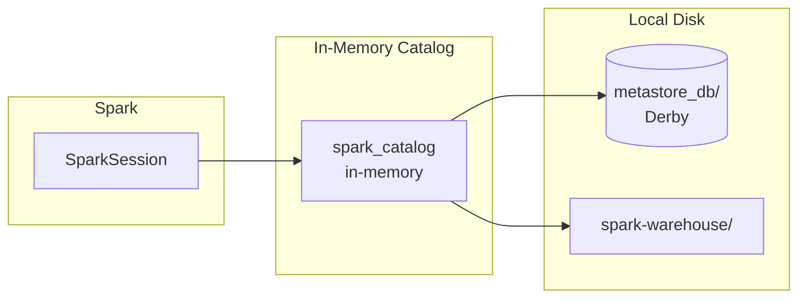

# In-Memory Metastore

Default catalog when Hive support is **not** enabled. Uses an embedded Apache Derby instance under the hood. All metadata is lost when the Spark session ends.

---

## Architecture



---

## Key Configuration

| Property | Default | Description |
|---|---|---|
| `spark.sql.catalogImplementation` | `in-memory` | Catalog backend — no Hive dependency required |
| `spark.sql.warehouse.dir` | `./spark-warehouse` | Root directory for managed table data |

---

## SparkSession Setup

```python title="src/metastore/memory/memory_metastore.py"
from pyspark.sql import SparkSession

spark = (
    SparkSession.builder
    .appName("InMemoryCatalog")  # (1)!
    .config("spark.sql.shuffle.partitions", "4")  # (2)!
    .getOrCreate()
)
```

1. Application name visible in the Spark UI.
2. Reduced shuffle partitions for local / small-data workloads.

!!! note "No `.enableHiveSupport()`"
    Omitting `enableHiveSupport()` keeps the catalog implementation as `in-memory`.

---

## SQL Examples

### Show catalogs and databases

```sql
SHOW CATALOGS;
SHOW DATABASES;
SHOW DATABASES IN spark_catalog;
```

### Create and query a table

```sql
CREATE TABLE users (id INT, name STRING)
USING parquet;

INSERT INTO users VALUES (1, 'Alice'), (2, 'Bob');

SELECT * FROM users;
```

### Clean up

```sql
DROP TABLE IF EXISTS users;
```

---

## Local Artefacts

When Spark runs with the in-memory catalog it still creates local files:

| Path | Purpose |
|---|---|
| `metastore_db/` | Embedded Derby database storing catalog metadata |
| `derby.log` | Derby transaction log |
| `spark-warehouse/` | Default managed-table data directory |

!!! warning "Derby single-connection limitation"
    Derby allows only **one JVM connection** at a time.
    Running two Spark sessions against the same working directory will fail with a lock error.
    Delete `metastore_db/` between runs if you hit this.

---

## When to Use

!!! success "Good fit"
    - Development and local testing
    - Ephemeral / throw-away jobs
    - CI pipelines that don't need persistent metadata
    - Quick prototyping with Spark SQL

!!! failure "Not a good fit"
    - Production workloads requiring durable metadata
    - Multi-session or concurrent access
    - Shared catalog across applications

---

## Full Source

```python title="src/metastore/memory/memory_metastore.py"
--8<-- "src/metastore/memory/memory_metastore.py"
```
