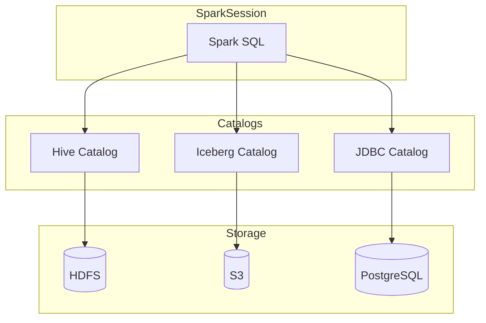

# Multi-Catalog Setup

Spark 3+ supports registering multiple catalogs simultaneously, enabling
federated queries across different data sources in a single session. This is the
foundation for **data mesh**, **cross-platform migration**, and **federated
analytics** patterns.

## Architecture



## Configuration

All three catalogs are registered in the same `SparkSession`:

| Property | Value | Description |
|----------|-------|-------------|
| `spark.sql.catalog.hive` | `org.apache.spark.sql.hive.HiveCatalog` | Hive Metastore catalog |
| `spark.sql.catalog.hive.uri` | `thrift://hive-metastore:9083` | Hive Metastore Thrift URI |
| `spark.sql.catalog.iceberg` | `org.apache.iceberg.spark.SparkCatalog` | Iceberg catalog |
| `spark.sql.catalog.iceberg.type` | `hadoop` | Iceberg backend type |
| `spark.sql.catalog.iceberg.warehouse` | `s3://my-bucket/iceberg` | Iceberg warehouse path |
| `spark.sql.catalog.postgres` | `org.apache.spark.sql.execution.datasources.v2.jdbc.JDBCTableCatalog` | JDBC catalog (PostgreSQL) |
| `spark.sql.catalog.postgres.url` | `jdbc:postgresql://db:5432/mydb` | JDBC connection URL |

## SparkSession Setup

```python
from pyspark.sql import SparkSession


def create_spark_session():
    return (
        SparkSession.builder
        .appName("MultiCatalog")
        # ── Hive Catalog ──────────────────────────────────
        .config("spark.sql.catalog.hive",
                "org.apache.spark.sql.hive.HiveCatalog")  # (1)!
        .config("spark.sql.catalog.hive.uri",
                "thrift://hive-metastore:9083")
        # ── Iceberg Catalog ───────────────────────────────
        .config("spark.sql.catalog.iceberg",
                "org.apache.iceberg.spark.SparkCatalog")  # (2)!
        .config("spark.sql.catalog.iceberg.type", "hadoop")
        .config("spark.sql.catalog.iceberg.warehouse",
                "s3://my-bucket/iceberg")
        # ── JDBC Catalog (PostgreSQL) ─────────────────────
        .config("spark.sql.catalog.postgres",
                "org.apache.spark.sql.execution.datasources.v2.jdbc."
                "JDBCTableCatalog")  # (3)!
        .config("spark.sql.catalog.postgres.url",
                "jdbc:postgresql://db:5432/mydb")
        .getOrCreate()
    )


def query_catalog(spark, catalog, query):
    spark.sql(f"USE CATALOG {catalog}")
    return spark.sql(query)


if __name__ == "__main__":
    spark = create_spark_session()

    hive_df = query_catalog(spark, "hive",
                            "SELECT * FROM sales_db.transactions")
    hive_df.show()

    iceberg_df = query_catalog(spark, "iceberg",
                               "SELECT * FROM analytics.events")
    iceberg_df.show()

    postgres_df = query_catalog(spark, "postgres",
                                "SELECT * FROM public.users")
    postgres_df.show()

    spark.stop()
```

1. Traditional **Hive Metastore** — stores metadata in an RDBMS via Thrift.
2. **Iceberg** catalog using the Hadoop backend — metadata lives on S3.
3. **JDBC** catalog — exposes PostgreSQL tables as Spark tables.

## SQL Examples

### Querying individual catalogs

```sql
-- Hive catalog
SELECT * FROM hive.sales_db.transactions
WHERE order_date >= '2024-01-01';

-- Iceberg catalog
SELECT * FROM iceberg.analytics.events
WHERE event_type = 'purchase';

-- JDBC / PostgreSQL catalog
SELECT * FROM postgres.public.users
WHERE active = true;
```

### Cross-catalog JOINs

```sql
SELECT
    h.order_id,
    h.amount,
    p.email,
    p.name
FROM hive.sales_db.orders        h
JOIN postgres.public.customers    p
  ON h.customer_id = p.id;
```

!!! warning

    Cross-catalog JOINs pull data through the Spark driver. For large tables
    this can be slow and memory-intensive. Pre-aggregate or filter early.

### Switching the active catalog

```sql
-- Switch default catalog context
USE CATALOG iceberg;

-- Now unqualified names resolve against the Iceberg catalog
SHOW NAMESPACES;
SHOW TABLES IN analytics;
SELECT * FROM analytics.events LIMIT 10;
```

### Listing registered catalogs

```sql
SHOW CATALOGS;
```

## Use Cases

| Scenario | Description |
|----------|-------------|
| **Data mesh** | Each domain team owns a catalog; central Spark queries federate across them |
| **Migration** | Read from Hive, write to Iceberg in the same job — no ETL pipeline needed |
| **Federated analytics** | Join operational data (JDBC) with analytical data (Iceberg / Hive) |
| **Platform comparison** | Run the same query against two catalogs to validate correctness |

## When to Use

!!! success "Good fit"

    - **Organisations with mixed data platforms** — Hive + Iceberg + RDBMS.
    - **Migration scenarios** — read from the old catalog, write to the new one.
    - **Data mesh architectures** — each domain publishes through its own catalog.
    - **Ad-hoc federated analytics** — quick cross-source exploration.

!!! failure "Not a good fit"

    - **Simple single-source pipelines** — one catalog is sufficient.
    - **Minimal infrastructure** — multi-catalog adds configuration complexity.
    - **Latency-sensitive joins** — cross-catalog JOINs are not optimised.

!!! tip

    Name catalogs **descriptively** (e.g., `hive`, `iceberg`, `postgres`) rather
    than generically (`catalog1`, `catalog2`). This makes SQL immediately readable:
    `SELECT * FROM iceberg.analytics.events`.

## Full Source

:material-file-code: [`src/metastore/multi_catalog/multi_catalog.py`](../../../src/metastore/multi_catalog/multi_catalog.py)
