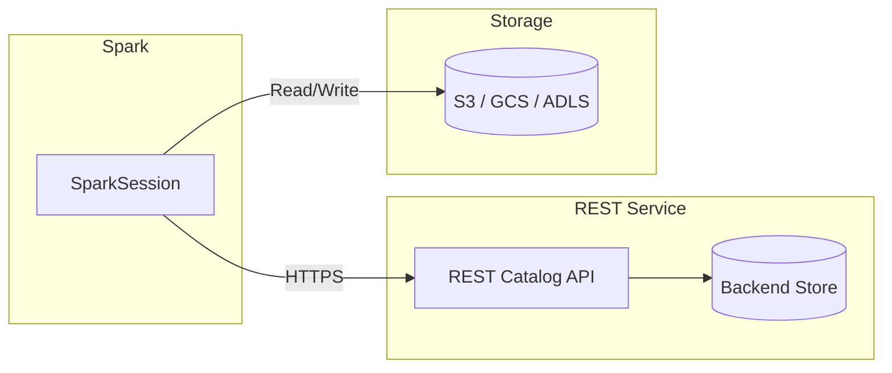

# REST Catalog

The REST catalog is an Iceberg catalog backed by a REST API service. It provides
cloud-native, stateless metadata management — decoupling compute from the catalog
layer and enabling multi-engine access through a standardised HTTP interface.

## Architecture



## Configuration

| Property | Value | Description |
|----------|-------|-------------|
| `spark.sql.catalog.rest` | `org.apache.iceberg.spark.SparkCatalog` | Register the catalog under the name **rest** |
| `spark.sql.catalog.rest.type` | `rest` | Use the REST catalog backend |
| `spark.sql.catalog.rest.uri` | `https://metastore-api.example.com` | Base URL of the REST catalog service |
| `spark.sql.catalog.rest.warehouse` | `s3://my-bucket/warehouse` | Default warehouse location for new tables |
| `spark.sql.catalog.rest.credential` | `bearer-token` | Authentication credential (token or secret) |

## SparkSession Setup

```python
from pyspark.sql import SparkSession


def create_spark_session():
    try:
        spark = (
            SparkSession.builder
            .appName("RESTCatalog")
            .config("spark.sql.catalog.rest",
                    "org.apache.iceberg.spark.SparkCatalog")  # (1)!
            .config("spark.sql.catalog.rest.type", "rest")  # (2)!
            .config("spark.sql.catalog.rest.uri",
                    "https://metastore-api.example.com")  # (3)!
            .config("spark.sql.catalog.rest.warehouse",
                    "s3://my-bucket/warehouse")
            .config("spark.sql.catalog.rest.credential",
                    "bearer-token")  # (4)!
            .config("spark.sql.shuffle.partitions", "200")
            .config("spark.executor.memory", "4g")
            .config("spark.driver.memory", "2g")
            .enableHiveSupport()
            .getOrCreate()
        )
        print("SparkSession created successfully.")
        return spark
    except Exception as e:
        print(f"Error creating SparkSession: {e}")
        raise


spark = create_spark_session()
```

1. Registers an Iceberg `SparkCatalog` under the logical name `rest`.
2. Selects the **REST** backend — Spark sends metadata requests over HTTP.
3. The base URI of your REST catalog service (Tabular, Polaris, Gravitino, etc.).
4. Replace with a real OAuth2 token or service-account credential.

## SQL Examples

### Browse namespaces and tables

```sql
-- List all namespaces in the REST catalog
SHOW NAMESPACES IN rest;

-- List tables inside a specific namespace
SHOW TABLES IN rest.analytics;
```

### Create and populate a table

```sql
CREATE TABLE rest.analytics.events (
    event_id   BIGINT,
    event_type STRING,
    ts         TIMESTAMP,
    payload    STRING
) USING iceberg
PARTITIONED BY (days(ts));

INSERT INTO rest.analytics.events VALUES
    (1, 'click',  TIMESTAMP '2024-01-15 10:30:00', '{"page":"/home"}'),
    (2, 'scroll', TIMESTAMP '2024-01-15 10:31:00', '{"depth":80}');
```

### Time-travel queries

```sql
-- Query a specific snapshot
SELECT * FROM rest.analytics.events VERSION AS OF 123456789;

-- Query as of a point in time
SELECT * FROM rest.analytics.events TIMESTAMP AS OF '2024-01-15 10:30:00';

-- Inspect snapshot history
SELECT * FROM rest.analytics.events.snapshots;
```

## REST API Endpoints

The REST catalog exposes a standard set of endpoints defined by the
[Iceberg REST Open API spec](https://github.com/apache/iceberg/blob/main/open-api/rest-catalog-open-api.yaml):

| Method | Endpoint | Description |
|--------|----------|-------------|
| `GET` | `/v1/namespaces` | List all namespaces |
| `GET` | `/v1/namespaces/{ns}/tables` | List tables in a namespace |
| `GET` | `/v1/namespaces/{ns}/tables/{table}` | Load table metadata |
| `POST` | `/v1/namespaces/{ns}/tables` | Create a new table |
| `POST` | `/v1/namespaces/{ns}/tables/{table}` | Update / commit to a table |
| `DELETE` | `/v1/namespaces/{ns}/tables/{table}` | Drop a table |

## Authentication

The REST catalog supports multiple authentication mechanisms:

| Method | Config Property | Notes |
|--------|----------------|-------|
| **Bearer token** | `spark.sql.catalog.rest.credential` | Static token passed in the `Authorization` header |
| **OAuth2** | `spark.sql.catalog.rest.oauth2-server-uri` | Token endpoint for client-credentials flow |
| **OAuth2 credential** | `spark.sql.catalog.rest.credential` | `client_id:client_secret` for the OAuth2 flow |

```python
# OAuth2 client-credentials example
spark = (
    SparkSession.builder
    .config("spark.sql.catalog.rest.oauth2-server-uri",
            "https://auth.example.com/oauth/token")
    .config("spark.sql.catalog.rest.credential",
            "my-client-id:my-client-secret")
    ...
)
```

## When to Use

!!! success "Good fit"

    - **Cloud-native deployments** — stateless, horizontally scalable metadata layer.
    - **Multi-engine access** — Spark, Flink, Trino, and DuckDB can share one catalog.
    - **SaaS catalog providers** — Tabular, Snowflake Open Catalog, Dremio Arctic, Gravitino.
    - **Microservices architectures** — catalog is just another HTTP service.

!!! failure "Not a good fit"

    - **On-premise without API infrastructure** — if you cannot host or reach an HTTP service, prefer the Hive or Hadoop catalog.
    - **Simple local / dev setups** — the Hadoop catalog with a local warehouse is simpler.
    - **Air-gapped environments** — external SaaS providers are unreachable.

!!! tip

    The REST catalog is the **emerging standard** for cloud Iceberg deployments.
    If you are starting a new Iceberg project today, evaluate a REST catalog first.

## Full Source

:material-file-code: [`src/metastore/rest/rest_catalog.py`](../../../src/metastore/rest/rest_catalog.py)
