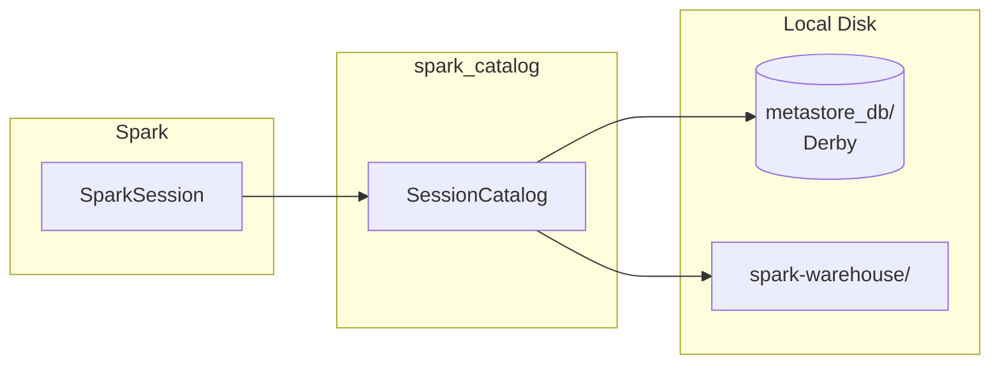

# Spark Built-in Catalog

The default `spark_catalog` that ships with every Spark distribution. Uses an embedded Derby database on local disk — zero configuration required.

---

## Architecture



---

## Key Configuration

| Property | Default | Description |
|---|---|---|
| `spark.sql.defaultCatalog` | `spark_catalog` | Name of the active catalog |
| `spark.sql.warehouse.dir` | `./spark-warehouse` | Root directory for managed table data |
| `spark.sql.catalog.spark_catalog` | *(built-in)* | Override to swap the implementation (e.g. Iceberg, Delta) |

---

## SparkSession Setup

```python title="src/metastore/spark/spark_metastore.py"
import os
from pyspark.sql import SparkSession

warehouse_location = os.environ.get("SPARK_WAREHOUSE", "spark-warehouse")  # (1)!

spark = (
    SparkSession.builder
    .appName("SparkCatalog")
    .config("spark.sql.shuffle.partitions", "4")  # (2)!
    .config("spark.sql.warehouse.dir", warehouse_location)  # (3)!
    .getOrCreate()
)
```

1. Reads the warehouse path from an environment variable, falling back to `spark-warehouse/` in the current directory.
2. Keep partitions low for local workloads — the default of 200 is overkill for small data.
3. Managed table data (Parquet, ORC, etc.) will be written under this directory.

---

## SQL Examples

### Show catalogs and databases

```sql
SHOW CATALOGS;
SHOW DATABASES IN spark_catalog;
```

### Create and query a table

```sql
CREATE TABLE users (id INT, name STRING)
USING parquet;

INSERT INTO users VALUES (1, 'Alice'), (2, 'Bob');
```

### Three-level namespace query

```sql
SELECT * FROM spark_catalog.default.users;
```

### Write via DataFrame API

```python
data = [(1, "Alice"), (2, "Bob"), (3, "Cathy")]
df = spark.createDataFrame(data, ["id", "name"])

df.write.saveAsTable("my_table")  # (1)!

spark.sql("SELECT * FROM spark_catalog.default.my_table").show()
```

1. `saveAsTable` writes data to the warehouse directory and registers the table in `spark_catalog`.

### Clean up

```sql
DROP TABLE IF EXISTS my_table;
```

---

## Local Artefacts

| Path | Purpose |
|---|---|
| `metastore_db/` | Embedded Derby database that persists catalog metadata between sessions |
| `spark-warehouse/` | Default directory for managed table data files |
| `derby.log` | Derby transaction and error log |

!!! note "Persistence across sessions"
    Unlike the pure in-memory catalog, `spark_catalog` persists metadata in `metastore_db/`.
    Tables created in one session **are** visible in the next — as long as you run from the same working directory.

---

## When to Use

!!! success "Good fit"
    - Local development and prototyping
    - Single-user exploration of Spark SQL
    - Quick demos and tutorials
    - Scripts that need lightweight table persistence without external services

!!! failure "Not a good fit"
    - Production deployments requiring concurrent access
    - Distributed environments with multiple Spark drivers
    - Workloads that need a centralised, shared catalog

!!! warning "Derby single-connection lock"
    Derby uses a file-level lock (`metastore_db/db.lck`).
    Only **one JVM** can access the metastore at a time.
    If a previous Spark session crashed without releasing the lock,
    delete `metastore_db/` before restarting.

---

## Full Source

```python title="src/metastore/spark/spark_metastore.py"
--8<-- "src/metastore/spark/spark_metastore.py"
```
